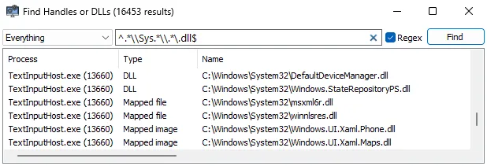
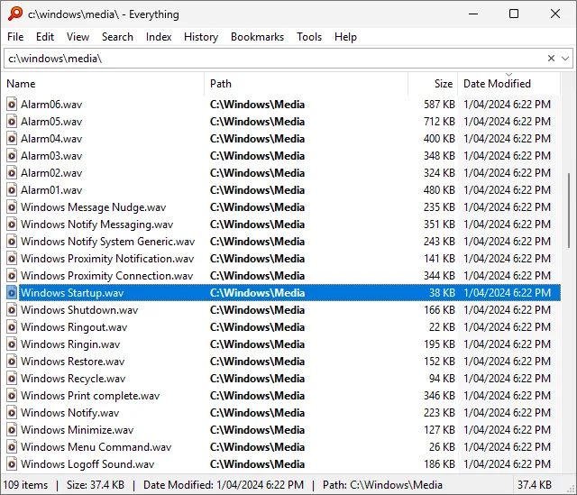
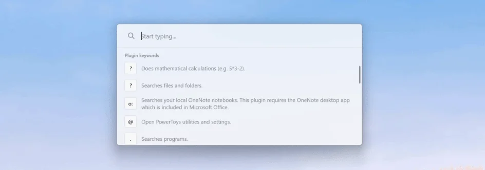
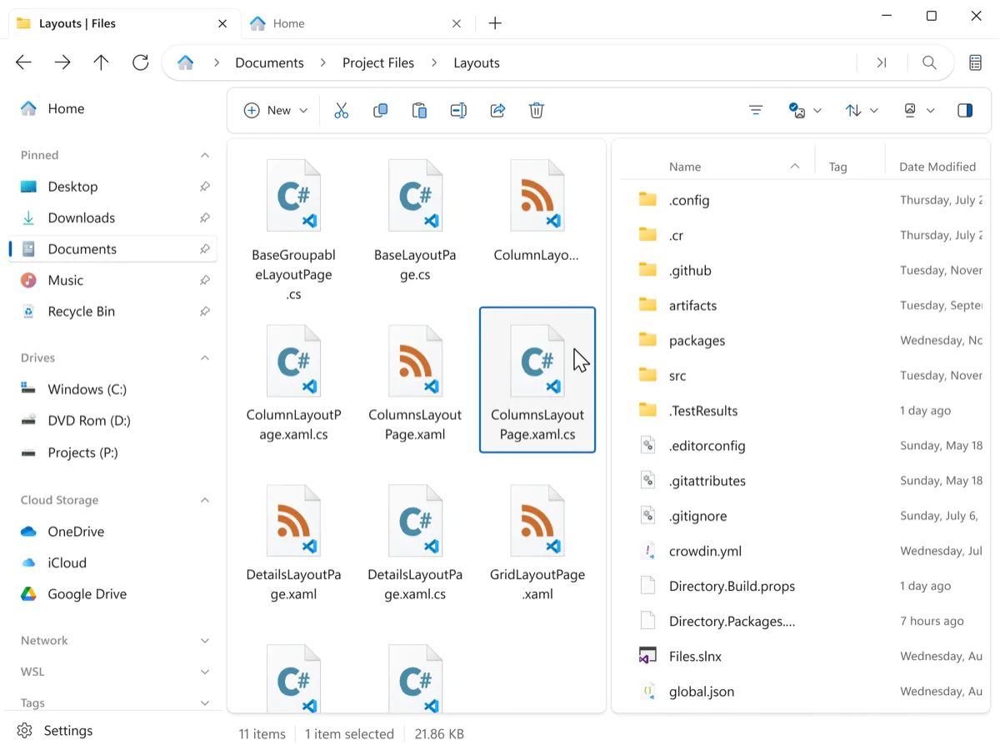

Windows 11 имеет почти всё необходимое для обычной работы. Но у системы есть странная особенность: некоторые базовые задачи она решает заметно хуже, чем это делают бесплатные сторонние программы.

Найти файл? Будь добр — жди результаты поиска. Понять, какой процесс захватил файл — штатных средств для этого мало. Работа с двумя папками — открывай два окна Проводника. А если приложение зависло так, что обычное завершение задачи не помогает, начинается старый добрый ритуал с перезагрузкой.

За эти годы появилось несколько open-source проектов, которые закрывают такие пробелы без подписок, рекламы и платных функций. Причём речь не о полном отказе от компонентов Windows. Эти программы можно использовать рядом со штатными средствами и запускать только тогда, когда они действительно нужны.

Я бы выделил три: **System Informer**, **Everything в связке с PowerToys Run** и **Files**.

## 1. System Informer – для тех случаев, когда Диспетчер задач уже не справляется

Диспетчер задач Windows 11 хорошо показывает загрузку процессора, памяти, диска и сети. Для обычной диагностики этого хватает. Но когда нужно разобраться, почему конкретный файл нельзя удалить или какой процесс держит зависшее приложение, возможностей уже недостаточно.

**System Informer** вырос из проекта Process Hacker и пошёл гораздо дальше обычного списка процессов. Проект распространяется под лицензией MIT и публикует исходный код на GitHub.

Главное отличие — в конкретной ситуации.

Допустим, Windows сообщает: «Не удаётся выполнить действие, поскольку файл открыт в другой программе». Проводник не говорит, какая именно программа держит файл. System Informer позволяет найти этот процесс через поиск дескрипторов. После этого становится понятно, что именно нужно закрыть.



*Поиск дескрипторов в System Informer: Ctrl+F → имя файла → сразу видно процесс. Скриншот: systeminformer.sourceforge.io*

Для диагностики процессов информации тоже гораздо больше. Можно посмотреть PID, родительский процесс, путь к исполняемому файлу, командную строку запуска, сетевые соединения и использование ресурсов. Сам проект отдельно указывает поиск процессов, которые используют конкретный файл, как одну из основных возможностей.

Полезен System Informer и при зависших программах. У него есть более глубокие возможности управления процессами, чем у обычного Диспетчера задач. Это особенно заметно с играми, установщиками и программами, которые успели зависнуть настолько, что обычное завершение процесса не помогает.

При этом заменять Диспетчер задач полностью я бы не стал. Для быстрого взгляда на загрузку системы штатного инструмента достаточно. System Informer лучше держать как «тяжёлую артиллерию» для случаев, когда Windows перестаёт объяснять происходящее.

### Установка

Если в системе есть WinGet, достаточно выполнить:

```powershell
winget install --id WinsiderSS.SystemInformer -e
```

WinGet позволяет устанавливать приложение по точному идентификатору пакета.

У System Informer есть и portable-вариант. Его можно запускать без классической установки, в том числе с внешнего накопителя.

**Кому пригодится:** тем, кто занимается диагностикой Windows, часто работает с играми, серверами, установщиками или регулярно сталкивается с сообщениями «файл используется другим процессом».

## 2. Everything + PowerToys Run – когда поиск файла перестаёт быть отдельной задачей

У стандартного поиска Windows есть важное преимущество – он умеет искать и по именам, и по содержимому. Но если вы точно знаете имя файла, ждать полноценного поиска обычно бессмысленно.

Здесь Everything выглядит почти неприлично просто.

Программа строит индекс имён файлов и папок, после чего показывает совпадения сразу после ввода запроса. Официальная документация Everything прямо описывает такой сценарий: вводите часть имени – совпадения появляются мгновенно.



*Everything индексирует NTFS за секунды и показывает результаты по мере ввода. Скриншот: voidtools.com*

Причём Everything не ограничивается примитивным поиском по строке. Можно фильтровать результаты по расширению, пути, размеру и дате изменения. Например, запрос `*.pdf` покажет PDF-файлы, а `size:>1gb` поможет найти файлы больше гигабайта.

Есть и ещё одна полезная особенность – результаты можно перетаскивать мышью в другие программы. Нашли фотографию, документ или архив – схватили его из выдачи и перетащили куда нужно.

Но у Everything есть одна особенность: это поиск **именно по имени и атрибутам**, а не универсальный поисковик Windows. Поэтому я не воспринимаю его как замену стандартному поиску. Это другой инструмент для другой задачи.

А вот **PowerToys Run** превращает такой подход в полноценный запускатор.

По умолчанию он вызывается сочетанием **Alt + Пробел**. Начинаете печатать название программы, файла или системной команды – результаты появляются прямо в небольшом окне запуска. Microsoft описывает PowerToys Run именно как быстрый запускатор приложений, файлов и системных команд.



*PowerToys Run — Alt+Пробел и ввод, без меню Пуск. Скриншот: learn.microsoft.com*

Получается интересная связка: Everything отвечает за быстрый поиск файлов, PowerToys Run – за быстрый доступ к программам и командам.

Например, вместо поиска `ipconfig` через меню Пуск можно открыть PowerToys Run, ввести команду и запустить её. Для человека, который регулярно работает с Windows, такие мелочи постепенно экономят больше времени, чем кажется.

### Установка

```powershell
winget install --id voidtools.Everything -e
winget install --id Microsoft.PowerToys -e
```

Everything после первого запуска создаёт индекс локальных NTFS-томов. Производитель указывает, что первоначальная индексация занимает несколько секунд, после чего поиск по именам работает мгновенно.

PowerToys после установки должен работать в фоне, а PowerToys Run нужно включить в настройках. Горячая клавиша **Alt + Пробел** используется по умолчанию, но её можно изменить.

**Кому пригодится:** тем, кто постоянно ищет документы, фотографии, установщики, проекты и другие файлы по имени. Если вы за день десятки раз открываете «Пуск» только ради запуска программы или поиска файла, связка быстро становится привычной.

## 3. Files – Проводник с нормальной работой между двумя папками

Проводник Windows 11 получил вкладки, и это давно пора было сделать. Но вкладки не решают другую классическую проблему: переносить файлы между двумя папками по-прежнему не так удобно, как хотелось бы.

Можно открыть два окна. Можно использовать несколько вкладок. Но если вы регулярно раскладываете файлы, копируете проекты или переносите большие объёмы данных, две панели рядом остаются намного практичнее.

Именно здесь пригодится **Files** от Files Community.

Это open-source файловый менеджер для Windows с вкладками, раздельными панелями, тегами и другими функциями, которых нет в штатном Проводнике в таком виде. Исходный код проекта доступен на GitHub.

Сценарий простой. Слева открыта папка с загрузками, справа – каталог проекта. Нашли нужные файлы, выделили и перетащили в соседнюю панель. Не нужно переключаться между окнами и держать в голове, какая вкладка сейчас открыта.



*Две панели в Files — перетаскивание между каталогами в одном окне. Скриншот: files.community*

Теги решают другую задачу. Папка отвечает на вопрос «где лежит файл», а тег – «что это за файл». Например, документы можно пометить как «Работа», «Срочно» или «Архив», не перестраивая всю файловую структуру.

Files также поддерживает работу с архивами и другие функции управления файлами. Проект развивается открыто, а разработчики публикуют исходный код и принимают предложения и сообщения об ошибках через GitHub.

При этом Files не требует мгновенно отказываться от Проводника. Можно использовать его как второй файловый менеджер, а уже потом решить, нужен ли он вам постоянно.

### Установка

```powershell
winget install --id files-community.Files -e
```

После установки Files можно оставить обычный Проводник программой по умолчанию. Это хороший вариант, если хочется попробовать дополнительные возможности без изменения привычного рабочего процесса.

**Кому пригодится:** тем, кто постоянно переносит файлы между каталогами, работает с несколькими папками одновременно или хочет использовать теги вместо десятков вложенных каталогов.

## Почему всё это до сих пор делают сторонние разработчики

Есть соблазн сказать: «Microsoft опять ничего не умеет». Но ситуация сложнее.

Windows стоит на миллиарде устройств, где изменение одного компонента может повлиять на совместимость, корпоративные сценарии и миллионы существующих компьютеров. Поэтому Microsoft двигается осторожно.

Сторонний open-source проект находится в другой позиции. Его разработчики могут решить одну конкретную проблему и не ждать, пока она попадёт в приоритеты всей операционной системы.

Получается интересный парадокс. **Windows 11 развивается десятилетиями, а небольшая команда разработчиков иногда быстрее закрывает конкретную бытовую потребность.**

При этом у такого подхода есть цена. Сторонняя программа может изменить интерфейс, получить ошибку после обновления Windows или просто перестать подходить конкретному пользователю. Поэтому я не сторонник идеи «заменить половину Windows сторонними утилитами».

Гораздо разумнее использовать их точечно.

Нужна глубокая работа с процессами – запускаем System Informer. Нужно мгновенно найти `backup_final_final2.zip` – открываем Everything. Нужно работать с двумя каталогами – запускаем Files.

## Что я бы поставил первым

Если выбирать только одну программу, мой выбор зависит от сценария.

**Everything** пригодится большинству пользователей, потому что поиск файлов – задача регулярная. Особенно если на дисках уже накопились десятки или сотни гигабайт данных.

**System Informer** нужен реже, но в момент проблемы может оказаться незаменимым. Это тот случай, когда программа большую часть месяца спокойно лежит в меню Пуск, а потом за пять минут экономит перезагрузку компьютера.

**Files** имеет смысл ставить тем, кто действительно работает с файлами, а не просто открывает папку «Загрузки» раз в неделю.

Именно поэтому я бы не устанавливал все три просто ради галочки. Open-source – не магическое слово, после которого любая программа автоматически становится нужной.

Windows 11 вполне можно использовать без них. Но если конкретная функция Windows постоянно раздражает, нет смысла терпеть её годами только потому, что она встроена в систему. Иногда небольшой бесплатный проект решает проблему лучше очередного большого обновления Windows. 
