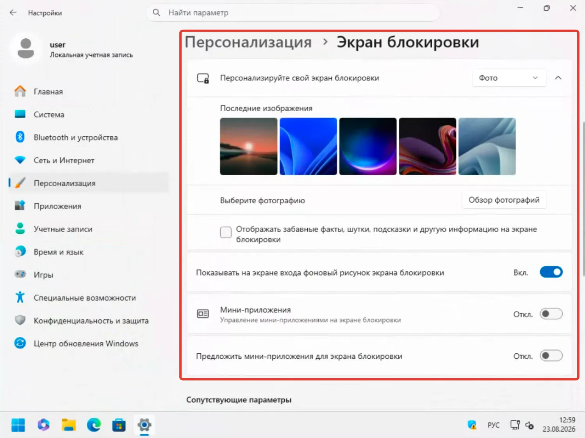
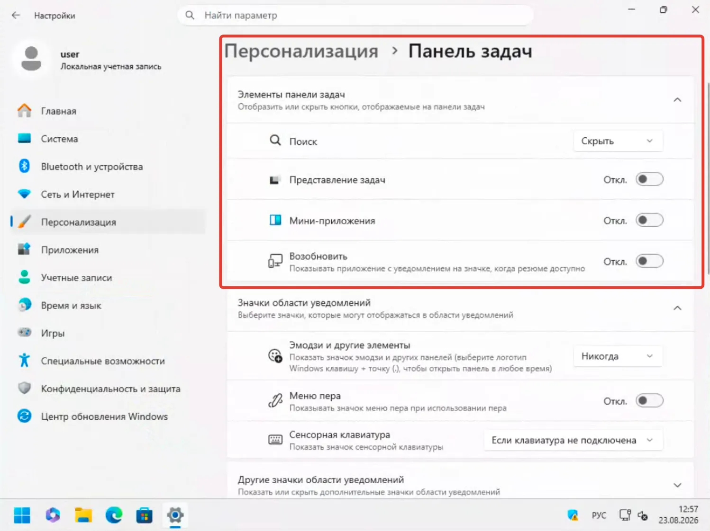
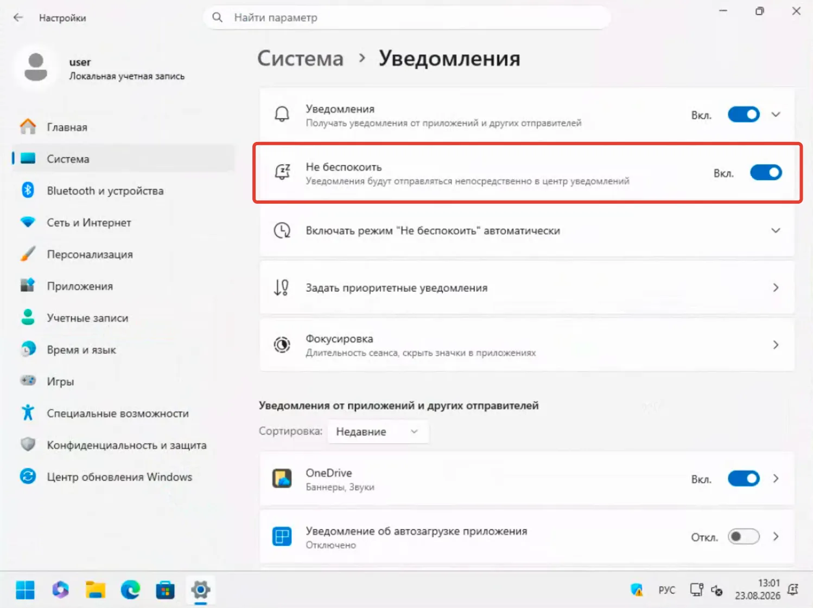
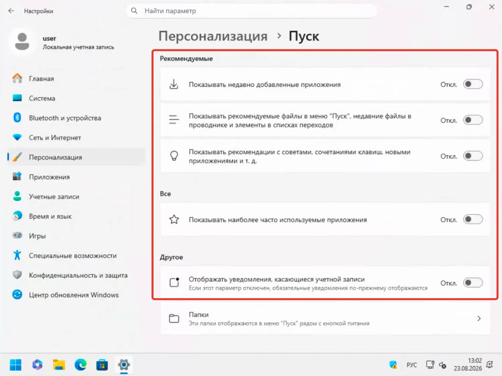
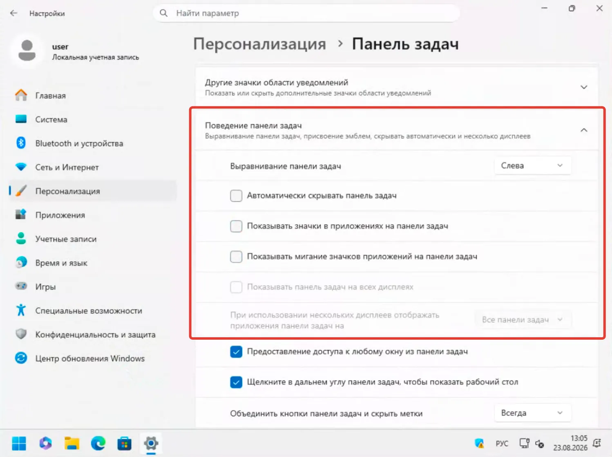
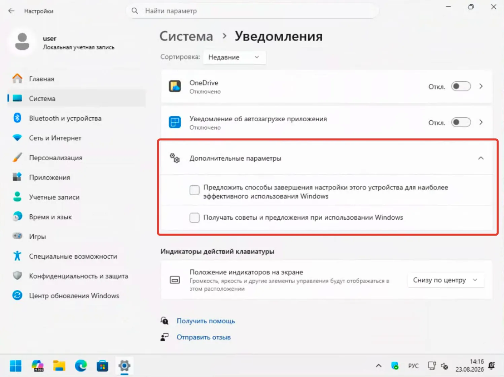
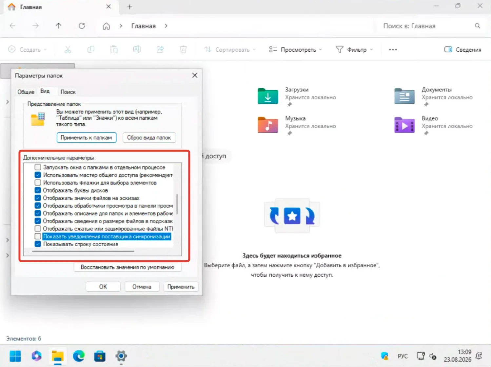

После чистой установки Windows 11 я не бросаюсь сразу ставить программы. Сначала прохожусь по настройкам самой системы.

Причина простая: Windows 11 умеет не только запускать приложения и управлять железом. Она ещё показывает новости, рекомендации, уведомления, советы, виджеты и предложения Microsoft.

Каждая функция сама по себе может быть полезной. Но вместе они превращают рабочий стол в место, где постоянно что-то происходит.

Мне от Windows нужно другое: запустил компьютер — и работаешь. Система должна напоминать о себе только тогда, когда действительно есть причина.

Поэтому есть несколько настроек, которые я меняю практически после каждой установки.

## 1. Убираю виджеты с экрана блокировки

Экран блокировки для меня — это промежуточный экран перед входом в систему.

На нём достаточно видеть время, дату и способ входа.

В Windows 11 на экран блокировки можно вывести виджеты с погодой и другой информацией. Microsoft прямо называет их способом получать актуальные сведения без разблокировки компьютера.

Мне эта идея не подходит.

Если я хочу узнать погоду — открою приложение. Если нужно посмотреть новости — сам выберу источник. Получать ленту информации ещё до входа в Windows мне незачем.

### Как отключить

Откройте:

**Параметры → Персонализация → Экран блокировки**

В разделе с виджетами отключите их отображение.

Заодно я меняю динамический Windows Spotlight на обычную фотографию.

Spotlight может показывать не только изображения, но и дополнительный динамический текст, сведения и предложения.

Если нужен максимально спокойный экран блокировки, выбираю **Фото** и указываю собственную картинку.

## 2. Убираю кнопку «Виджеты» с панели задач

Виджеты я отключаю не потому, что они бесполезны.

Просто мне не нужен ещё один источник информации, который постоянно находится перед глазами.

Windows позволяет убрать Widgets с панели задач. При этом сама панель виджетов никуда не исчезает — её по-прежнему можно открыть сочетанием **Win + W**.

То есть получается нормальный компромисс: функция остаётся, но не занимает место на панели.

О том, какие ещё настройки панель задач получит в обновлении 26H2, я писал отдельно: [Microsoft возвращает настройки панели задач в Windows 11](https://trick32.ru/articles/taskbar-settings-windows-11/).

### Где отключить

Откройте:

**Параметры → Персонализация → Панель задач**

Найдите раздел с элементами панели задач и выключите **Виджеты (мини-приложения)**.

Название отдельных пунктов может немного меняться после обновлений Windows 11.

Я предпочитаю именно такой вариант.

Не удалять функцию и не лезть в реестр, а просто убрать её с глаз.

## 3. Перестаю получать баннеры от всего подряд

Одна из самых раздражающих вещей после установки Windows — всплывающие уведомления.

Новое письмо.

Обновление приложения.

Предложение что-то настроить.

Напоминание.

Сообщение от Microsoft.

Ещё одно сообщение.

Потом ещё одно.

При этом важные уведомления легко теряются среди второстепенных.

Windows позволяет отключать уведомления отдельно для каждого приложения и выбирать, показывать ли баннеры, оставлять ли сообщения в центре уведомлений и воспроизводить ли звук.

Я обычно начинаю с режима **Не беспокоить**.

Открываю:

**Параметры → Система → Уведомления**

и включаю **Не беспокоить**.

При этом уведомления не пропадают. Большинство из них просто не показываются баннерами и остаются в центре уведомлений. Для нужных приложений можно настроить приоритетные уведомления.

Это важное отличие.

Я не запрещаю системе сообщать мне о событиях. Я запрещаю ей прерывать меня в случайный момент.

## 4. Привожу меню «Пуск» в порядок

После установки Windows 11 открываю «Пуск» и вижу приложения, недавно добавленные программы и различные рекомендации.

Мне от этого блока пользы мало.

Я запускаю программы через поиск или закреплённые значки. Недавние документы Windows тоже не нужны мне в каждом открытии меню «Пуск».

Microsoft сама предусматривает настройку содержимого «Пуска»: можно управлять недавно добавленными приложениями, недавно открытыми элементами и другими блоками.

### Что я меняю

Захожу в:

**Параметры → Персонализация → Пуск**

И отключаю всё, чем не пользуюсь.

В частности, скрываю недавно добавленные приложения и недавно открывавшиеся элементы, если они мне мешают.

В обновлении 26H2 меню «Пуск» станет ещё гибче — [разбирал эти изменения отдельно](https://trick32.ru/articles/menyu-pusk-windows-11-26h2/).

Здесь нет универсального рецепта.

Если вы постоянно открываете последние документы через «Пуск», отключать этот блок не нужно.

Мой принцип проще: оставляю только то, чем пользуюсь.

## 5. Убираю счётчики с панели задач

Красная точка на значке почты.

Цифра на мессенджере.

Значок с напоминанием.

Кажется, что это мелочи. Но такие мелочи отлично умеют вытаскивать человека из текущей задачи.

Windows называет эти элементы badges — эмблемами или счётчиками на кнопках приложений. Они показывают, что в программе есть активность, требующая внимания.

Я отключаю их.

### Как это сделать

Щёлкните правой кнопкой мыши по панели задач и откройте **Параметры панели задач**.

Перейдите к **Поведениям панели задач**.

Отключите пункт **Показывать значки в приложениях на панели задач**.

В некоторых сборках Windows название может отличаться.

Есть ещё одна похожая функция — мигание значков на панели задач. Windows может подсвечивать приложение, если ему требуется внимание. Её тоже можно отключить, если вы хотите максимально спокойную панель задач.

## 6. Отключаю советы Windows

Есть отдельная категория уведомлений, которую я почти никогда не хочу видеть.

Это советы самой Windows.

Система предлагает попробовать новую функцию, закончить настройку компьютера или посмотреть, что нового появилось после обновления.

Один раз такое сообщение может быть полезным.

Через несколько месяцев работы — уже нет.

В Windows 11 соответствующие параметры находятся в:

**Параметры → Система → Уведомления → Дополнительные параметры**

Microsoft позволяет отключить показ приветственного интерфейса после обновлений и входа в систему, а также советы и рекомендации во время работы.

Я снимаю эти параметры.

Особенно после чистой установки.

Windows уже установлена. Я уже знаю, что это Windows.

## 7. Запрещаю Проводнику показывать уведомления поставщиков синхронизации

А вот этот пункт многие вообще не замечают.

Проводник Windows может показывать уведомления от поставщиков синхронизации.

На компьютере с OneDrive подобные сообщения могут быть связаны с синхронизацией и предложениями сервиса.

Я предпочитаю, чтобы Проводник занимался файлами.

Не рекламой облачного хранилища.

Не предложениями оформить подписку.

Не напоминаниями о сервисах.

### Где отключить

Откройте Проводник сочетанием:

**Win + E**

Нажмите кнопку с тремя точками → **Параметры**.

Перейдите на вкладку **Вид**.

Найдите пункт:

**Показывать уведомления поставщика синхронизации**

и отключите его.

После этого нажмите **Применить** и **ОК**.

## Почему я не отключаю всё подряд

Здесь есть важный момент.

Я не сторонник идеи «после установки Windows нужно вырубить половину системы».

У Windows 11 есть функции, которыми я пользуюсь.

Мне нужны Windows Update, поиск, Защитник Windows, история буфера обмена, уведомления от некоторых программ и интеграция с облаком там, где она действительно помогает.

Проблема начинается не с наличия функции.

Проблема начинается тогда, когда функция сама требует внимания.

Например, уведомления от рабочего мессенджера я оставлю. А предложение Microsoft попробовать какой-нибудь сервис — нет.

Разница простая: первое связано с моей работой, второе пытается изменить моё поведение.

## Есть ещё один полезный уровень настройки

Я бы не стал отключать все уведомления глобально.

Лучше пройтись по списку отправителей в:

**Параметры → Система → Уведомления**

и оставить баннеры только тем программам, от которых действительно нужно узнавать о событии сразу.

Windows позволяет настраивать каждый источник отдельно: баннеры, центр уведомлений, звук и другие параметры.

Например:

**Telegram** — оставить.

**Почта** — оставить.

**Календарь** — оставить.

**Браузер** — сильно ограничить.

**Магазин** — отключить.

**Игровые сервисы** — отключить, если ими не пользуюсь.

Получается не «тихая Windows», а Windows, которая говорит только по делу.

## Моя настройка Windows после установки

В итоге получается довольно простой принцип.

Я убираю с глаз всё, что не связано непосредственно с работой:

* виджеты с экрана блокировки;
* кнопку Widgets с панели задач;
* лишние баннеры;
* рекомендации в «Пуске»;
* счётчики на значках;
* советы Windows;
* уведомления поставщиков синхронизации в Проводнике.

При этом сами функции не обязательно удаляются.

Виджеты по-прежнему доступны через **Win + W**.

Центр уведомлений продолжает работать.

Приложения могут отправлять сообщения.

Проводник остаётся Проводником.

Я просто убираю постоянные напоминания о том, что всё это существует.

Для рабочего компьютера мне такой подход подходит лучше.

Windows должна быть инструментом, а не ещё одним источником информационного шума.

И если после установки системы я могу спокойно открыть рабочий стол и несколько часов вообще не вспоминать о Windows — значит, настройки сделаны правильно.
