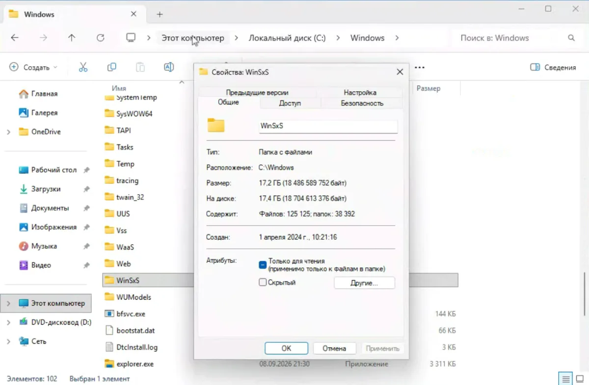
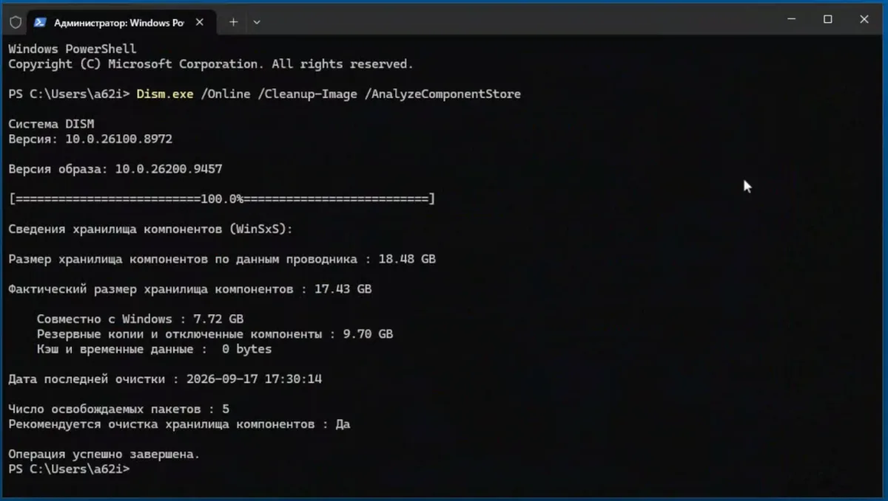
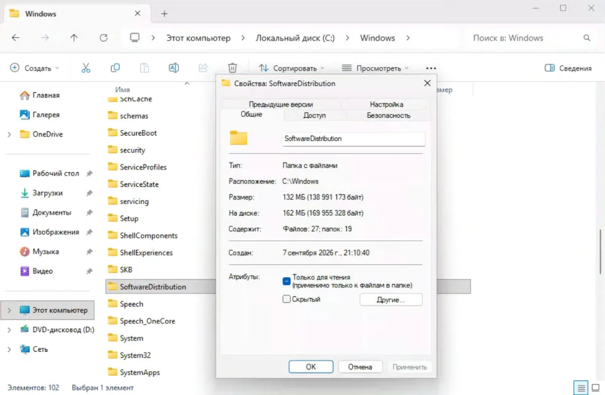
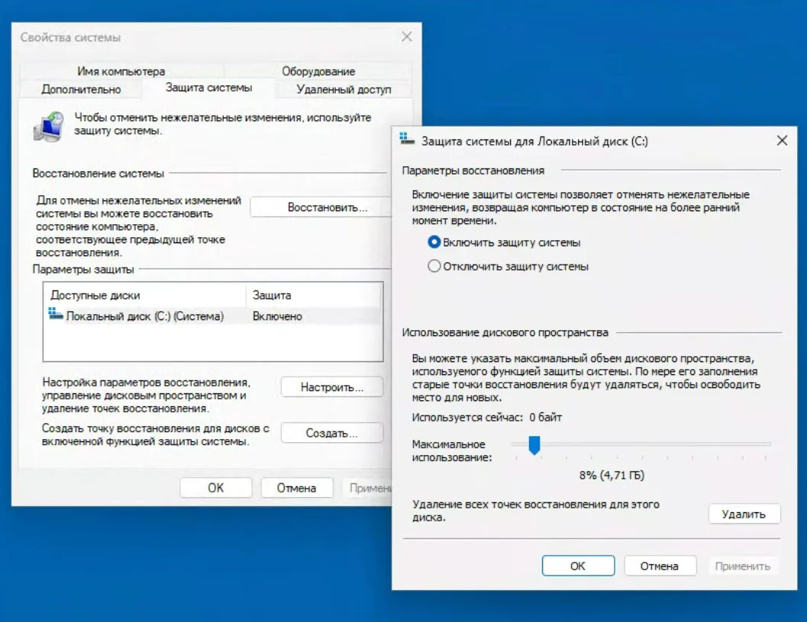
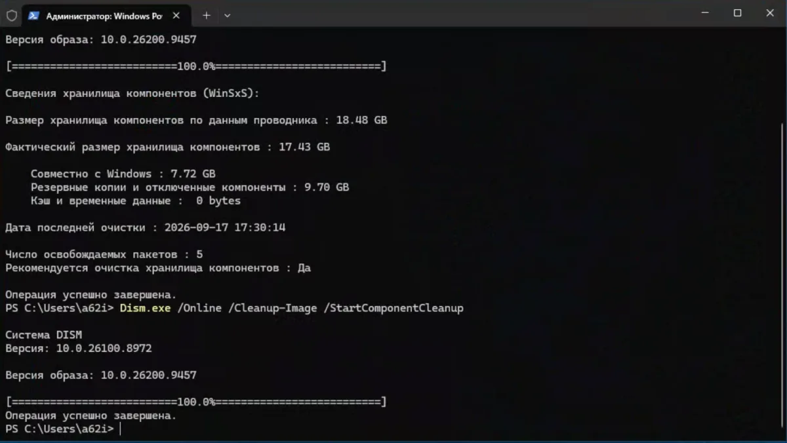
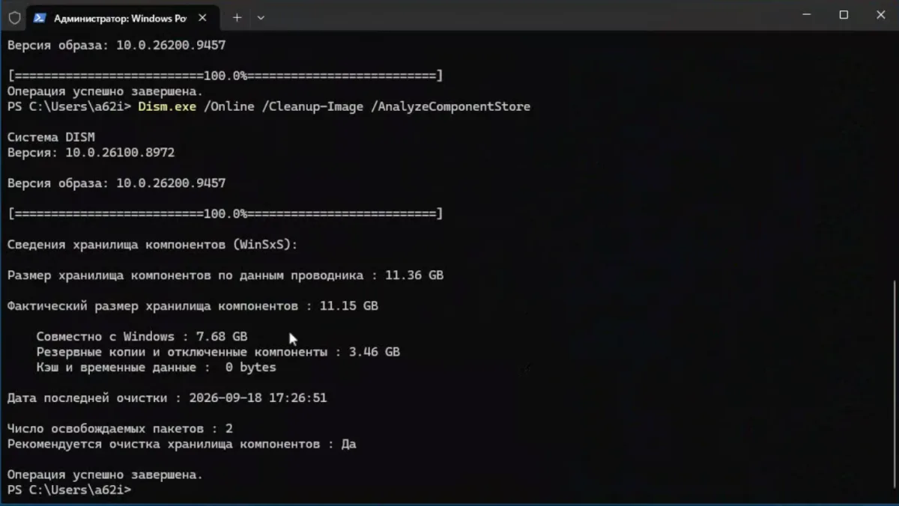
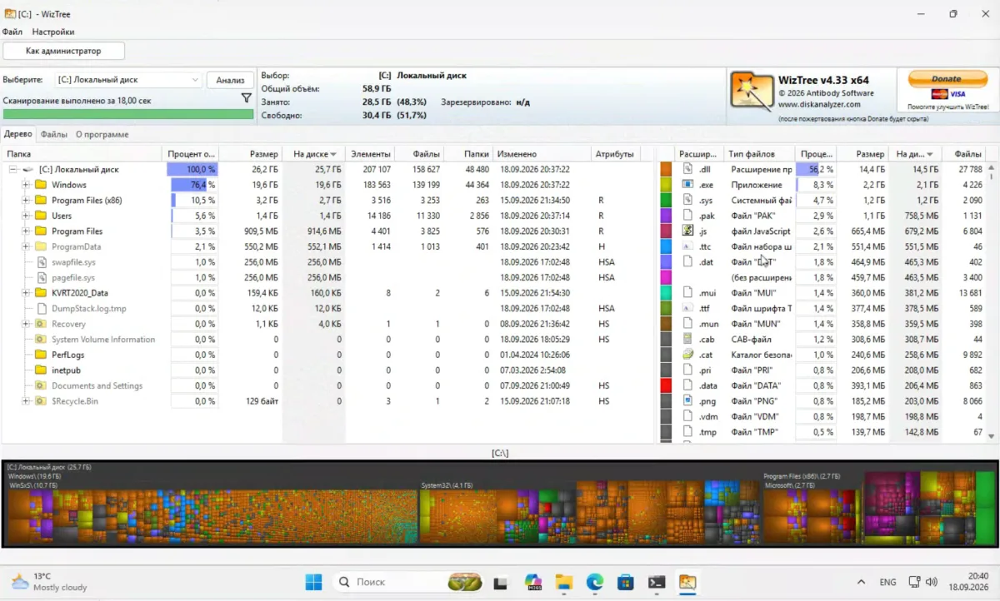

Системный диск на моей машине — всего 59 ГБ. Свободно 28, занято 31. Вроде не красный, но на таком объёме каждые десять гигабайт на счету. Открываю свойства `C:\Windows\WinSxS` — 17,2 ГБ, 125 тысяч файлов. Больше половины занятого места — одна папка. Сколько вообще занимает Windows 11 целиком и куда уходит остальное, я разбирал отдельно — [реальные цифры по месту](https://trick32.ru/articles/skolko-mesta-zanyimaet-windows-11-realnye-cifry/), и там цифра заметно скромнее.

Дальше проверяю каждого подозреваемого по очереди, со скриншотами с этой же машины (Windows 11 25H2, сборка 26200.9457). Двое оказались невиновны, третий отдал гигабайты — но меньше, чем пообещал счётчик. Дальше — честный баланс до последнего мегабайта.

## Подозреваемый первый: WinSxS. Проводник считает не то

Свойства папки говорят 17,2 ГБ. Но в WinSxS почти нет «своих» файлов — там жёсткие ссылки на файлы, физически живущие в других местах системы. Проводник считает каждую ссылку отдельным файлом, и цифра в свойствах всегда завышена.



Реальный расклад показывает только анализ хранилища компонентов. Команда от администратора:

```cmd
Dism.exe /Online /Cleanup-Image /AnalyzeComponentStore
```

Результат такой: по данным Проводника — 18,48 ГБ, фактический размер — 17,43 ГБ. Из них совместно с Windows — 7,72 ГБ (это трогать нельзя в принципе), резервные копии и отключённые компоненты — 9,70 ГБ, кэш — ноль. Последняя очистка — вчера, пакетов к освобождению — 5, чистка рекомендуется.



Вот она, настоящая находка: 9,70 ГБ старых версий компонентов. Всё остальное в этом деле — фон.

## Подозреваемый второй: кэш обновлений. Невиновен

Папка `C:\Windows\SoftwareDistribution` — рабочая область службы Windows Update, туда скачиваются пакеты. На моей машине в ней 132 МБ и 27 файлов. Создана 7 сентября — свежая, худая, ни при чём.



Для порядка — официальная процедура Microsoft, если у вас там гигабайты, а не мегабайты: остановить службы, вычистить содержимое, запустить обратно.

```cmd
net stop wuauserv
net stop bits
```

Удалить всё содержимое `C:\Windows\SoftwareDistribution` (саму папку не трогаем), затем:

```cmd
net start wuauserv
net start bits
```

У Microsoft это шаг, которым лечат зависшие обновления, а не еженедельный ритуал. Чистить стоит, когда папка разрослась без причины или обновления висят с ошибками.

## Подозреваемый третий: точки восстановления. Тоже мимо

Защита системы включена, лимит — 8% диска (4,71 ГБ). А используется — 0 байт. Точек нет, есть пустой резерв.



Проверяется через `systempropertiesprotection.exe` → «Настроить», ровный лимит в цифрах задаёт команда:

```cmd
vssadmin resize shadowstorage /for=C: /on=C: /maxsize=5%
```

Здесь кстати своевременная деталь: начиная с Windows 11 26H2 восстановление по точкам включается по умолчанию на домашних устройствах (лимит 2% диска, живут точки около трёх суток). Осенью лимит появится сам — лучше выставить его осознанно заранее.

## Чистка: DISM пообещал −6,3, диск выдал +2,5

Остался единственный реальный резерв — 9,70 ГБ бэкапов в WinSxS. Удалять папку или файлы руками запрещено: система может перестать загружаться. Легальный путь — DISM без грейс-периода планировщика:

```cmd
Dism.exe /Online /Cleanup-Image /StartComponentCleanup
```

Чистка отработала — и повторный анализ показал: фактический размер 11,15 ГБ, бэкапы ужались с 9,70 до 3,46 ГБ. По счётчику DISM — минус 6,28 ГБ.





А свойства диска показали другое: было свободно 30 088 687 616 байт (28,0 ГБ), стало 32 633 655 296 (30,3 ГБ). Прирост — 2 544 967 680 байт, то есть +2,5 ГБ. DISM говорит «ушло 6,3», диск говорит «пришло 2,5». Оба правы: первый считает уменьшение хранилища, второй — свободные кластеры после встречных записей системы.

## Баланс: куда делись остальные

Замеряю встречные записи. Кэш обновлений за время чистки подрос со 132 до 213 МБ (+81 МБ — перекачался). Журналы CBS — 118 МБ размером, 39,9 МБ на диске (система сжимает свои же логи). Вместе — около 0,2 ГБ. Точки восстановления исключены дважды: `vssadmin list shadows` пуст, а в WizTree `System Volume Information` — ноль.

Сам WizTree, читающий MFT напрямую, дал третью независимую цифру WinSxS — 10,7 ГБ (Проводник говорил 17,2, DISM — 11,15). Три линейки — три результата, и самый честный про занятые кластеры — у MFT. Заодно скан показал, что 56,2% всех файлов диска — `.dll` (14,4 ГБ): место съедают компоненты, а не «мусор». И ещё одна строка из того же скана: занято 28,5 ГБ при сумме файлов 25,7 ГБ — разница ~2,8 ГБ сидит в служебном (MFT, журналы, резерв), вне файлов вообще.



Итоговый баланс: DISM −6,28 / диск +2,55 / встречные и служебные ~3,7 (0,2 замерено напрямую, ~2,8 — служебные структуры, остаток — фоновый шум системы). До мегабайта не сойдётся никогда: три счётчика меряют разное. Но порядок величин теперь объяснён весь.

Служебные структуры, впрочем, не единственный скрытый потребитель места. На дисках поменьше десятки гигабайт умеет отъедать файл гибернации — что это и можно ли его отключить, я разбирал отдельно: [файл hiberfil.sys](https://trick32.ru/articles/hiberfil-sys-windows-11-zachem-nuzhen-i-stoit-li-otklyuchat/).

Честная оговорка напоследок: DISM после чистки всё равно пишет «рекомендуется очистка: Да», осталось 2 пакета. Часть компонентов удалить нельзя, пока они нужны системе.

## При чём тут осеннее обновление

Для всех на 24H2 и 25H2 переход на 26H2 — это пакет включения около 174 КБ (KB5121794): код уже приехал с накопительными обновлениями, нужна одна перезагрузка. Полные ~6,5 ГБ грозят только тем, кто сидит на 23H2 и старше или на Windows 10. Точной даты выхода Microsoft не называла, ориентир — осень. Если ваш диск тоже на 59 ГБ, как мой, — чистка перед осенью обязательна именно вам. А как пройти обновление без сюрпризов, включая неподдерживаемый ПК, — [как избежать проблем при обновлении до 26H2](https://trick32.ru/articles/windows-11-26h2-kak-izbezhat-problem-pri-obnovlenii/).

## Вывод

В итоге из 31 ГБ занятого — 17 отдавал WinSxS. Из них 9,7 — старые версии компонентов. Кэш обновлений (132 МБ) и точки восстановления (0 байт) оказались ни при чём — и это нормально: проверять надо всех, чистить — виновного. Порядок один: `AnalyzeComponentStore`, чистка содержимого SoftwareDistribution при показаниях, DISM, лимит теней.
