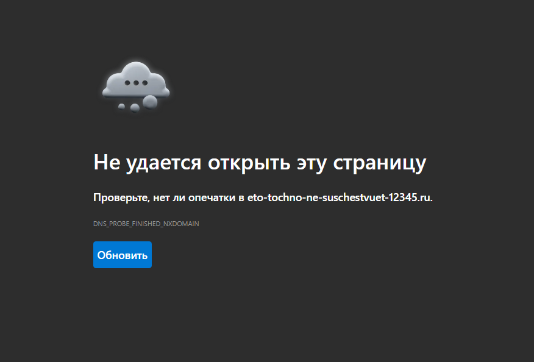
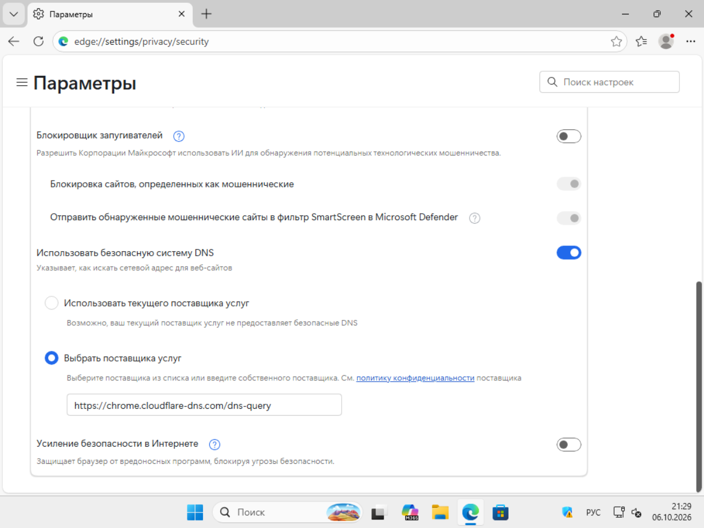
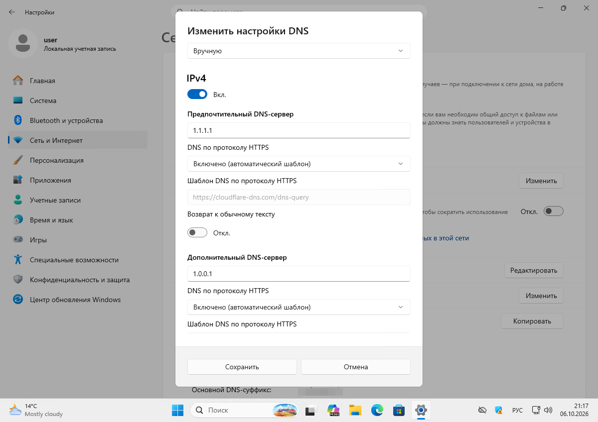
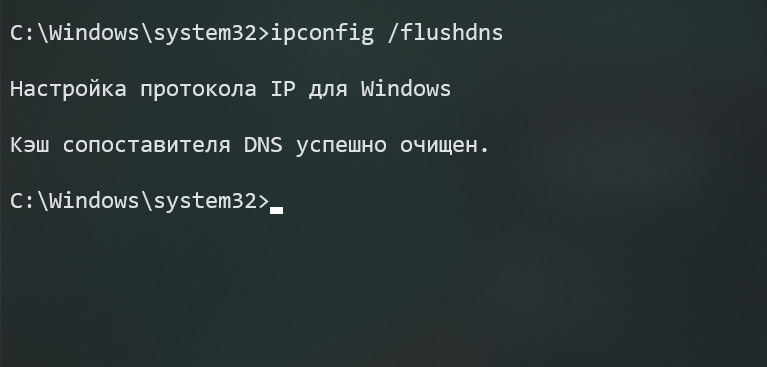

Интернет работает, а Edge не открывает сайт и показывает `DNS_PROBE_FINISHED_NXDOMAIN`. Короткий ответ: **сначала проверьте, открывается ли сайт в другом браузере**. Если да — виноват Secure DNS внутри Edge, лечится за минуту на странице `edge://settings/privacy/security`. Если нет — правится системный DNS в параметрах Windows 11.

## Что значит ошибка

Браузер не смог превратить имя сайта в IP-адрес: DNS-сервер ответил, что такого имени нет (NXDOMAIN), или не ответил вовсе. Важно: **это диагноз «не нашёл адрес», а не «нет интернета»**. Мессенджеры и уже открытые вкладки при этом могут работать.

Отдельно: несуществующий адрес (набор случайных символов) даст эту ошибку всегда и в любом браузере — это нормально, а не поломка. Баг — когда **реальные сайты** не открываются.



## Шаг 0. Локализация: один браузер или все

Откройте тот же сайт в другом браузере (Chrome, Firefox) и откройте в Edge любой другой известный сайт.

| Симптом | Где чинить |
|---|---|
| Не работает только Edge, в Chrome открывается | Secure DNS в Edge (раздел ниже) |
| Не работает везде, ни один сайт | Системный DNS Windows 11 |
| Не работает один конкретный сайт везде | Проблема на стороне сайта или провайдера, ПК ни при чём |

Дальше — по своей строке. Не выполняйте всё подряд.

## Случай 1. Ошибка только в Edge: Secure DNS

### Механика

В Edge есть собственный **Secure DNS** — шифрование DNS-запросов через HTTPS (DoH). Если в нём выбран конкретный провайдер, а тот недоступен или не резолвит домен, Edge показывает `DNS_PROBE_FINISHED_NXDOMAIN`, хотя системный DNS в порядке. Именно поэтому Chrome при тех же настройках Windows работает.

### Решение

1. Откройте в Edge адрес `edge://settings/privacy/security`.
2. Найдите блок **«Использовать безопасную систему DNS»**.
3. Выберите один из трёх вариантов:
   - выключить переключатель полностью;
   - **«Использовать текущего поставщика услуг»** — отдать резолвинг системному DNS;
   - оставить включённым, но **сменить провайдера** (в списке: Cloudflare, Google Public DNS, OpenDNS, CleanBrowsing, NextDNS).



После смены настройки браузер, как правило, соединяется сразу, без перезапуска.

### Нюанс про двойную конфигурацию

Не держите одновременно разные DoH-провайдеры в Windows и в Edge без необходимости: у автора материала системный шаблон Cloudflare (`https://cloudflare-dns.com/dns-query`) плюс отдельный шаблон в Edge (`https://chrome.cloudflare-dns.com/dns-query`). Такая связка затрудняет диагностику — при ошибке непонятно, какое звено сломалось. Оставьте DoH в одном месте.

## Случай 2. Ошибка везде: системный DNS Windows 11

### Смена DNS-сервера

1. Откройте **Параметры → Сеть и Интернет → Ethernet** (или Wi-Fi).
2. В строке **«Назначение DNS-сервера»** нажмите **Изменить**.
3. Переключите на **Вручную**, включите IPv4 и впишите:
   - предпочитаемый: `1.1.1.1`;
   - дополнительный: `1.0.0.1`.
4. Назначение IP при этом оставьте **автоматическим (DHCP)** — вручную задаётся только DNS.
5. Сохраните.



Публичные резолверы Cloudflare (`1.1.1.1` / `1.0.0.1`) использованы здесь как пример; подойдёт и Google `8.8.8.8` / `8.8.4.4`. Для России запасной вариант — Яндекс `77.88.8.8` и `77.88.8.1`: резолвер внутри страны, доступен стабильно. При желании включите **DNS по протоколу HTTPS** с автоматическим шаблоном — Windows подставит его сама.

### Очистка кэша DNS

Старая запись может сидеть в кэше даже после смены сервера. Очистка:

```
ipconfig /flushdns
```

Успешный вывод: «Кэш сопоставителя DNS успешно очищен».



Команда выполняется в обычной командной строке, права администратора не нужны (на кадре окно администратора — подойдёт и обычное).

## Если не помогло

1. Перезагрузите роутер (отключите питание на 30 секунд).
2. Проверьте тот же сайт с телефона через мобильный интернет: открывается — проблема у домашнего провайдера, звоните ему.
3. Проверьте, не лежит ли сам сайт (даундетекторы, кэш поисковика).
4. Временно отключите VPN и сторонний антивирус с веб-фильтром — они подменяют DNS.

А если барахлит не отдельный сайт, а весь интернет целиком — тормозит, рвётся, трафик утекает непонятно куда, — посмотрите разбор, [как найти фоновые приложения, которые жрут Wi-Fi](/articles/fonovye-prilozheniya-zhrut-wi-fi-kak-ostanovit/).

## FAQ

**Ошибка появилась после обновления Edge — это оно?**
Возможно: обновление могло включить или переключить Secure DNS. Начните со случая 1 — это самая быстрая проверка.

**Менять DNS в Windows или в Edge — что правильнее?**
Одно место, не оба. Если пользуетесь системным DoH Windows — отдайте Edge «текущего поставщика услуг». Если системный DNS не трогали — проще переключить провайдера в Edge.

**Безопасно ли ставить 1.1.1.1?**
Это публичный резолвер Cloudflare. DNS-запросы уходят ему вместо серверов провайдера — учитывайте, если для вас это важно.

**Несуществующий адрес тоже даёт NXDOMAIN — у меня баг?**
Нет. Случайный ненастоящий домен не резолвится по определению. Тестируйте на реальных сайтах.

