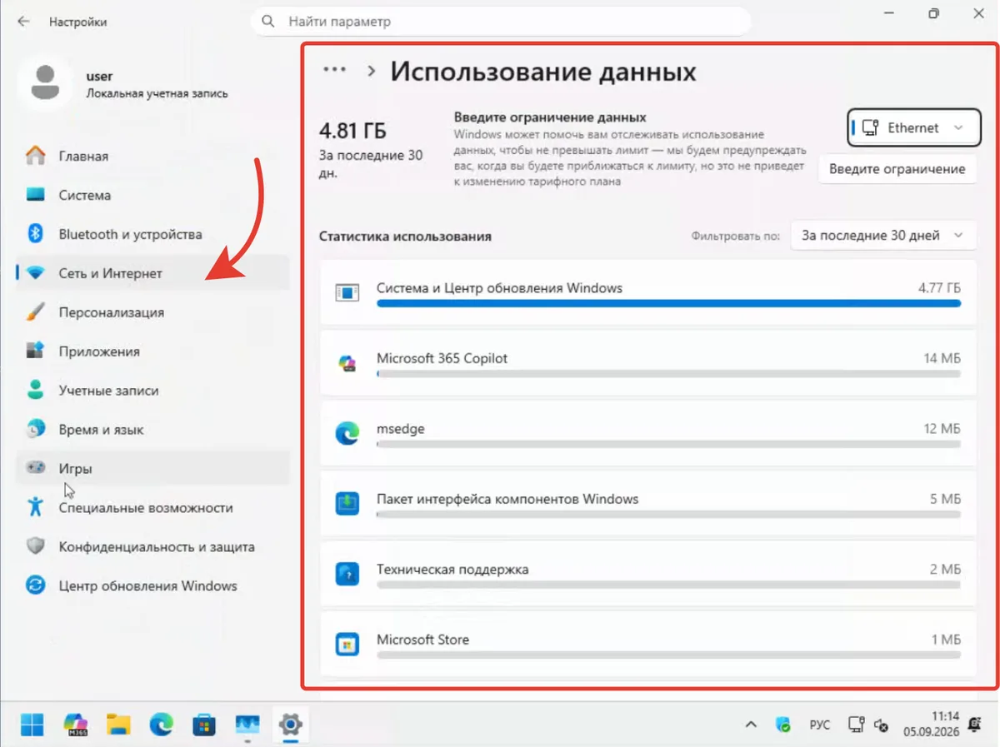
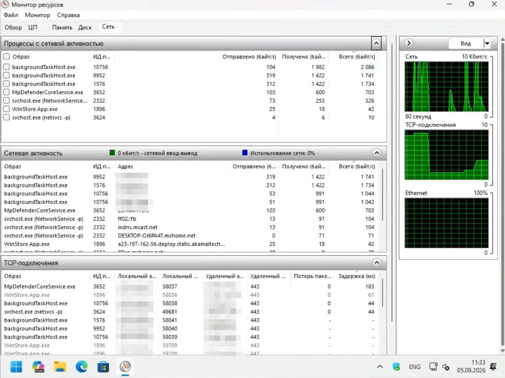
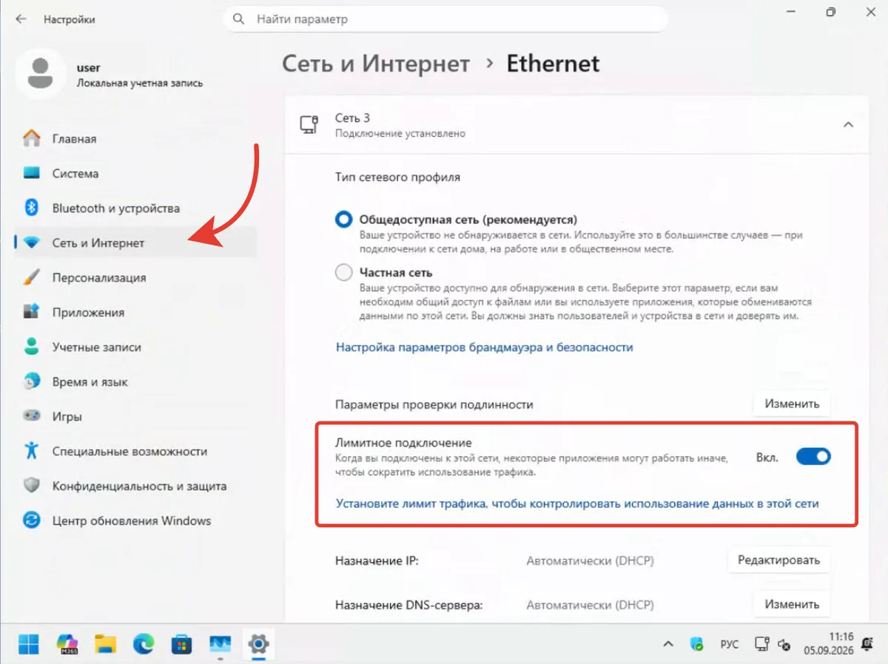
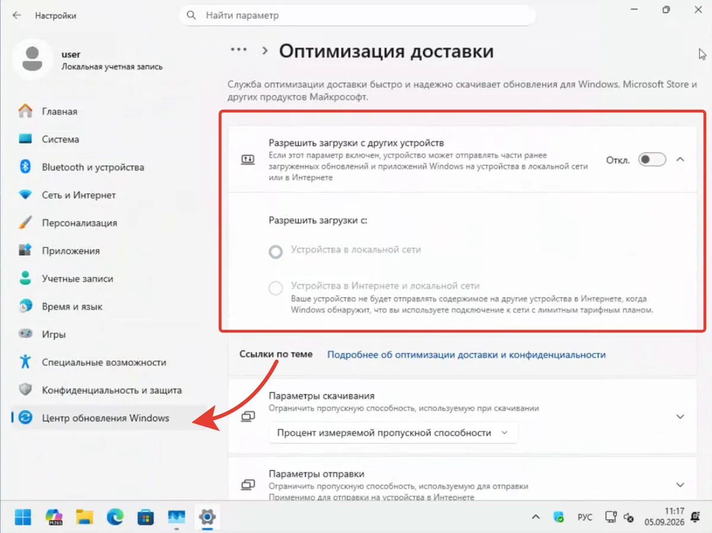
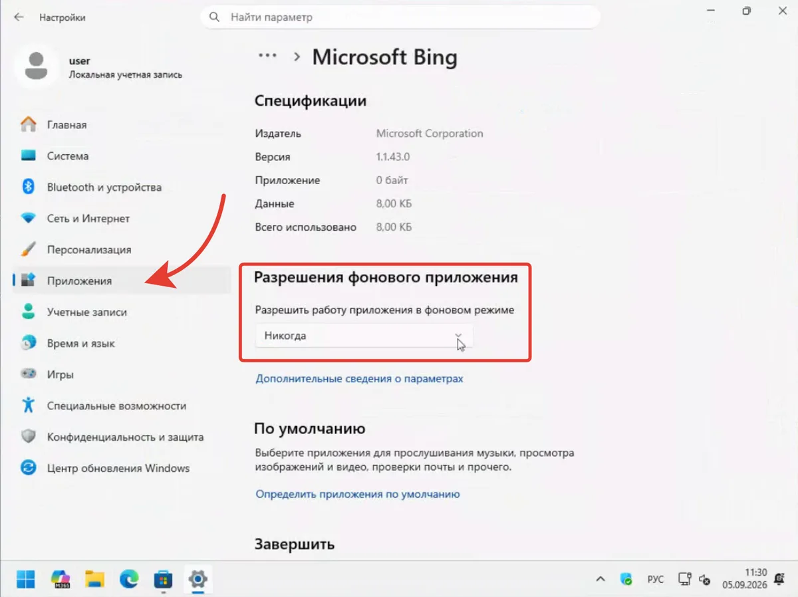

Скорость по договору 300 Мбит, а YouTube крутит 480p и заикается. Знакомо?

Чаще виноват не провайдер. Windows и десяток программ качают в фоне: обновления, облака, телеметрия, магазин. Делают это тихо, без окна и без спроса. Пока вы читаете почту, они уже съели гигабайт.

Я покажу, где за три клика увидеть, кто жрёт Wi-Fi прямо сейчас, и как отключить лишнее без вреда системе.

## Сначала, кто виноват прямо сейчас

Не гадайте. Откройте счётчик.

**Диспетчер задач → Процессы → Сеть.** Нажмите на заголовок `Сеть`, чтобы отсортировать по трафику. Сразу видно, кто качает в эту секунду: `Service Host: Delivery Optimization`, `OneDrive`, `Microsoft Store`, `Teams`.

Хотите цифру за месяц: `Параметры → Сеть и Интернет → Использование данных` (в сборках до 24H2 — через `Дополнительные параметры сети → Использование данных`). Там список за последние 30 дней в мегабайтах. У меня на чистом ноутбуке за неделю без торрентов лидером оказалось `Система и Центр обновления Windows`: 4,77 ГБ. Это и есть обновления и доставка.

*Рис. 2. Параметры → Сеть и Интернет → Использование данных: лидер — Система и Центр обновления Windows (скрин с вашего ПК — 4,81 ГБ)*

Ещё точнее: `Win + R → resmon` (Монитор ресурсов) → вкладка `Сеть` → `Сетевые процессы`. Видно каждый процесс, его адрес и скорость. Держите окно открытым минуту, картина станет честной.

*Рис. 1. Монитор ресурсов → Сеть: backgroundTaskHost и MpDefenderCoreService на моём ПК — основные потребители*

Запомните тройку лидеров. С ними и работаем.

## Что жрёт чаще всего

**1. Центр обновления и Delivery Optimization.** Windows качает патчи сама и ещё раздаёт их соседям по сети и интернету. Это и есть `Доставка`. Гигабайты уходят и на вход, и на отдачу.

**2. OneDrive.** Даже если вы им не пользуетесь, он проверяет каждый файл в папке `Документы` и гоняет превью в облако. На медленном Wi-Fi это заметно.

**3. Microsoft Store и предустановленные приложения.** `Clipchamp`, `Spotify`, `Candy Crush`: не смешно, но они обновляются сами. Каждое, по 200-400 МБ.

**4. Teams, Outlook, Widgets.** Держат постоянное соединение, тянут статусы, погоду, новости. По отдельности копейки, вместе: постоянный шум.

**5. Телеметрия и «Рекомендации».** `Connected User Experiences`, `Советы Windows`, не много, но льют без пауз.

## Как остановить: без лома

Я не предлагаю резать всё подряд. Отключите лишнее, оставьте нужное.

### 1. Лимитный Wi-Fi, самый честный способ

Для `Ethernet`: `Параметры → Сеть и Интернет → Ethernet → Лимитное подключение → Вкл` (как на скрине). Для `Wi-Fi`: `Параметры → Сеть и Интернет → Wi-Fi → ваша сеть → Свойства → Лимитное подключение → Вкл`. Если готовите систему к крупному обновлению, сначала проверьте лимитное — иначе 26H2 не предложат. 9 шагов подготовки — в [гайде по 26H2 без проблем](/articles/windows-11-26h2-kak-izbezhat-problem-pri-obnovlenii/).

Windows сразу перестаёт качать крупные обновления, Store ставит паузу, OneDrive переходит в экономный режим. Для домашнего тарифа с узким каналом это лучшее решение. На работу не влияет, на трафик: заметно. Минус один: крупные обновления придётся запускать вручную.

*Рис. 3. Сеть и Интернет → Ethernet → Лимитное подключение: Вкл (для Wi-Fi — тот же переключатель в свойствах сети)*

### 2. Обрежьте раздачу обновлений

`Параметры → Центр обновления Windows → Дополнительные параметры → Оптимизация доставки → Разрешить загрузки с других устройств → Откл` (в системе — «устройств», как на скрине, не «ПК»).

Раньше Windows по умолчанию раздавала ваши скачанные патчи всему интернету. Сейчас чаще `Только локальная сеть`, но проверьте. Одна галочка экономит гигабайты отдачи на другие устройства.

*Рис. 4. Центр обновления Windows → Оптимизация доставки: выключаем раздачу*

Чтобы не качать в неудобный момент: там же `Параметры скачивания → Процент измеряемой пропускной способности` или `Дополнительные параметры → Лимит пропускной способности` (название зависит от сборки) — поставьте `10%` в фоне. Обновления дойдут, но Wi-Fi не ляжет.

### 3. OneDrive: пауза или выход

Не пользуетесь, выйдите. Правый клик по значку облака в трее → `Параметры → Учётная запись → Удалить связь с этим ПК`. Папка останется, синхронизация остановится. Как Windows теперь предлагает честный отказ от бэкапа — [разобрал в статье про OneDrive](/articles/windows-11-onedrive-otkaz-ot-rezervnogo-kopirovaniya/).

Пользуетесь: ограничьте: `Параметры OneDrive → Сеть → Ограничить скорость отдачи/загрузки`, поставьте `50 КБ/с` на слабом канале. И снимите `Файлы по запросу`, если постоянно качает превью.

### 4. Фоновые приложения — выключите по списку

`Параметры → Приложения → Установленные приложения → три точки → Дополнительные параметры → Разрешения фонового приложения → Разрешить работу приложения в фоновом режиме → Никогда`.

Пройдите по списку: `Погода`, `Новости`, `Xbox Game Bar`, `Cortana`, `Phone Link` — всё, чем не пользуетесь ежедневно. Не трогайте `Безопасность Windows`, `Проводник`, `Диспетчер задач`.

На старых сборках тот же переключатель был по пути `Параметры → Конфиденциальность и защита → Фоновые приложения` — сейчас основной путь через `Приложения`.

*Рис. 5. Приложения → Установленные приложения → Дополнительные параметры → Разрешения фонового приложения: Никогда*

### 5. Магазин — обновлять только вручную (важно: путь изменился)

Раньше был путь `Microsoft Store → Библиотека → Автообновления → Выкл` — сейчас его нет.

С осени 2025 Microsoft убрала полный выключатель. Теперь: `Microsoft Store → профиль → Параметры магазина → Обновления приложений →` можно лишь **приостановить** на 1–5 недель. После срока Store снова начнёт обновлять сам.

Если нужно обновлять только по кнопке: откройте `Библиотека → Получить обновления → Обновить` вручную раз в неделю. Для полного запрета (не рекомендую без нужды) — только через реестр/политики:
`reg add "HKLM\SOFTWARE\Policies\Microsoft\WindowsStore" /v AutoDownload /t REG_DWORD /d 2 /f` (требует перезагрузки, блокирует автообновления Store).

Предустановленный хлам в любом случае удалите: `Параметры → Приложения → Установленные приложения` — `Spotify`, `Candy Crush`, `Clipchamp` → Удалить. Они больше не проснутся.

### 6. Виджеты, Teams, чат

Виджеты: `Параметры → Персонализация → Панель задач → Виджеты → Выкл`. Минус один постоянный клиент к `msn.com`.

Teams: если не нужен для работы — `Удалить`. Если нужен — `Автозагрузка → Выкл`, запускайте по клику. То же с `Copilot`.

## Что проверить за минуту после настройки

Откройте снова `resmon → Сеть`. Нагрузка на холостом ходу должна упасть до 0-20 КБ/с. Если держится 1-2 Мбит — снова смотрите, кто в топе. Часто это снова `DoSvc` (Delivery Optimization) — перезапустите `Службы → Delivery Optimization → Перезапустить`.

Второй тест: `speedtest.net` до и после. На моём ноутбуке с лимитным Wi-Fi и выключенной раздачей пинг упал с 48 до 19 мс, загрузка перестала проседать при просмотре 4K.

## Мой опыт — где грань

Я держу лимитное подключение на домашнем роутере с 4G и на раздаче с телефона — всегда. На проводном гигабите — выключаю. Раздачу обновлений оставляю `Только локальная сеть` — в квартире три ПК, пусть делятся между собой, но не с интернетом.

OneDrive не сношу — ограничиваю скорость. Фон — режу всё, кроме `Безопасности` и `OneDrive`. Магазин — только вручную.

И главное: не ставьте «ускорители Wi-Fi» из сети. Один переключатель `Лимитное подключение` делает больше, чем пять твикеров. А те ещё и службу `wuauserv` сломают — потом обновления не поставятся без переустановки.

Попробуйте эти шаги и откройте снова `Использование данных` через сутки. Сколько мегабайт ушло у самого прожорливого приложения — и помог ли лимит?