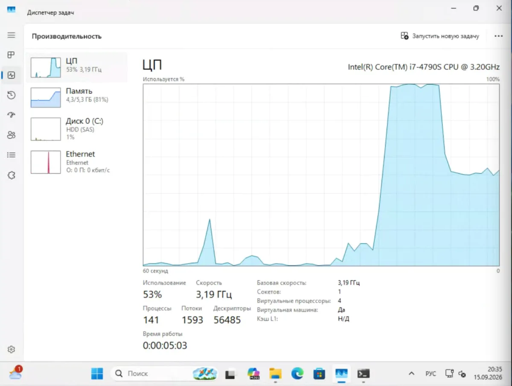
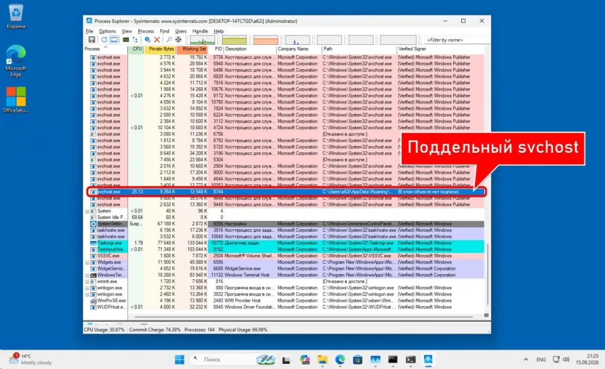
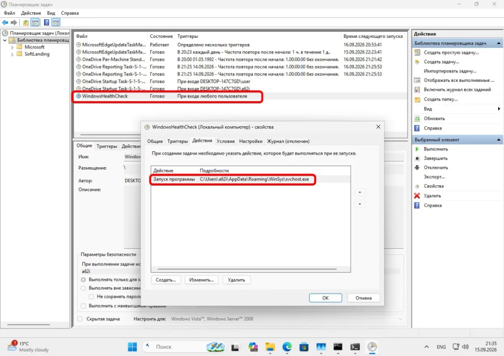
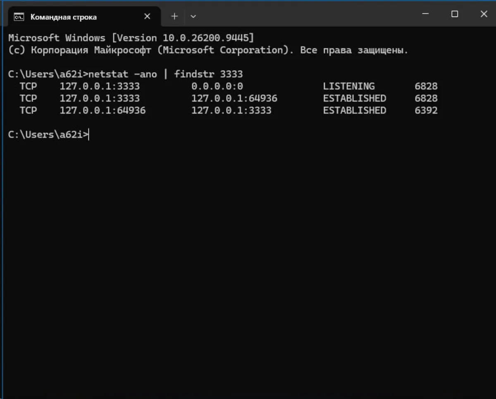
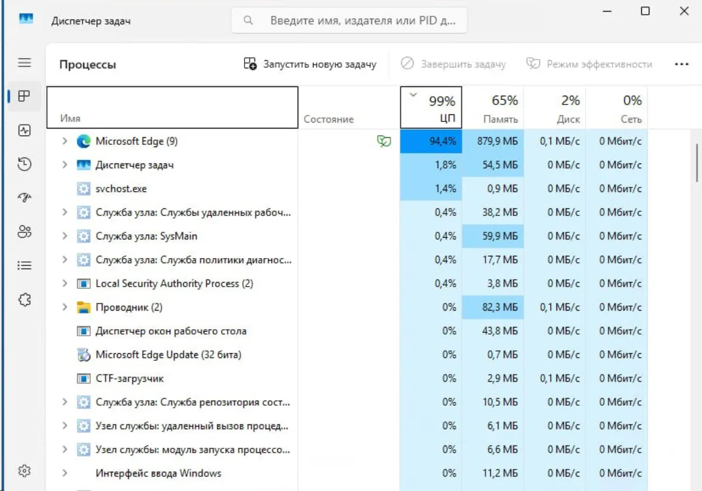
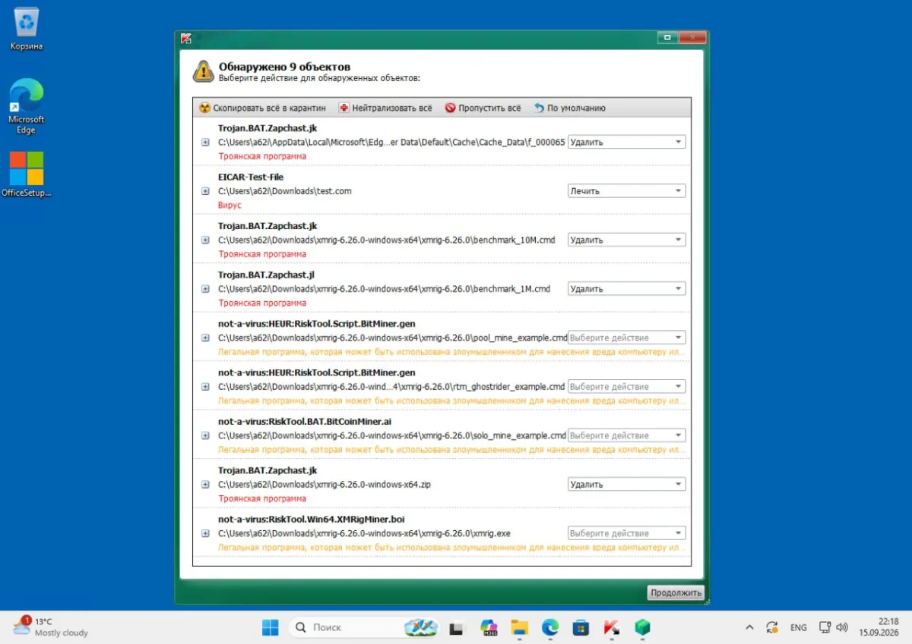

Компьютер тормозит, кулер шумит, корпус горячий, а Диспетчер задач показывает 5% загрузки. Это первый признак скрытого майнера: он делает паузу, когда вы открываете утилиту, и продолжает работу, когда окно закрыто.

Майнер не шифрует файлы и не требует выкуп. Он тихо жжёт процессор и видеокарту ради чужой криптовалюты, а счёт за электричество растёт у вас. Заметить такое заражение сложно: система работает, просто медленнее и горячее обычного.

Разбираю, как найти майнер на Windows 10 и 11 за шесть шагов и что делать, если он не удаляется. Если дело не ограничивается майнером, начните с [общего разбора заражений](/articles/vredonosnye-programmy-kak-najti-i-udalit/).

## Признаки майнера: что должно насторожить

Один признак ничего не доказывает. Два-три одновременно — повод проверять.

* Процессор или видеокарта загружены на 70–100% в простое. Вы не запускали ни игр, ни рендера, а кулеры работают на полную.
* Температура 70–90°C в простое. Нормальный холодный процессор в покое держит 35–50°C.
* Компьютер стал громче и медленнее, но новых программ вы не ставили.
* Диспетчер задач или Монитор ресурсов закрывается сам, зависает или показывает подозрительно ровную нагрузку.
* Счёт за электричество вырос без причины.

Верный признак — **нагрузка падает, когда открываешь Диспетчер задач**. Часть майнеров следит за запуском утилиты и останавливается, чтобы не попасться.



## Почему Диспетчер задач не видит майнер

Когда вы открываете Диспетчер задач, вредонос приостанавливает майнинг и прячется. Вы видите спокойные 5% и делаете вывод, что всё в порядке.

Поэтому смотреть надо не на цифры, а на признаки, которые майнер подделать не может: **путь к файлу, издателя и родительский процесс**.

Первое правило: настоящий `svchost.exe` запускается только из `C:\Windows\System32`, а его родитель — `services.exe`. Если процесс с таким именем живёт в `%AppData%`, `%TEMP%` или `C:\ProgramData` — это майнер.

## Шаг 1. Проверьте процессы через Process Explorer

Диспетчер задач годится только для беглого взгляда. Для проверки нужен **[Process Explorer](https://learn.microsoft.com/ru-ru/sysinternals/downloads/process-explorer)** от Microsoft — входит в набор Sysinternals. Он бесплатный, не требует установки и показывает то, что скрыто в стандартной утилите:

* полный путь к файлу процесса;
* цифровую подпись и издателя;
* родительский процесс — кто запустил этот файл.

Что делать:

1. Запустите Process Explorer от имени администратора.
2. Отсортируйте по столбцу CPU.
3. Посмотрите на процессы без подписи, с путём из `%AppData%`, `%TEMP%`, `C:\ProgramData`.
4. Проверьте `svchost.exe`: путь и родитель должны быть системными.

Красный флаг — процесс с системным именем, но не из `C:\Windows\System32`. Частые маски: `svchost32.exe`, `winlogon32.exe`, `WindowsHost.exe`, `chrome_update.exe`.



## Шаг 2. Проверьте автозагрузку и Планировщик заданий

Майнер должен запускаться сам после перезагрузки, поэтому он оставляет следы в автозапуске. В 2026 году вредонос ставит сразу несколько механизмов закрепления: задачи в Планировщике, ключи в реестре и ярлык в автозагрузке.

* **Планировщик заданий** — нажмите `Win + R`, введите `taskschd.msc`. Ищите задачи, которые запускают `.exe` из `%TEMP%`, `%AppData%` или `C:\ProgramData`.
* **Автозагрузка** — `Ctrl + Shift + Esc`, вкладка «Автозагрузка». Незнакомое имя, пустой издатель, странный путь — повод отключить и проверить.
* **[Autoruns](https://learn.microsoft.com/ru-ru/sysinternals/downloads/autoruns)** — та же утилита Sysinternals, но показывает все точки автозапуска сразу. Неподписанные записи подсвечены.

Удаляйте и задачу, и сам файл, иначе майнер вернётся. И проверьте **watchdog**: второй процесс перезапустит майнер, если убить только первый.



## Шаг 3. Проверьте сетевые соединения

Майнер постоянно стучится на майнинг-пул. Это видно по сети.

Откройте командную строку и выполните:

```
netstat -ano
```

Ищите процесс с множеством исходящих подключений на один адрес. Типичные порты пулов — 3333, 4444, 5555, 14444. Найдите PID процесса в левом столбце и сопоставьте с программой через Process Explorer.



Майнер также может превратить ваш компьютер в прокси — тогда через него идёт чужой трафик. Ещё звоночек: программы закрыты, а исходящий трафик растёт.

## Шаг 4. Проверьте браузерные майнеры

Отдельный случай — майнер, который работает внутри вкладки браузера. Он не устанавливается в систему и живёт, пока открыта страница с пиратским фильмом, торрентом или сомнительным стримом.

Всё просто: откройте Диспетчер задач и отсортируйте процессы по загрузке ЦП. Если браузер держит ядро на 90–100%, хотя открыта одна вкладка, — сайт встроил WebAssembly-майнер. Закрыли вкладку — нагрузка исчезла.



Защита — блокировщик скриптов. Подойдёт [uBlock Origin со списком NoCoin](/articles/ublock-origin-edge-registry-hak-do-2027/), в Brave защита от майнеров включена по умолчанию.

## Шаг 5. Просканируйте систему портативным сканером

Ручная проверка находит явные следы, но не всё. Дальше — сканер, которому не нужна установка:

* **Kaspersky Virus Removal Tool (KVRT)** — разовая проверка без установки;
* **Dr.Web CureIt!** — лечит активные угрозы;
* **MinerSearch** — утилита именно под майнеры: проверяет службы, подписи, задачи и файлы по сигнатурам XMRig, lolMiner, PhoenixMiner.



Ставьте сканер только с официального сайта. Найдёте утилиту по первой ссылке — она и окажется майнером.

## Шаг 6. Если майнер не удаляется

Бывает, что процесс возвращается после удаления. Тогда:

1. Загрузитесь в **безопасный режим** и просканируйте систему вторым сканером.
2. Проверьте точки автозапуска заново — watchdog мог восстановить файл.
3. Если не помогает — **чистая переустановка Windows** с форматированием системного диска. Это гарантированно убирает майнер.

Простой [сброс к заводским настройкам](/articles/sbros-windows-do-zavodskih-nastroek/) помогает не всегда: часть сборок хранит предустановленные вредоносные модули. А вот чистый образ убирает всё.

## Откуда майнер попадает в 2026 году

Главный источник — пиратский софт: сборки Windows, активаторы, кряки, репаки игр. «Лаборатория Касперского» посчитала источники так: пиратский софт — 38%, читы и взломанные игры — 22%, фейковые установщики — 18%, фишинг — 12%, расширения браузера — 6%.

В 2026 году добавились два новых способа:

* **Сайты-двойники популярных утилит.** В мае 2026 Microsoft раскрыла кампанию из более чем 150 сайтов-клонов HWMonitor, CrystalDiskInfo, FurMark и K-Lite Codec Pack. Поддельные ссылки всплывали даже в ответах ИИ-чат-ботов. Вместо утилиты на диск попадает GPU-майнер.
* **Инфостилеры с майнером.** В сентябре 2026 нашли REVSTEALER: он отключает Windows Update и добавляет исключения в Defender, а затем запускает XMRig внутри системных процессов `nslookup.exe` и `svchost.exe`. Основной стилер себя удаляет, но модули остаются и продолжают работать.

Отдельная история — неофициальные сборки Windows. В 2023 году Dr.Web нашла стилер и клипер прямо внутри сборок Windows 10 с торрент-трекера. Вредонос прописался даже в EFI-раздел компьютера. Тогда чистая переустановка не всегда помогала.

## Как не поймать майнер снова

* Не ставьте пиратские сборки, активаторы и кряки. Через [активаторы](/articles/kms-auto-windows-10-11-staryj-sposob-aktivacii/) заражаются чаще всего.
* Ставьте Windows из [оригинального ISO](/articles/skachat-windows-original-iso-microsoft/) с серверов Microsoft.
* Берите программы с официальных сайтов, а не по первой ссылке из поиска или из ответа ИИ. Сверяйте адрес домена.
* Держите включённым Defender с защитой в реальном времени и обновляйте систему.
* Поставьте блокировщик рекламы — он же режет браузерные майнеры.

## Итог

Майнер легко не заметить: он прячется от Диспетчера задач и не мешает работать. Найти его можно за шесть шагов: Process Explorer, автозагрузка и Планировщик, сетевые соединения, браузер, сканер и, если нужно, безопасный режим.

Всё это занимает 15–20 минут. А главная защита — не ставить чужие сборки и активаторы: на пиратский софт и читы приходится больше половины заражений.
