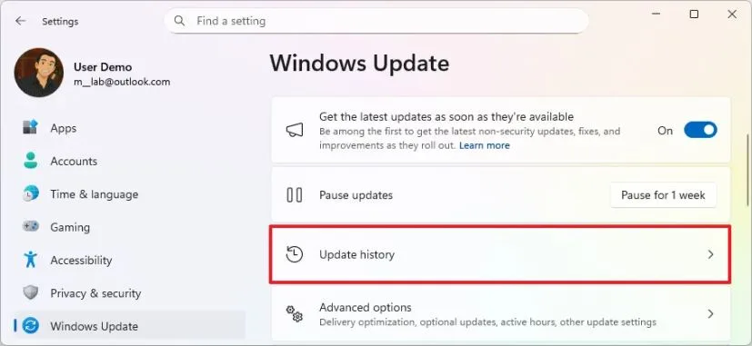
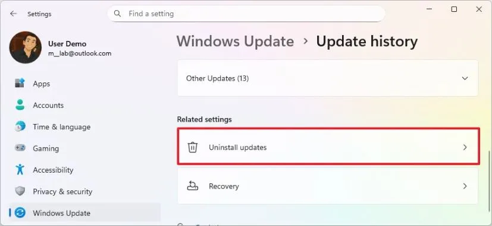
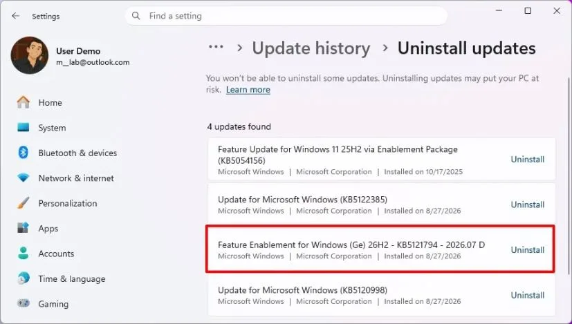
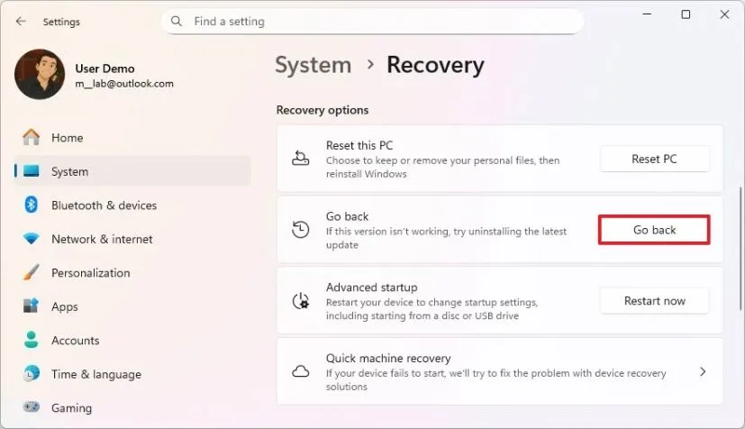
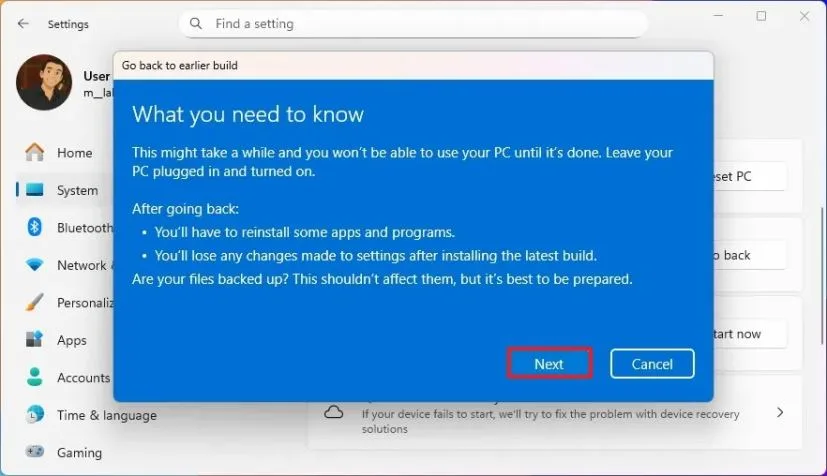
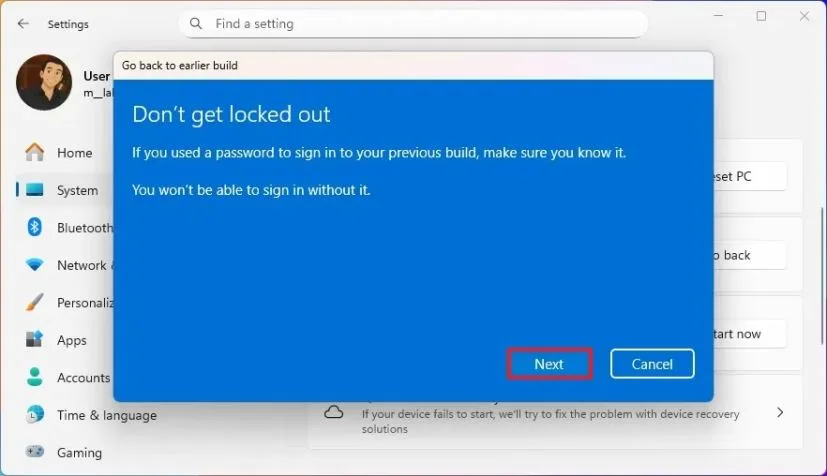
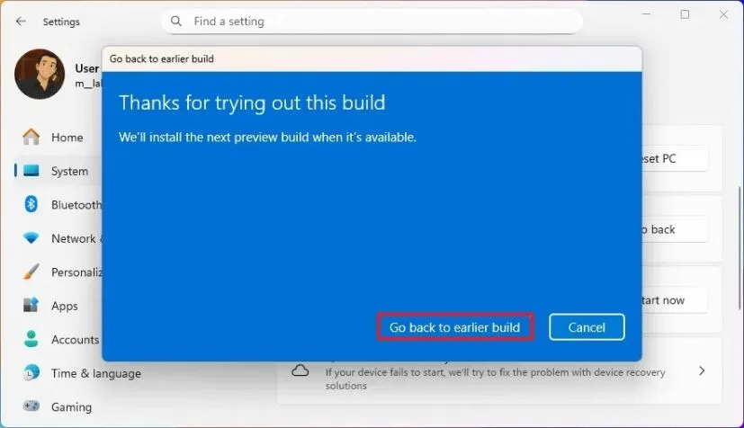

Обновились до Windows 11 26H2 и хотите откатиться — из-за бага, драйвера или просто решили остаться на 25H2/24H2 подольше. Откат без потери личных файлов возможен, но способ зависит от того, как вы ставили 26H2.

Если 26H2 пришла через **Центр обновления** как пакет включения `KB5121794` — удаляем обновление. Если ставили через **Installation Assistant**, **ISO** или обновлялись с **Windows 10** — откатываемся через **Восстановление → Вернуться**. Чистую установку 26H2 удалить нельзя — только чистая установка старой версии.

Ниже — оба способа по шагам и что делать, когда кнопка отката пропала.

## Что важно знать до отката

**Откат Windows** сохраняет личные файлы, но не всё остаётся прежним. После возврата на 25H2/24H2 часть приложений придётся переустановить, а часть настроек — например, панель задач и конфиденциальность — настроить заново.

**Время ограничено.** При откате через **Восстановление** система хранит файлы для возврата около **10 дней**. После их удаления кнопка **Вернуться** пропадает и остаётся только чистая установка старой версии с восстановлением из бэкапа.

**Сделайте бэкап.** Скопируйте важные документы и фото, запишите пароли. Это занимает минуты и спасает, когда что-то идёт не так.

**Отличайте откат от сброса.** Откат возвращает предыдущую версию Windows. [Сброс до заводских](https://trick32.ru/articles/sbros-windows-do-zavodskih-nastroek/) переустанавливает текущую версию заново. Это разные сценарии.

## Способ 1. Удаляем KB5121794 через Центр обновления

Подходит, если вы обновились с **Windows 11 25H2 или 24H2** через **Центр обновления**. В этом случае 26H2 пришла как enablement package **KB5121794**. Именно так Microsoft переводит 25H2/24H2 на 26H2. Пакет весит около 174 КБ и включает уже загруженные компоненты. Подробнее — в разборе [KB5121794: обновление до 26H2 без переустановки](https://trick32.ru/articles/windows-11-26h2-kb5121794-obnovlenie/).

Если вы ставили 26H2 через Assistant/ISO или с Windows 10 — переходите к способу 2.

**Как удалить:**

1. Откройте **Параметры** (`Win + I`).
2. Перейдите в **Центр обновления Windows**.
3. Откройте **Журнал обновлений**.

*Журнал обновлений: тут список установленных пакетов — ищите KB5121794 в конце*

4. Нажмите **Удалить обновления** в разделе **Сопутствующие параметры**.

*Кнопка «Удалить обновления» — открывает список, где доступен откат KB5121794*

5. Найдите **Feature Enablement for Windows (Ge) — KB5121794** и нажмите **Удалить**.

*Удалите KB5121794 — система откатится на предыдущую версию 25H2 или 24H2*

> Название пакета может слегка отличаться, когда 26H2 выйдет в общий канал.

6. Подтвердите удаление.
7. Перезагрузите компьютер.

После перезагрузки система вернётся на **Windows 11 25H2** или **24H2** — ту версию, которая стояла до обновления. Личные файлы останутся.

## Способ 2. Откат системы через Восстановление → Вернуться

Подходит, если вы ставили 26H2 через **Installation Assistant**, **ISO**, другую установку по месту или обновлялись с **Windows 10**. В этом случае отката через удаление KB5121794 нет — нужен механизм **Восстановления**.

**Как откатить систему Windows:**

1. Откройте **Параметры**.
2. Перейдите в **Система → Восстановление**.
3. В разделе **Параметры восстановления** нажмите **Вернуться** (Go back).

*Кнопка «Вернуться»: жмите её, если обновлялись через ISO или Assistant*

4. Нажмите **Далее**.
5. Нажмите **Нет, спасибо** (No, thanks).
6. Нажмите **Далее**.

*Система предупредит, что после отката часть приложений придётся переустановить*

7. Снова нажмите **Далее**.

*Если вы меняли пароль после обновления — вспомните старый, он понадобится после отката*

8. Нажмите **Вернуться к предыдущей сборке** (Go back to earlier build).

*Последний шаг — запуск отката на предыдущую версию*

После шагов система удалит 26H2 и вернёт предыдущую версию — с сохранением файлов, большинства настроек и приложений.

Если вместо кнопки видите сообщение **«Этот параметр больше недоступен на этом компьютере»** — файлы для отката уже удалены. Такое бывает через 10 дней или после очистки диска. Тогда откат через Восстановление невозможен. Нужна [чистая установка старой версии](https://trick32.ru/articles/windows-11-26h2-chistaya-ustanovka-nepodderzhivaemoe-oborudovanie/) и возврат файлов из бэкапа.

## Когда удалить 26H2 нельзя

Если вы делали **чистую установку Windows 11 26H2** с флешки или ISO на пустой диск — отката нет. Система не хранит предыдущую версию.

Вариант один: установка с нуля той версии, которая нужна (25H2/24H2), и возврат файлов из резервной копии. Перед этим обязательно сохраните файлы — при установке с нуля диск форматируется.

## Что проверить после отката

* Переустановите драйверы, которые ставили после обновления на 26H2.
* Проверьте приложения, установленные после перехода на 26H2 — часть придётся поставить заново.
* Снова настройте параметры, которые меняли в 26H2.
* Если меняли пароль после обновления — используйте старый пароль от предыдущей версии.

На рабочем компьютере я бы не ставил 26H2 без бэкапа только потому, что «можно откатиться». Откат — страховка, а не план. Если система нужна для работы, держите копию важных файлов отдельно, а на 26H2 переходите, когда общий выпуск стабилизируется.

## Что выбрать — короткая шпаргалка

* **Обновлялись с 25H2/24H2 через Центр обновления → удаляйте KB5121794** (способ 1). Откат занимает 2–3 минуты плюс перезагрузка.
* **Ставили 26H2 через Assistant/ISO или с Windows 10 → Восстановление → Вернуться** (способ 2).
* **Кнопки Вернуться нет или ставили 26H2 начисто → только установка старой версии с нуля.**
* **Ставили 26H2 на неподдерживаемый ПК** — см. отдельный разбор про [обновление без переустановки через KB5121794 на неподдерживаемом ПК](https://trick32.ru/articles/windows-11-26h2-nepodderzhivaemyj-pk-bez-pereustanovki-kb5121794/).

Откат Windows 11 26H2 — простая процедура, если выбрать правильный путь. Определите, как ставилась 26H2, и идите нужным маршрутом. И не тяните: через 10 дней файлы отката исчезнут, и останется только переустановка.
