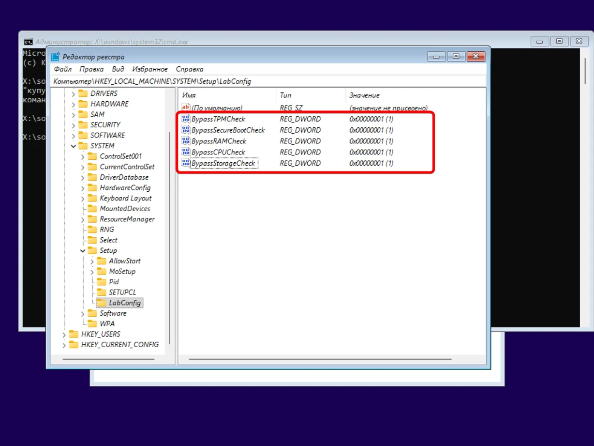
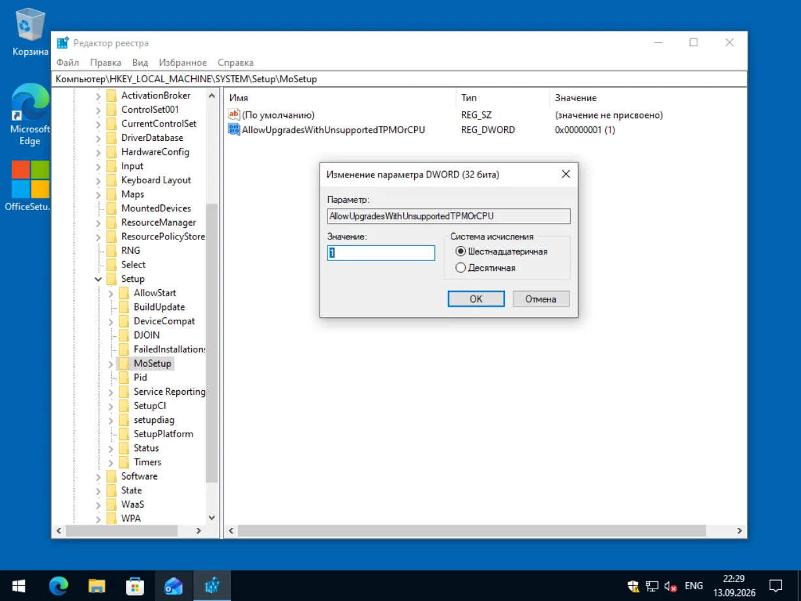
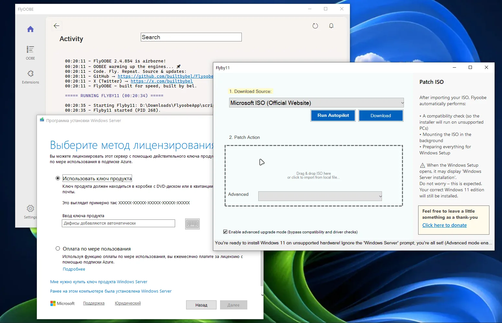
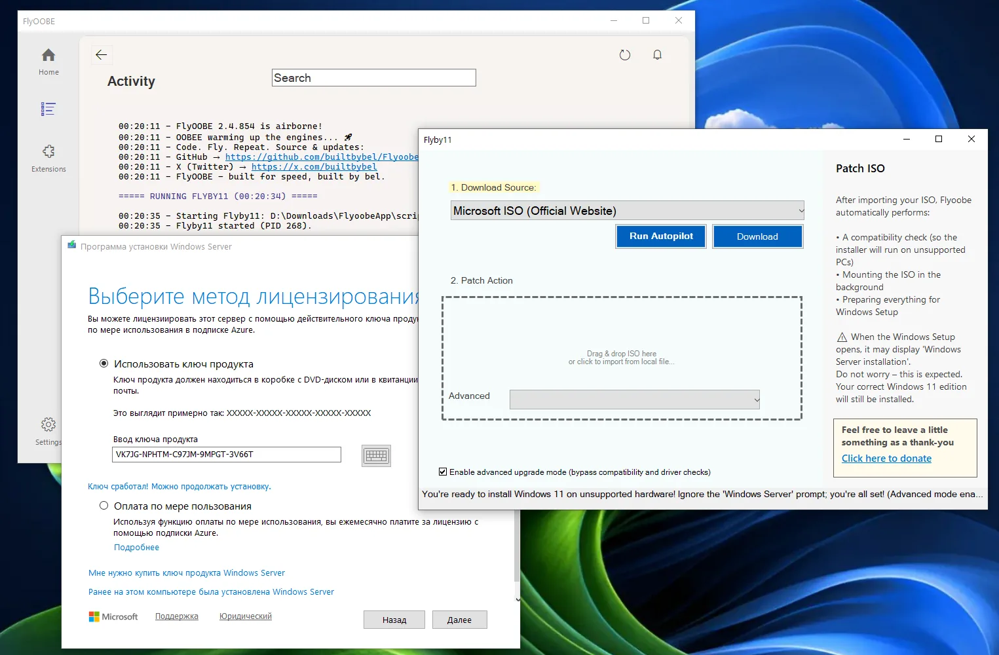
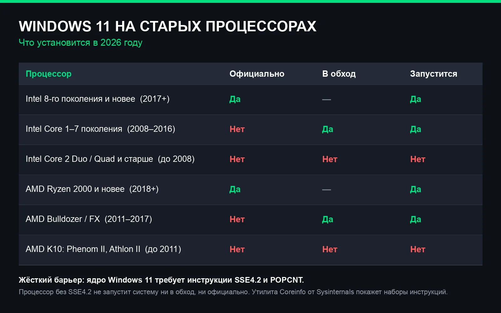
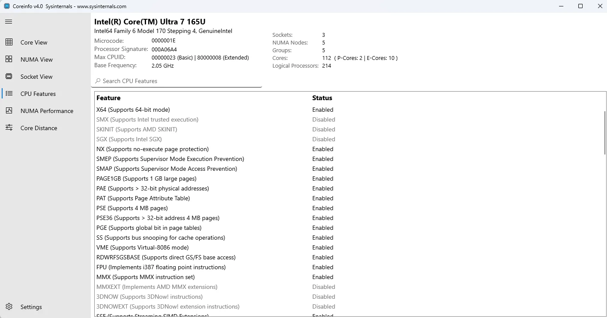

В октябре выходит Windows 11 26H2, а версия 24H2 перестаёт получать обновления. Для владельцев старого железа это значит, что обновляться придётся вручную. Обходы проверки TPM, Secure Boot и памяти не закрыты, но за год многое изменилось.

Я поставил 26H2 на виртуальную машину без TPM 2.0, без Secure Boot, с маленьким диском — и прошёл по всем известным способам. Ниже, что реально работает, что с оговорками и что Microsoft уже прикрыла.

**Коротко о рисках.** Обход даёт **неподдерживаемую конфигурацию**: Microsoft не гарантирует обновления, драйверы и совместимость. Для старого компьютера это разумный компромисс, для рабочей машины с важными файлами — нет. О том, насколько это опасно на практике, я уже [разбирал отдельно](https://dzen.ru/a/aEx206laymyfjddY).

## Что изменилось за год

За год Microsoft заметно усилила защиту Windows 11 — и от установки на неподдерживаемое железо, и особенно от настройки системы без аккаунта Microsoft.

Первое: **локальную учётную запись (MSA) на этапе установки почти прикрыли.** В октябре 2025 года Microsoft объявила, что убирает известные механизмы создания локальной записи из экрана начальной настройки — компания объяснила это тем, что обходы пропускают важные шаги и оставляют систему недонастроенной. Сначала убрали команду `bypassnro`, затем заблокировали `start ms-cxh:localonly` и вход через поддельный аккаунт, а потом отключили и реестровый `BypassNRO`. К сентябрю 2026 года рабочих обходов почти не осталось. А что осталось - разберу в следующей статье.

Второе: **у серверного режима установки появилось окно лицензирования.** Установщик Windows Server 2025 на старте требует [выбрать метод лицензирования](https://learn.microsoft.com/en-us/windows-server/get-started/windows-server-pay-as-you-go) — ключ продукта или оплата по мере использования. Без него кнопка «Далее» не активна. Это добавило отдельный шаг тем, кто ставит Windows 11 в обход через `/product server`.

При этом требования к железу Microsoft не меняла: планка у 26H2 [такая же, как у 24H2 и 25H2](https://blogs.windows.com/windows-insider/2026/08/27/releasing-windows-11-version-26h2-to-the-release-preview-channel/) — все три версии используют общую ветку обслуживания.

Итог простой. Защиту Microsoft усилила — и заметно. Но способы установки на неподдерживаемое оборудование никуда не делись, просто к каждому добавились оговорки. Разберу по порядку, что из этого работает сейчас.

## Rufus

Самый простой путь для чистой установки. Записываете флешку в [Rufus-RuBeRoID](https://trick32.ru/articles/oshibka-sentinel-rufus-ruberoid/) и отмечаете галочку **«Удалить требования 4+ ГБ ОЗУ, безопасной загрузки и TPM 2.0»**. Установщик перестаёт спрашивать про железо.

Годится и для 25H2, и для предрелизных сборок 26H2. Пошаговую инструкцию по чистой установке 26H2 с UUP Dump я давал [в отдельном руководстве](/articles/windows-11-26h2-chistaya-ustanovka-nepodderzhivaemoe-oborudovanie/).

## LabConfig — только для чистой установки

Второй рабочий способ — правка реестра прямо на экране установки. Нажимаете **Shift+F10**, открываете `regedit` и создаёте ветку `HKLM\SYSTEM\Setup\LabConfig` с параметрами DWORD:

- `BypassTPMCheck` = 1
- `BypassSecureBootCheck` = 1
- `BypassRAMCheck` = 1
- `BypassCPUCheck` = 1
- `BypassStorageCheck` = 1

После этого проверки пропускаются, и установка идёт дальше.

Важно: **это работает только при чистой установке** — когда вы грузитесь с флешки или ISO. При обновлении поверх уже работающей системы параметры LabConfig ничего не меняют, и тут упираешься в следующий способ.

## MoSetup — обновление поверх, но не для всех

Чтобы обновить существующую систему без потери файлов, есть отдельный параметр. В реестре рабочей Windows создаёте ветку `HKLM\SYSTEM\Setup\MoSetup` и DWORD `AllowUpgradesWithUnsupportedTPMOrCPU` = 1.

Раньше этот способ был официальным: Microsoft сама описывала его в справке. Но страницу обновbkb, и к февралю 2025 инструкцию из неё убрали — сейчас это неофициальная лазейка.

И у неё есть предел, о котором в гайдах пишут редко. MoSetup снимает **только** проверки TPM 2.0 и процессора. Минимум TPM 1.2 и 64 ГБ на диске он не отменяет. На моей виртуальной машине без TPM вообще обновление поверх так и не пошло: установщик выдал «ПК не готов: нет TPM 2.0, диск меньше 60 ГБ». Параметры LabConfig здесь тоже не помогли — они для установки с нуля.

Если система уже на 24H2 или 25H2, есть путь проще — [обновление через пакет KB5121794](/articles/windows-11-26h2-nepodderzhivaemyj-pk-bez-pereustanovki-kb5121794/), без Rufus и правки реестра.

## Серверный режим упёрся в лицензию

Есть третий приём: запустить установщик в режиме Windows Server командой `setupprep.exe /product server`. В нём проверки совместимости не выполняются, а на выходе вы всё равно получаете обычную Windows 11. Тот же способ автоматизирует утилита [Flyby11/FlyOOBE](https://github.com/builtbybel/FlyOOBE).

Но на 25H2 у этого способа появился новый барьер. Серверный установщик теперь показывает экран **«Выберите метод лицензирования»** с двумя вариантами: ключ продукта или оплата по мере использования. Без него кнопка «Далее» не активна, а оплата по мере использования требует Azure и уводит из установки.

Решение — ввести **generic-ключ Windows 11**. Это не пиратство: Microsoft сама публикует такие коды для установки — они выбирают редакцию, но систему не активируют. Для Pro это `VK7JG-NPHTM-C97JM-9MPGT-3V66T`, для Home — `YTMG3-N6DKC-DKB77-7M9GH-8HVX7`. Свой вводите потом, уже в параметрах активации.

То есть серверный режим всё ещё действует, но стал сложнее: добавьте код, тогда пойдёт.

## Что Microsoft закрыла

**Локальную учётную запись при установке.** В 2025 году Microsoft вырезала команду `bypassnro`, затем заблокировала `start ms-cxh:localonly`, ввод поддельного аккаунта и реестровый `BypassNRO`. К августу 2026 года все известные способы настроить Windows 11 без аккаунта Microsoft перестали работать.

**Но 13 сентября 2026 нашёлся новый.** На экране входа в аккаунт нужно нажать маленькую ссылку **«Подробнее»** в абзаце под вариантами входа — установка уводит на создание локальной записи. Это баг, а не функция: Microsoft прикроет его так же, как предыдущие. В редакции Pro остаётся штатный пункт «Настроить для работы или учёбы» с присоединением к домену.

## Стена, которую обходом не пробить

Здесь самое важное. С версии 24H2 Windows требует от процессора инструкции **SSE4.2 и POPCNT**. Если их нет, система не загрузится вообще — никакие правки и галочки не помогут, это требование самого ядра.

Практический порог — процессоры Intel от первого поколения Core (Nehalem, 2008 год) и AMD от Bulldozer (FX, 2011 год). Всё старше остаётся на Windows 10 или 23H2.

Проверить просто: утилита [Coreinfo от Sysinternals](https://learn.microsoft.com/en-us/sysinternals/downloads/coreinfo) показывает наборы инструкций, ищите строку с SSE4.2.

## Есть и официальный путь

Мало кто знает, но Windows 11 IoT Enterprise LTSC начиная с версии 24H2 официально **не требует TPM** и поддерживает legacy BIOS. Это не взлом и не пиратская сборка — обычная редакция корпоративной линейки с поддержкой до 2034 года. Минус один: лицензию достать сложнее, чем бытовую Home.

## Чем платите за обход

Обойдя проверки, вы остаётесь на неподдерживаемой конфигурации:

- обновления могут прийти с задержкой или не прийти — 26H2 автоматически на такое железо не придёт;
- Microsoft не отвечает за сбои;
- часть функций безопасности (Windows Hello, BitLocker с привязкой к TPM) может не работать;
- трюк с локальной учётной записью прикроют первым же обновлением.

Если после обновления что-то пошло не так, вернуться с 26H2 на 25H2 или 24H2 можно — [порядок отката здесь](/articles/kak-udalit-windows-11-26h2-i-vernutsya-na-25h2-24h2/).

## Итог

Все обходы сводятся к двум подходам: **Rufus** и **скрипты правки реестра**. Первый — галочка снятия требований при записи флешки. Второй — параметры LabConfig при установке с нуля, MoSetup при обновлении поверх и серверный режим для опытных. Один путь для тех, кто переустанавливает систему, другой — кто обновляет уже работающую.

Чистая установка даётся проще всего: через Rufus или параметры LabConfig — система ставится даже без TPM. Обновление поверх сложнее: MoSetup требует хотя бы TPM 1.2 и место на диске, а серверный режим теперь просит лицензию. Жёсткий барьер один — процессор без SSE4.2 не запустит Windows 11 ни в обход, ни официально.

Если у вас старая машина и возиться с реестром не хочется — ставьте **Windows 11 LTSC** (Windows 11 IoT Enterprise LTSC). Там проверки мягче официально: TPM и Secure Boot опциональны, поддерживается legacy BIOS, а срок поддержки — до 2034 года. Минус один: лицензию достать сложнее, чем бытовую Home.

Если ваш ПК просто не проходит проверку по TPM и Secure Boot, всё решаемо. Если процессор старше 2008 года — не тратьте время.

## Нужна помощь?

Если Вы боитесь самого слова `реестр`, не понимаете в ключах и лицензировании — помогу удалённо. Активирую Windows, а заодно поставлю оригинальный Microsoft Office 2024 или Microsoft 365: подберу версию, установлю Word и Excel, исправлю ошибки установки и активации. Вы видите экран и отключаетесь в один клик, ставлю только официальные дистрибутивы — без репаков и торрентов.

→ [Удалённая установка Microsoft Office и помощь с активацией Windows](/articles/udalennaya-pomoshch-ustanovka-microsoft-office-word-excel/)

Нажмите кнопку «💬 Написать в чате» справа внизу.
