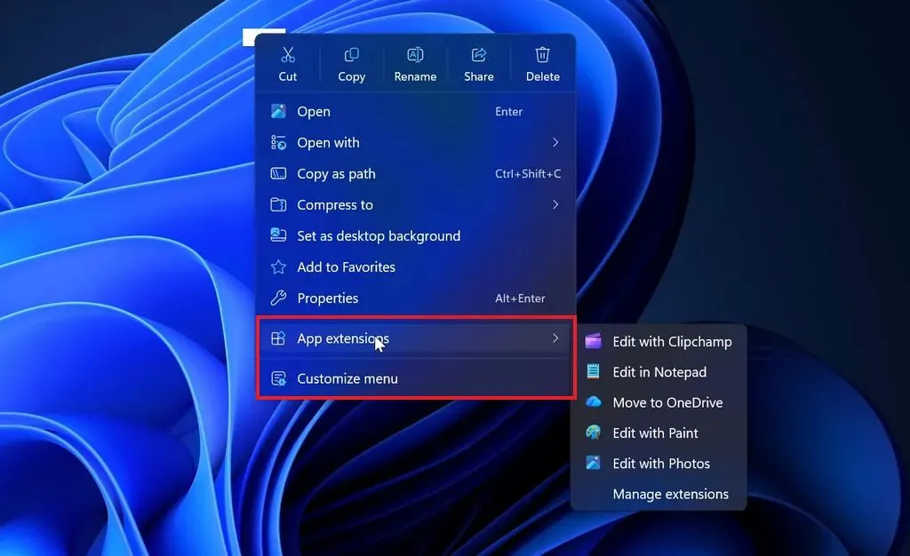
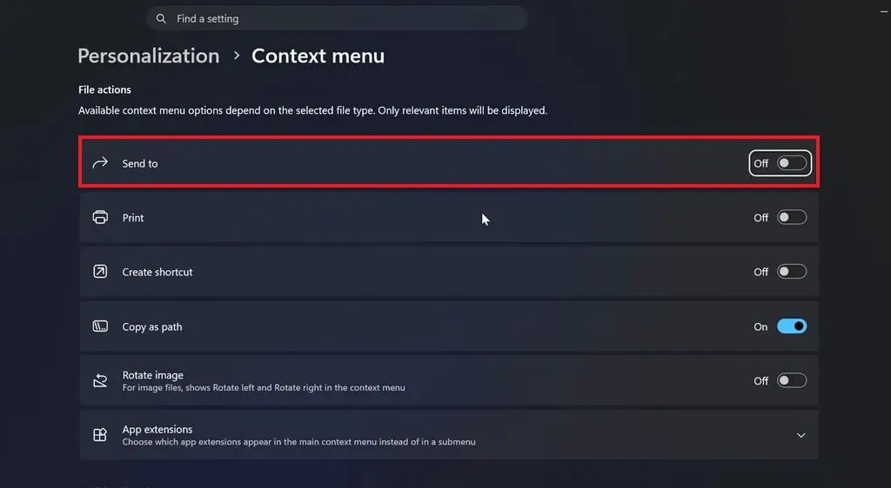
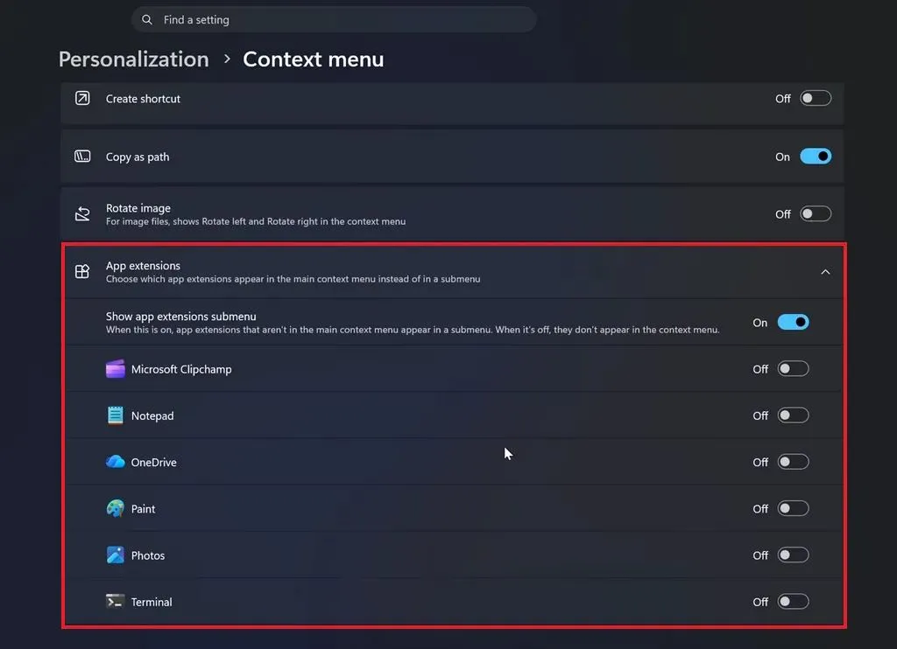
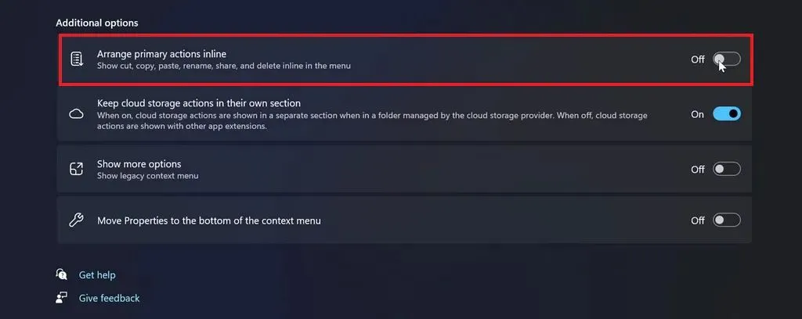
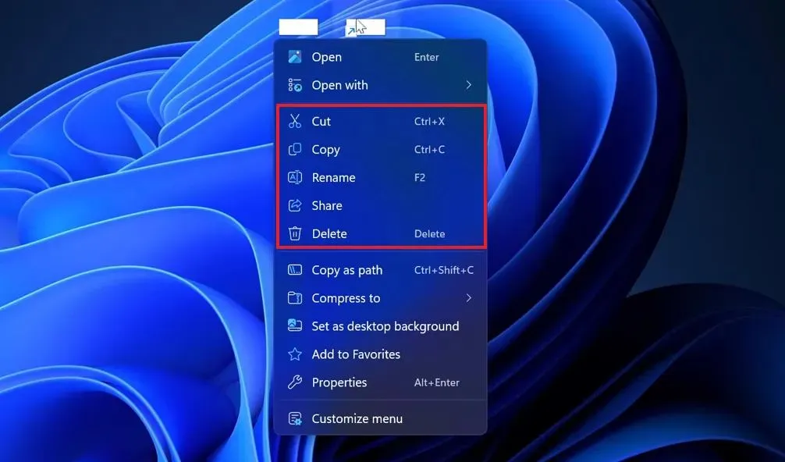
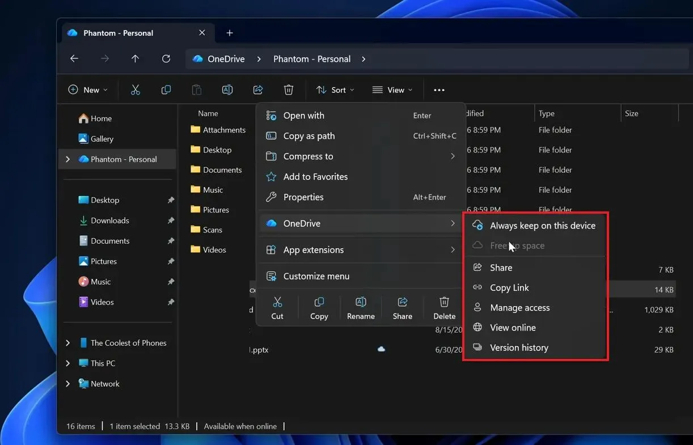
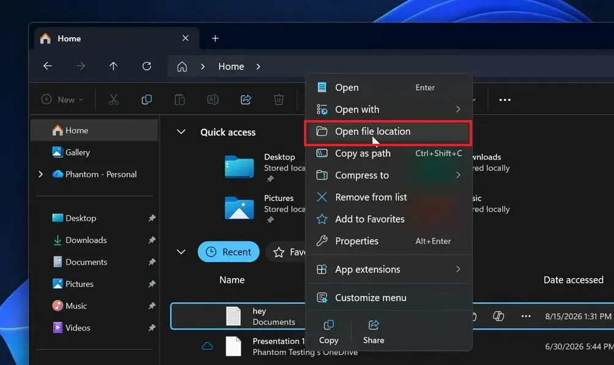

Контекстное меню Windows 11 – один из тех элементов системы, который Microsoft переделала ради красоты, но долго не давала пользователю нормально настроить.

Теперь ситуация меняется.

Microsoft тестирует новую концепцию контекстного меню. В ней появляется отдельная страница настроек, где можно управлять основными командами, расширениями приложений, OneDrive и доступом к старому меню.

Для Windows это довольно важное изменение. Не потому, что кнопки станут красивее. А потому, что Microsoft наконец начинает отдавать пользователю контроль над тем, что происходит после обычного клика правой кнопкой мыши.

Пока речь идёт о тестовой реализации. Дата выхода в стабильную Windows 11 не объявлена.

## Почему контекстное меню Windows 11 вообще стало проблемой

Контекстное меню существует в Windows десятилетиями.

И всё это время происходило примерно одно и то же.

Устанавливаем программу – она добавляет свои команды.

Ставим архиватор – появляется ещё несколько пунктов.

Добавляем облачный диск – ещё несколько.

Графический редактор, антивирус, Git, инструменты разработчика – меню продолжает расти.

В результате обычный клик правой кнопкой по файлу может превращаться в небольшой квест.

В Windows 11 Microsoft попыталась решить проблему другим способом – сделала новое компактное меню и спрятала часть старых команд за пунктом «Показать больше параметров».

Выглядит аккуратнее.

Но проблема никуда не исчезла.

Пользователь по-прежнему практически не решал, **какие команды ему нужны**.

Именно это Microsoft теперь пытается исправить.

## Появится отдельная настройка контекстного меню

В новой версии появляется пункт **«Настроить меню»**.

Через него можно попасть в отдельный раздел:

**Параметры → Персонализация → Контекстное меню.**

Это уже принципиально другой подход.

Microsoft не предлагает искать нужную настройку в реестре или устанавливать стороннюю утилиту. Управление контекстным меню становится обычной функцией Windows.

И вот здесь начинается самое интересное.

Пользователь сможет включать и отключать отдельные действия с файлами.

Например, команду **«Отправить»**.

То есть контекстное меню постепенно превращается из жёстко заданного интерфейса в настраиваемый элемент системы.

На мой взгляд, именно этого Windows не хватало много лет.

## Расширения приложений перестанут лезть в главное меню

Отдельно Microsoft работает с расширениями приложений.

В новом меню появляется раздел **«Расширения приложений»**.

Это важное решение.

Сторонние программы любят добавлять свои команды в контекстное меню. Иногда это действительно удобно. Но проблема начинается тогда, когда таких программ становится много.

Microsoft предлагает отправлять подобные команды в отдельное подменю.

В результате главное меню остаётся компактным, а дополнительные функции никуда не исчезают.

Можно также полностью отключить точку входа в расширения.

Правда, есть ограничение – выбрать отдельные пункты внутри этого подменю пока нельзя. Можно показать или скрыть само подменю целиком.

Это не идеальная реализация.

Но направление правильное.

## Основные команды можно будет вернуть в строку

Есть ещё одна полезная настройка – **«Установить основные действия в строке»**.

Речь идёт о привычных командах:

- Вырезать
- Копировать
- Переименовать
- Поделиться
- Удалить

Microsoft позволяет выбрать, как именно они будут отображаться.

Можно оставить компактный вариант Windows 11.

А можно вывести основные команды непосредственно в меню.

Это небольшая настройка, но она хорошо показывает новую философию интерфейса.

Не Microsoft решает, какой вариант удобнее.

**Пользователь решает сам.**

## Старое меню никуда не исчезнет

Microsoft также сохраняет возможность использовать классическое меню.

Причём переход к нему можно будет оставить через настройку **«Показать больше параметров»**.

А если нужно открыть старое меню сразу, по-прежнему работает сочетание **Shift + правый клик**.

Это правильное решение.

Windows 11 не заставляет пользователя выбирать между современным и классическим интерфейсом.

Нужна новая оболочка – используйте её.

Нужны старые команды – они остаются под рукой.

## OneDrive наконец получает отдельное место

Ещё один пример – интеграция OneDrive.

Команды вроде **«Всегда сохранять на этом устройстве»** больше не должны занимать место в основном контекстном меню.

Microsoft переносит их в отдельное подменю OneDrive.

И это логично.

Если человек постоянно работает с OneDrive – он знает, где искать его команды.

Если не работает – зачем показывать ему несколько дополнительных пунктов при каждом клике?

Это и есть нормальная организация интерфейса.

Не обязательно удалять функцию.

Иногда достаточно убрать её с первого плана.

## Изменения затронут и Проводник

Новое поведение распространяется не только на файлы.

Microsoft меняет некоторые элементы контекстного меню Проводника.

Например, команда **«Обновить»** теперь становится частью современного меню.

В разделе «Домой» Проводника команда **«Открыть местоположение файла»** также получает более логичное расположение.

Сами изменения небольшие.

Но именно из таких мелочей и складывается удобство интерфейса.

## Microsoft наконец исправляет главную проблему

Самое важное здесь – даже не новая кнопка и не внешний вид.

Microsoft начинает признавать простую вещь:

**одинаковое контекстное меню не подходит всем пользователям.**

У обычного пользователя один набор задач.

У администратора – другой.

У разработчика – третий.

У человека, который работает с графикой, архивами и облачными хранилищами, – четвёртый.

Зачем всем показывать один и тот же набор команд?

Гораздо разумнее дать базовый набор и возможность убрать ненужное.

Именно поэтому я считаю новую концепцию одним из наиболее полезных изменений оболочки Windows 11 за последнее время.

Не очередная анимация.

Не новая иконка.

Не очередная косметика.

А нормальная настройка интерфейса.

## Но есть важная оговорка

Пока всё это находится в разработке.

Microsoft не объявила дату появления новой системы контекстного меню в стабильной версии Windows 11. Некоторые функции ещё могут измениться или вообще не попасть в финальный релиз.

Поэтому не стоит воспринимать сообщения о Windows 11 26H2 как подтверждённый план.

Пока это тестируемая концепция.

Именно так её и стоит воспринимать.

## Моё мнение

Microsoft понадобилось немало времени, чтобы прийти к очевидному решению.

Контекстное меню не должно быть одинаковым для всех.

Оно должно быть **настраиваемым**.

Пользователь должен иметь возможность убрать ненужные команды, оставить важные и отдельно управлять расширениями сторонних приложений.

Причём без редактора реестра.

Без PowerShell.

Без сторонних твикеров.

Просто открыть настройки Windows и поставить нужные переключатели.

Если Microsoft доведёт эту концепцию до стабильного релиза без очередного урезания возможностей – это будет действительно полезное обновление Windows 11.

Тенденция видна и в других элементах оболочки: [панель задач](https://trick32.ru/articles/taskbar-settings-windows-11/) возвращает настройки, которые Microsoft вырезала, а [меню «Пуск»](https://trick32.ru/articles/menyu-pusk-windows-11-26h2/) становится настраиваемым.

### Что в итоге

Новая система контекстного меню Windows 11 должна дать пользователю:

- управление основными командами;
- отдельную настройку расширений приложений;
- более аккуратную интеграцию OneDrive;
- возможность вернуть старое меню;
- выбор между компактным и расширенным отображением основных команд;
- более организованный интерфейс Проводника.

Пока остаётся главное – дождаться стабильного релиза.

А если Microsoft действительно доведёт задумку до конца, первым делом после обновления Windows я бы открыл **Параметры → Персонализация → Контекстное меню** и выкинул оттуда всё лишнее.

Потому что контекстное меню должно помогать работать, а не устраивать пользователю экскурсию по всем установленным программам.
