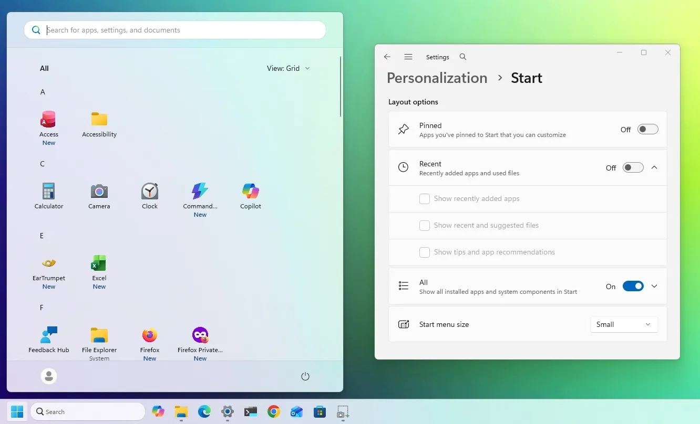
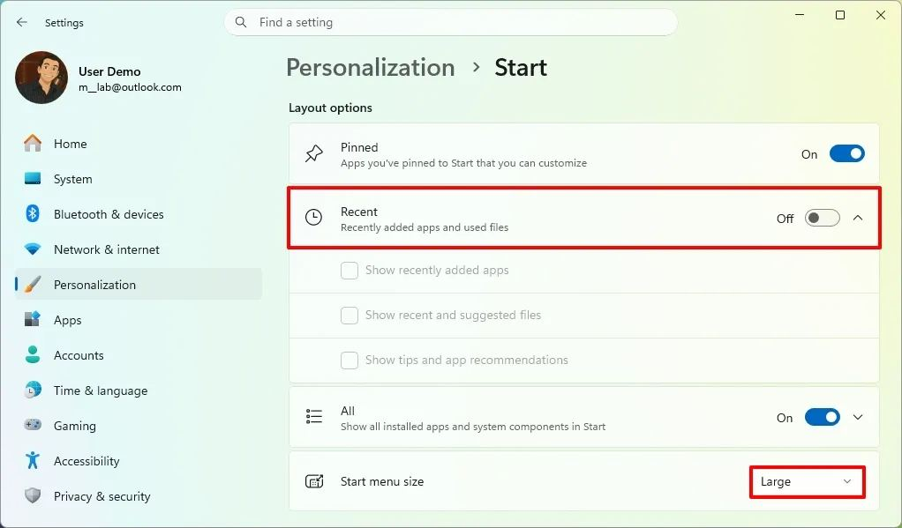
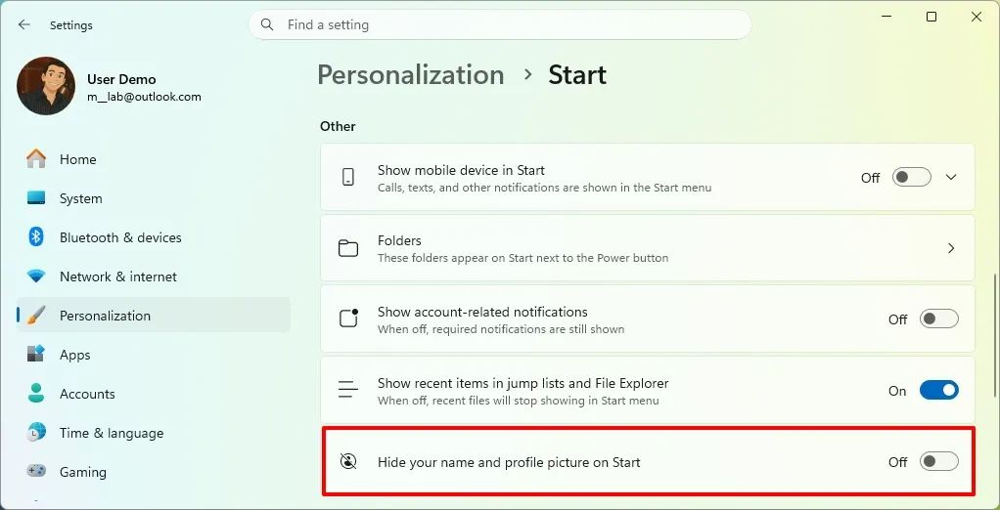

Microsoft готовит для Windows 11 более гибкое меню «Пуск». Пользователь сможет выбрать его размер, управлять отображением отдельных разделов и скрыть имя с фотографией профиля.

Изменения появляются в рамках подготовки Windows 11 26H2, но часть новых возможностей Microsoft может добавить и в уже существующие версии Windows 11 через обычные обновления.

## Размер меню «Пуск»

Сейчас Windows 11 сама определяет размер меню «Пуск» с учётом разрешения экрана и масштабирования. В новой версии пользователь сможет выбрать размер вручную.

В **«Параметры» → «Персонализация» → «Пуск»** появится настройка **«Размер меню „Пуск“»** с тремя вариантами:

- **Маленький**;
- **Большой**;
- **Автоматический**.

В автоматическом режиме размер будет определять сама Windows. Если стандартный вариант не устраивает, можно будет выбрать маленький или большой «Пуск».

### Чем это отличается от Windows 10

В Windows 10 меню «Пуск» можно было свободно растягивать мышью за края. Кроме того, существовал полноэкранный режим, рассчитанный в том числе на сенсорные устройства.

Windows 11 не возвращает эту модель. Здесь Microsoft предлагает готовые варианты размера вместо свободного масштабирования.

То есть пользователь получает больше выбора, но не полную свободу, которая была в Windows 10.

## Разделы «Пуск» можно будет отключить

Изменится и настройка содержимого меню.

Microsoft добавляет возможность выбирать, какие разделы показывать в «Пуске». Если какой-то раздел не нужен, его можно будет скрыть.

Причём можно отключить **все разделы** и получить практически пустое меню «Пуск».

Это пригодится тем, кто использует «Пуск» в основном для запуска приложений и не хочет видеть дополнительную информацию.

## «Рекомендуемые» переименуют в «Недавние»

Ещё одно изменение касается раздела **«Рекомендуемые»**.

Microsoft переименовывает его в **«Недавние»**. Одновременно меняется поведение настройки, связанной с недавно открытыми файлами.

Если отключить параметр **«Показывать последние и предлагаемые файлы»**, это больше не должно очищать историю недавно открытых файлов в «Проводнике».

Это важное уточнение.

### История файлов в «Проводнике» не пострадает

Раньше настройки отображения недавно использовавшихся файлов в меню «Пуск» могли восприниматься как связанные с общей историей Windows.

Теперь Microsoft разделяет эти функции.

Отключение отображения последних файлов в «Пуске» не должно удалять историю недавно открытых файлов в «Проводнике».

Поэтому можно убрать такие данные из меню «Пуск», не отказываясь от самой истории в «Проводнике».

## Можно скрыть имя и фотографию профиля

В настройках меню «Пуск» появится ещё одна полезная опция конфиденциальности.

В разделе **«Другое»** можно будет включить скрытие **имени пользователя и фотографии профиля**.

Зачем это нужно?

Например, если вы подключаете компьютер к проектору, демонстрируете экран коллегам или записываете видео, персональные данные не будут постоянно находиться на виду в меню «Пуск».

Это небольшая настройка, но она решает конкретную проблему без сторонних программ.

## Когда изменения появятся

Все перечисленные возможности Microsoft сейчас развивает в рамках подготовки Windows 11 26H2.

Но ждать именно выхода 26H2 для всех функций необязательно. Windows 11 26H2 использует ту же базовую платформу, что и 24H2 и 25H2, поэтому Microsoft может распространять отдельные изменения через обычные ежемесячные обновления.

Некоторые связанные с проектом Windows K2 улучшения уже появляются в предварительных сборках и дополнительных обновлениях.

При этом до финального релиза Microsoft ещё может изменить внешний вид настроек или само поведение функций.

## Что в итоге

Новый «Пуск» Windows 11 не пытается снова стать Windows 10. Microsoft выбрала другой путь – добавить пользователю больше настроек.

В Windows 11 26H2 можно будет:

- выбрать размер меню «Пуск» – маленький, большой или автоматический;
- скрывать ненужные разделы;
- отключить все дополнительные разделы;
- видеть раздел «Недавние» вместо «Рекомендуемых»;
- отключать отображение последних файлов в «Пуске», не затрагивая историю «Проводника»;
- скрывать имя и фотографию профиля.

Это не революционное изменение. И именно поэтому оно полезно.

Microsoft наконец исправляет не само меню «Пуск», а **лишнюю жёсткость его настройки**. Пользователь не обязан принимать предложенный интерфейс целиком – он сможет оставить только то, что действительно нужно.