Windows 10 закончила обычную поддержку 14 октября 2025 года. Компьютер от этого не перестал работать, но Microsoft больше не выпускает для неё обычные бесплатные обновления безопасности.

Если компьютер совместим с Windows 11, перейти на неё с Windows 10 в 2026 году по-прежнему можно бесплатно. Microsoft это подтверждает в актуальной документации.

Начинать стоит с Центра обновления Windows. Если Windows 11 там не появляется или нужен ISO-образ, можно перейти к ручной установке.

Для читателей из России и Беларуси есть ещё одна проблема – доступ к отдельным сервисам Microsoft может отличаться от других регионов. Поэтому я сделал три своих инструмента для получения ISO: **RuBeRoID, MS ISO Downloader и ShIFER**.

Они решают одну задачу разными способами.

## Сначала проверяем совместимость

Windows 11 требует 64-разрядный совместимый процессор, минимум 4 ГБ оперативной памяти и 64 ГБ накопителя. Нужны UEFI с поддержкой Secure Boot и TPM 2.0. Для прямого обновления с Windows 10 Microsoft также указывает Windows 10 версии 2004 или новее.

Самый простой способ проверить компьютер – **PC Health Check** от Microsoft.

Если программа доступна для скачивания в вашем регионе, установите её и нажмите **«Проверить сейчас»**. Утилита проверит компьютер и покажет, проходит ли он требования Windows 11. Microsoft сама рекомендует PC Health Check для такой проверки.

В РФ и РБ загрузка программы с сайта Microsoft может быть недоступна. В этом случае проверяем требования вручную.

В первую очередь смотрим на **TPM 2.0**, **Secure Boot** и режим загрузки **UEFI**.

Если TPM или Secure Boot отключены в прошивке, их иногда достаточно включить в BIOS/UEFI. Если Windows установлена в Legacy-режиме на диске MBR, потребуется отдельная настройка перехода на UEFI/GPT.

Перед изменением разметки диска или настроек загрузки сделайте резервную копию важных файлов.

Если компьютер не соответствует требованиям Windows 11, это уже отдельный сценарий. Microsoft не рекомендует устанавливать Windows 11 на неподдерживаемое оборудование — для такого случая у меня есть отдельная инструкция [как обновить неподдерживаемый ПК до Windows 11 26H2 без переустановки](/articles/windows-11-26h2-nepodderzhivaemyj-pk-bez-pereustanovki-kb5121794/).

## Обновление через Центр обновления Windows

Если компьютер подходит для Windows 11, сначала используйте штатный способ.

В Windows 10 откройте:

**Пуск → Параметры → Обновление и безопасность → Центр обновления Windows.**

Нажмите **«Проверить наличие обновлений»**.

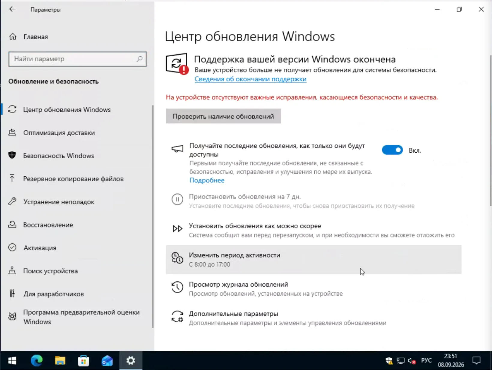
*Центр обновления Windows 10 после окончания поддержки 14.10.2025*

Windows Update сама проверяет, подходит ли конкретный компьютер для Windows 11. Если проверка пройдена и обновление доступно, система предложит его скачать и установить.

Нажмите **«Скачать и установить»**, после чего дождитесь завершения установки.

Перед обновлением сохраните важные файлы. Microsoft тоже рекомендует сделать резервную копию перед установкой новой версии Windows.

При обычном обновлении Windows сохраняет файлы и приложения. Но перед началом установки всё равно стоит проверить, какой вариант сохранения предлагает мастер.

### Почему Windows 11 подходит, но не появляется

Здесь есть важный нюанс.

Совместимость компьютера не гарантирует, что Windows 11 появится в Центре обновления сразу.

Microsoft использует **safeguard holds – защитные блокировки**. Если для конкретного устройства обнаружена известная проблема совместимости, Windows Update временно не предлагает ему новую версию Windows. Причиной может быть драйвер, программа или определённая конфигурация оборудования. После исправления проблемы Microsoft снимает блокировку.

Механизм применяется и к Windows 10. Microsoft прямо указывает Windows 10 среди систем, для которых работают safeguard holds.

Поэтому ситуация «компьютер подходит, но Windows 11 не предлагается» ещё не означает, что Центр обновления сломан.

Сначала установите все доступные обновления Windows 10 и проверьте драйверы и программы. Если Windows показывает сообщение о совместимости, лучше разобраться с причиной.

Microsoft отдельно предупреждает, что отключать защитные блокировки без необходимости не стоит. Такой обход может привести к проблемам, от которых Microsoft как раз пытается защитить компьютер.

Если компьютер совместим, известных проблем нет, а ждать появления Windows 11 в Центре обновления не хочется, можно перейти к установке из ISO.

## Обновление Windows 10 из ISO

ISO нужен не только для чистой установки.

Если запустить `Setup.exe` прямо из работающей Windows 10, можно выполнить обновление поверх существующей системы.

Скачайте ISO Windows 11 и откройте его в Проводнике. В Windows 10 достаточно нажать по файлу правой кнопкой мыши и выбрать **«Открыть с помощью → Проводник»**.

Система подключит образ как виртуальный DVD-диск.

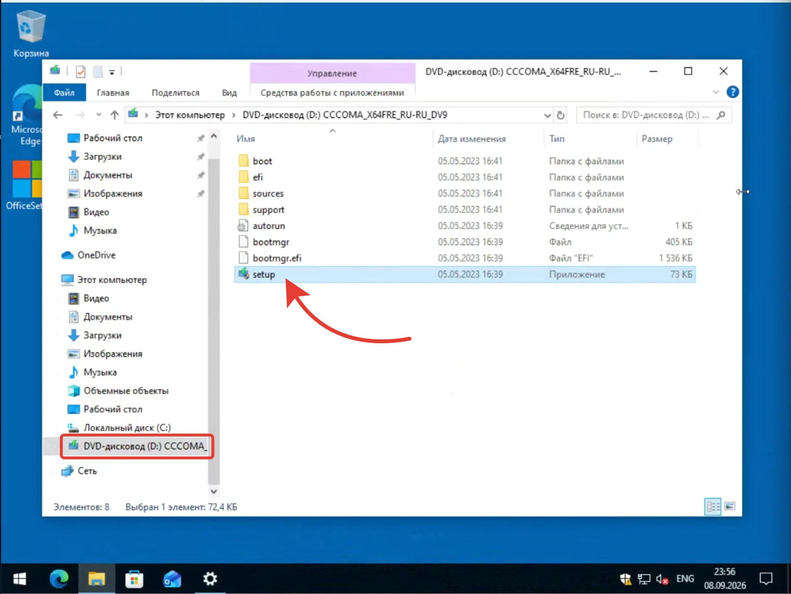
*После монтирования ISO откройте виртуальный DVD-диск и запустите setup.exe*

Откройте его и запустите:

`Setup.exe`

Установщик проведёт проверку компьютера и покажет варианты сохранения данных.

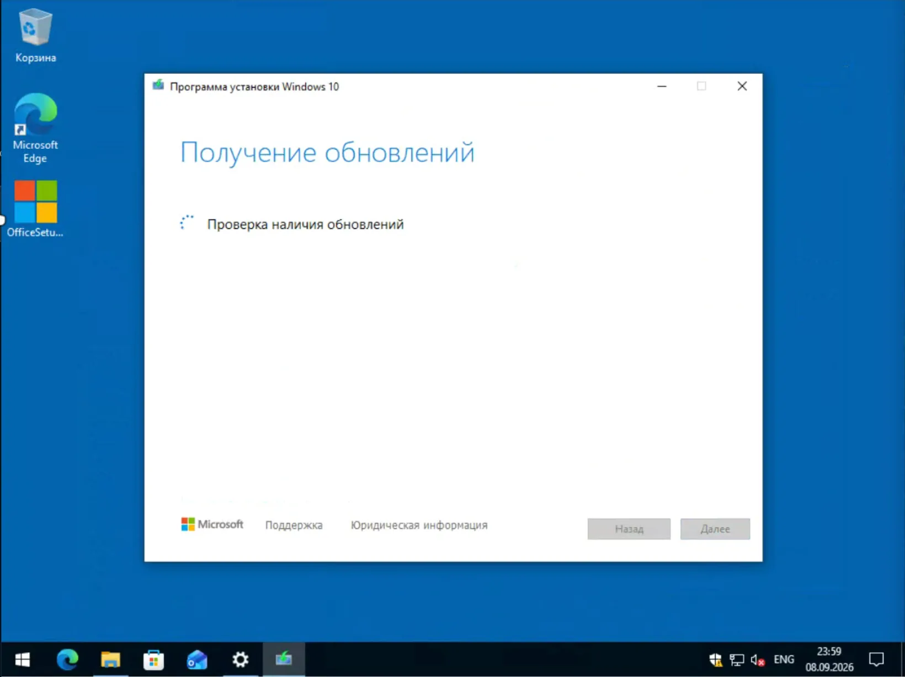
*Первый этап установки — проверка обновлений*

Для обычного обновления выбирайте вариант **«Сохранить личные файлы и приложения»**.

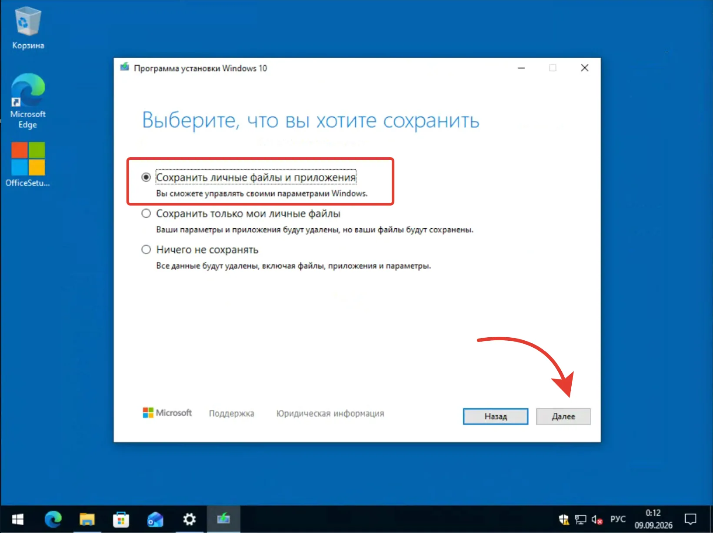
*Оставьте первый пункт, чтобы не потерять файлы и программы*

Это важный момент. Если выбрать **«Ничего не сохранять»**, получится уже не обычное обновление, а установка с удалением пользовательских данных и программ.

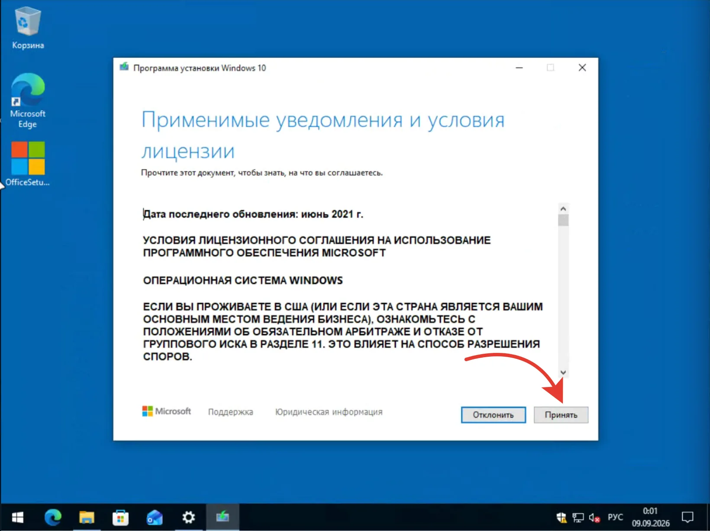
*Лицензионное соглашение — нажмите «Принять»*

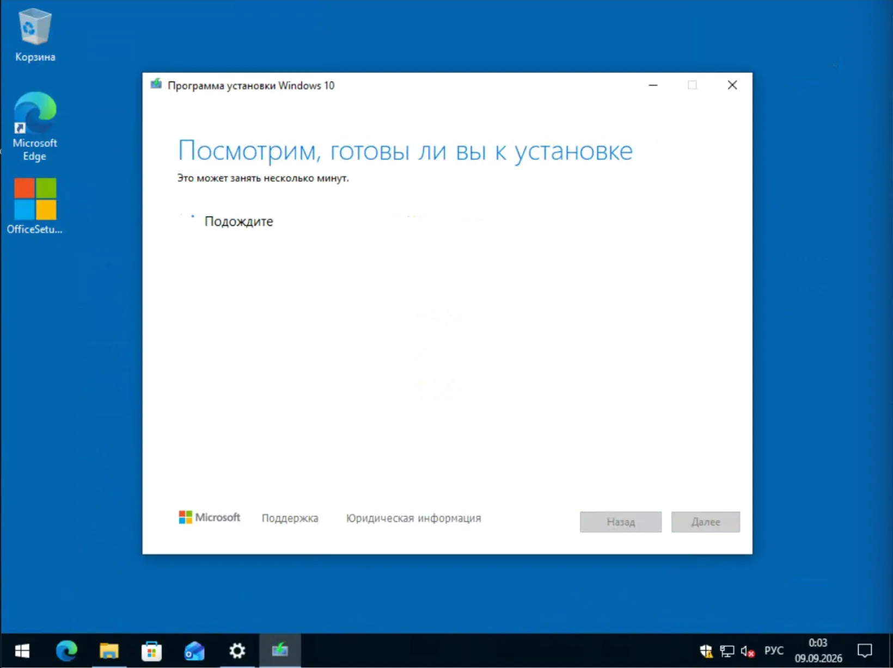
*Проверка «Готовы ли вы к установке» занимает пару минут*

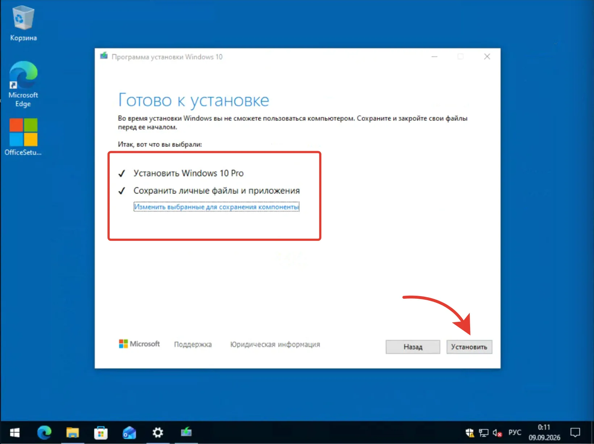
*На финальном экране проверьте, что выбрано сохранение файлов*

После нажатия **«Установить»** компьютер несколько раз перезагрузится.

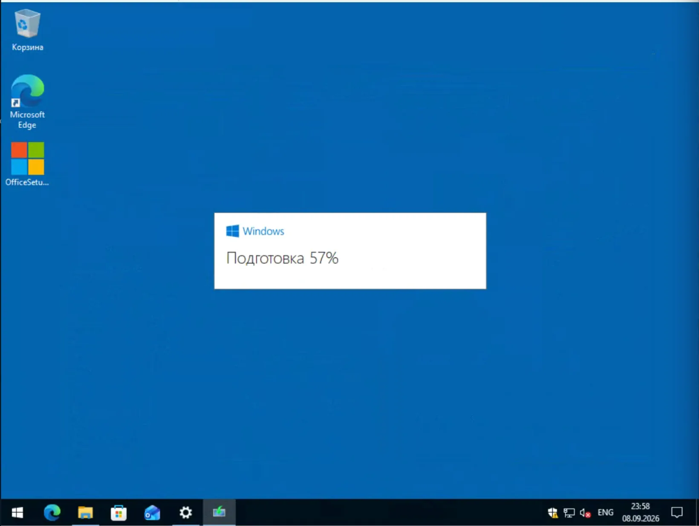
*После старта — подготовка и перезагрузки*

## Где взять ISO Windows 11

За пределами РФ и РБ проще всего использовать официальную страницу Microsoft:

[Скачать Windows 11 с сайта Microsoft](https://www.microsoft.com/software-download/windows11)

Microsoft предлагает несколько способов установки Windows 11, включая скачивание ISO.

Если официальный сайт или нужный сервис недоступен, можно воспользоваться моими инструментами.

Здесь есть важное уточнение: **я не храню готовые ISO и не раздаю собственные сборки Windows**. Мои проекты помогают получить образ или ссылку на него. Сам ISO скачивается отдельно.

## RuBeRoID – если нужен ISO и загрузочная флешка

[RuBeRoID на GitHub](https://github.com/WestDvina/rufus-RuBeRoID/releases) – моя версия Rufus с изменённым механизмом получения Windows ISO.

В основе остаётся Rufus. Я заменил штатный механизм FIDO для получения ISO на собственный способ загрузки. В репозитории это прямо указано как **FIDO → собственный API загрузки ISO**.

При этом сохраняется основная задача Rufus – создание загрузочной флешки Windows.

Можно выбрать ISO, флешку и параметры разметки диска. Это удобно, если кроме обновления понадобится установочный USB-накопитель.

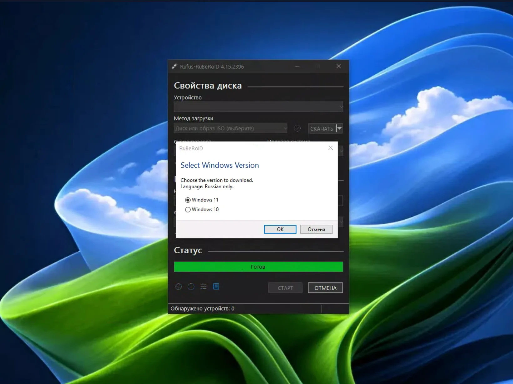
*RuBeRoID сохраняет интерфейс Rufus, кнопка «СКАЧАТЬ» снова работает в обход Sentinel и геоблока*

RuBeRoID – **не официальный выпуск Rufus**. Это мой форк.

Исполняемый файл подписан самоподписным сертификатом, поэтому Windows может показать предупреждение SmartScreen. Это ожидаемо для такой сборки. Информация о самоподписной подписи есть и в последних релизах проекта.

Если нужен одновременно ISO и инструмент для создания загрузочной флешки, этот вариант самый универсальный.

## MS ISO Downloader – получить ISO через Telegram

Если флешка не нужна, есть более короткий вариант.

Я сделал Telegram-бота **MS ISO Downloader**. Он автоматизирует получение данных для загрузки Windows ISO через API Microsoft.

Сценарий простой:

**Windows → архитектура → язык → ссылка на ISO.**

Бот не хранит готовые ISO у себя и не модифицирует образ. Его задача – получить параметры и ссылку, необходимые для загрузки.

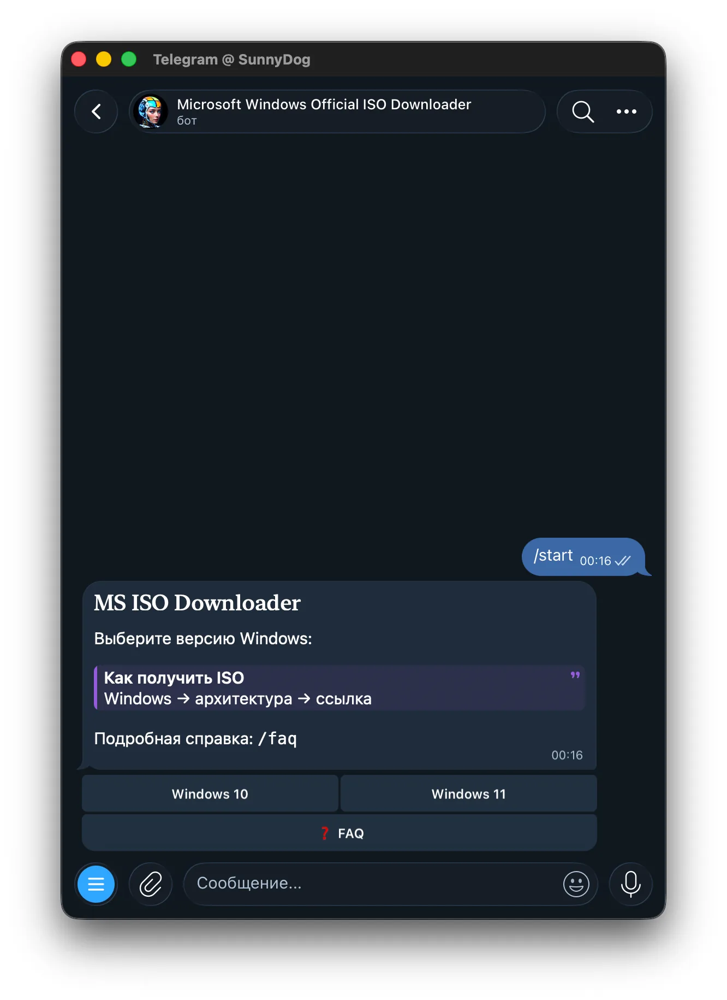
*Бот MS ISO Downloader — 4 клика: Windows → архитектура → язык → ссылка*

Проект ориентирован на потребительские редакции Windows Home и Pro. Серверные версии и LTSC в этот сценарий не входят.

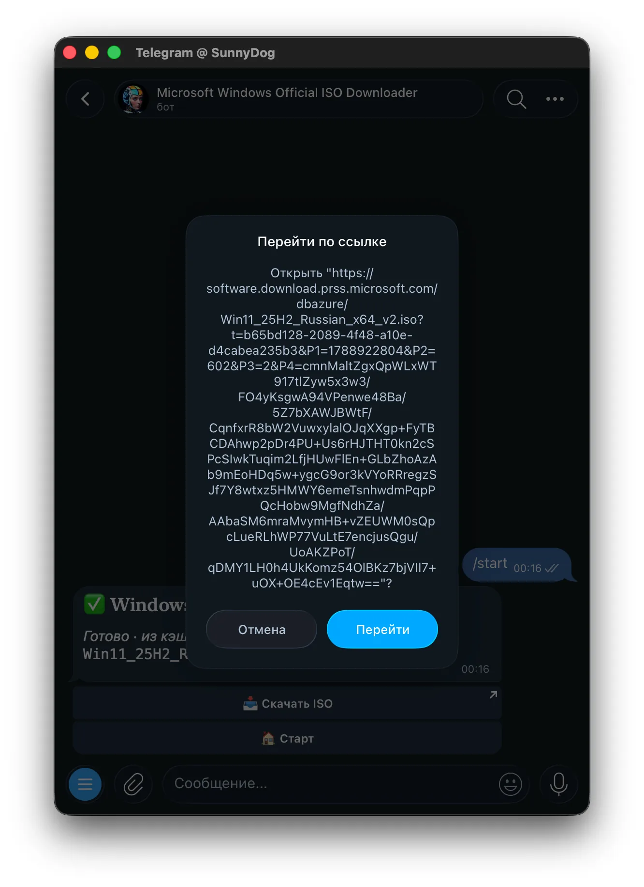
*Прямая ссылка вида software.download.prss.microsoft.com — чистый образ Microsoft*

Подробнее о проекте:

[MS ISO Downloader – статья на Дзене](https://dzen.ru/a/ajY7jfQQCSpPBgkm)

Если нужен обычный ISO для запуска `Setup.exe`, этот вариант получается самым коротким.

## ShIFER – отслеживать свежие ссылки Microsoft

ShIFER решает другую задачу.

Прямые ссылки Microsoft на ISO имеют ограниченный срок действия. В Microsoft Q&A появляются новые ссылки на образы, и за ними приходится следить вручную.

Я сделал **ShIFER**, который отслеживает такие ссылки и показывает актуальные данные.

[ShIFER – сайт проекта](https://westdvina.github.io/shifer/)

[ShIFER на GitHub](https://github.com/WestDvina/shifer)

Сервис периодически проверяет доступность свежих ссылок и показывает оставшееся время их действия.

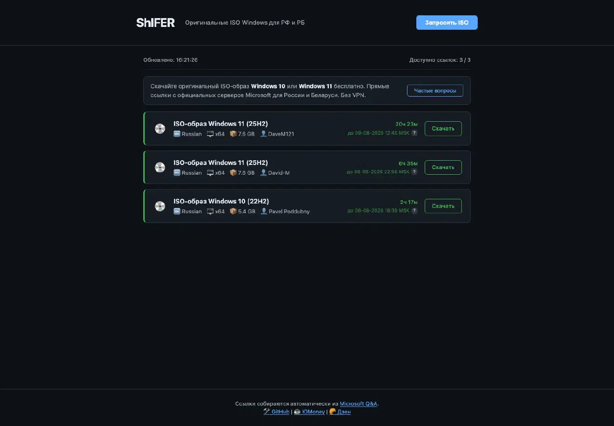
*ShIFER собирает живые ссылки Microsoft Q&A и показывает, сколько часов они ещё работают*

Есть и функция **«Запросить ISO»**. Она формирует готовый текст запроса для Microsoft Q&A, чтобы получить ссылку на нужный образ.

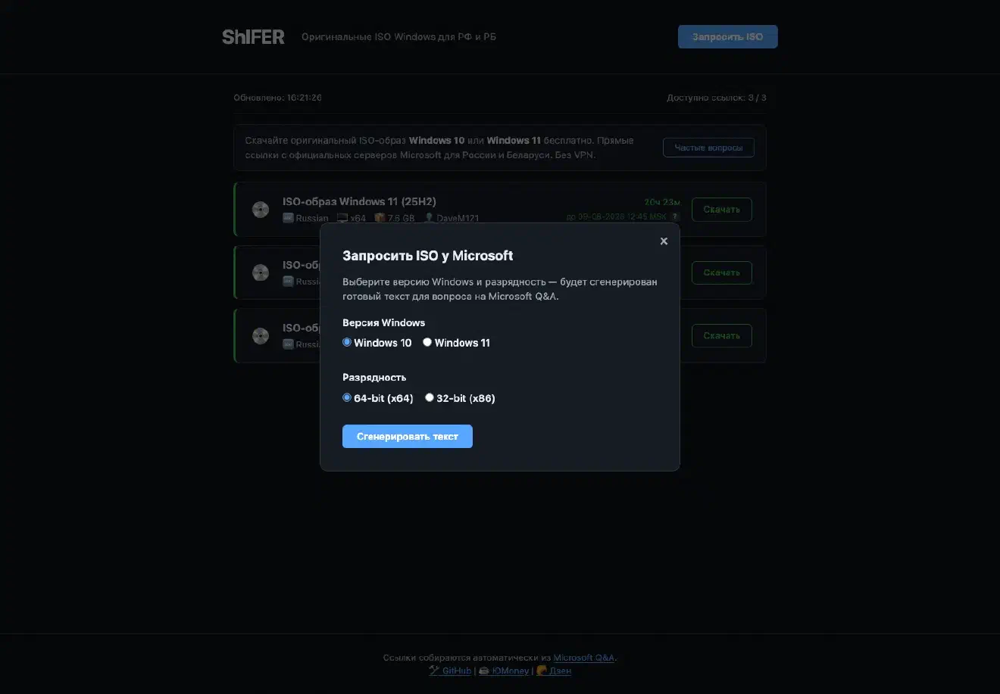
*Кнопка «Запросить ISO» формирует готовый текст для Microsoft Q&A*

Поэтому ShIFER больше подходит тем, кому нужен не просто ISO, а актуальная ссылка Microsoft и информация о её сроке действия.

Подробнее о подходе я писал отдельно:

[Статья о получении оригинального ISO Windows через Microsoft Q&A](https://dzen.ru/a/alIGoHzQxXyh-eme)

## Как выбрать вариант

Здесь всё зависит от задачи.

**Windows 11 появилась в Центре обновления** – обновляйтесь через Windows Update.

**Нужен ISO для запуска `Setup.exe`** – можно использовать MS ISO Downloader.

**Нужно отслеживать актуальные ссылки Microsoft** – пригодится ShIFER.

**Нужна загрузочная флешка** – используйте RuBeRoID.

Три проекта появились из одной проблемы, но объединять их в один инструмент смысла не было. У каждого свой сценарий.

## Что будет с лицензией

Само обновление с Windows 10 до Windows 11 для совместимых компьютеров остаётся бесплатным. Microsoft это прямо указывает в актуальной документации.

При обычном обновлении сохраняется соответствующая редакция Windows. Например, Windows 10 Home обновляется до Windows 11 Home, а Windows 10 Pro – до Windows 11 Pro.

Покупать новый ключ только из-за перехода на Windows 11 не требуется.

## Что делать, если оставаться на Windows 10

Windows 10 продолжает работать и после окончания поддержки.

Но обычная поддержка закончилась 14 октября 2025 года. Microsoft больше не выпускает для неё стандартные бесплатные обновления безопасности.

Для подходящих компьютеров Microsoft предлагает программу Extended Security Updates (ESU), которая позволяет получать обновления безопасности после окончания основной поддержки.

Если компьютер совместим с Windows 11, переход на неё остаётся самым прямым способом продолжить работу на поддерживаемой клиентской Windows.

## Итог

Если компьютер подходит под требования Windows 11, начинать стоит с **Центра обновления Windows**.

Если Windows 11 там появилась – обновляйтесь штатным способом.

Если система подходит, но обновление не предлагается, сначала проверьте причину. В том числе это может быть **safeguard hold** – защитная блокировка Microsoft из-за известной проблемы совместимости. Такой механизм действительно применяется и к Windows 10.

Если нужен ISO, используйте официальный источник Microsoft, когда он доступен.

Для случаев, когда получить его напрямую не получается, я сделал три своих инструмента: **RuBeRoID, MS ISO Downloader и ShIFER**.

RuBeRoID пригодится для загрузочной флешки, MS ISO Downloader – для быстрого получения ISO, ShIFER – для отслеживания актуальных ссылок Microsoft.

Главное – скачивать именно образ Microsoft, а не случайную «Windows 11 Pro Максимальная + активатор» с файлообменника. Экономия пяти минут на поиске ISO иногда заканчивается несколькими часами лечения уже установленной системы.
