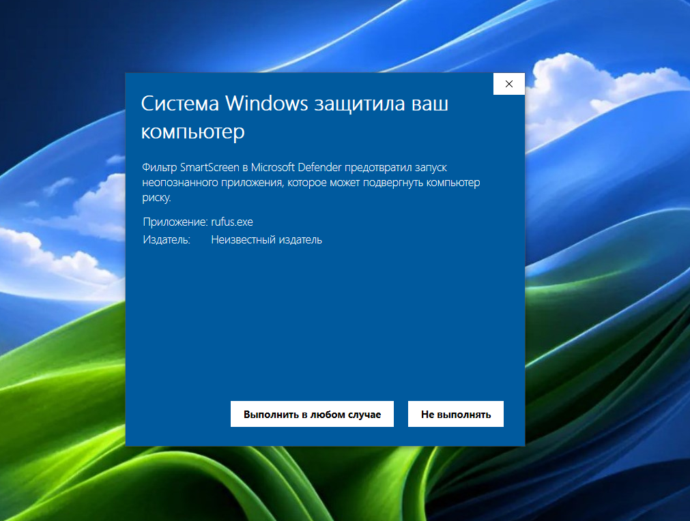
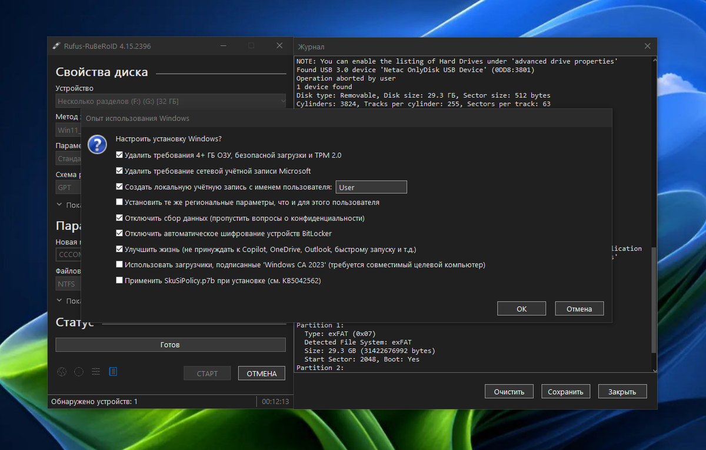
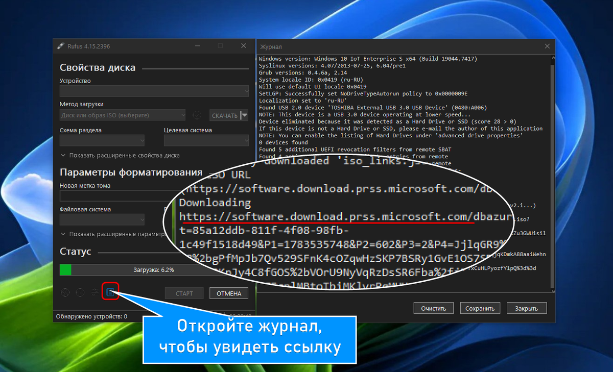
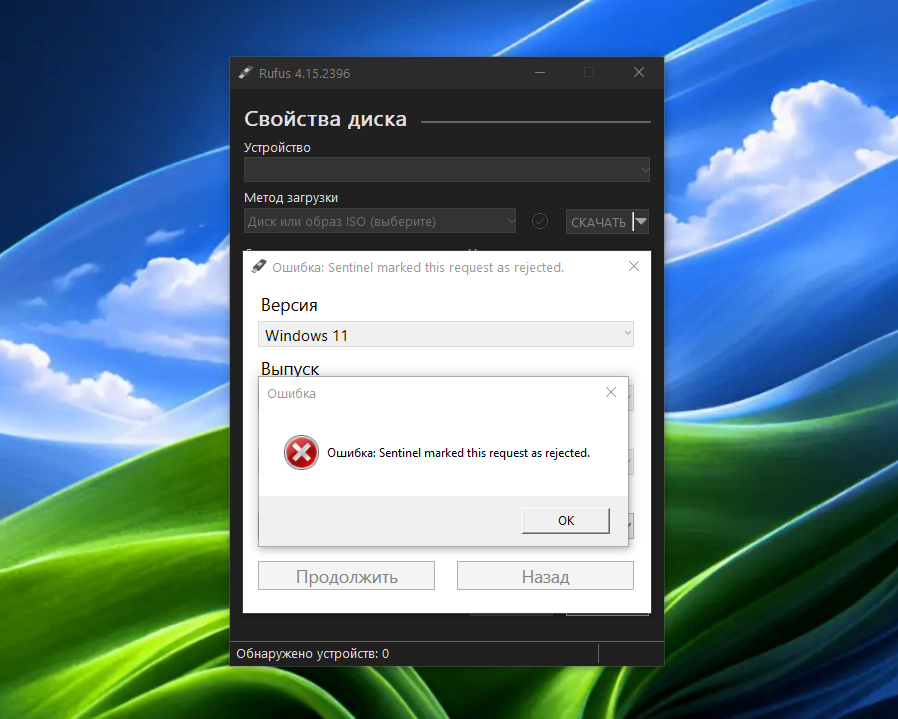

Многие пользователи Rufus заметили: кнопка «Скачать» перестала работать. При попытке скачать образ Windows программа выдаёт ошибку:

`Sentinel marked this request as rejected.`

Проблема во встроенном инструменте загрузки. Разбираюсь, почему он сломался и как скачивать оригинальные ISO без торрентов и неофициальных сборок.

-

## Почему Rufus больше не качает Windows

Rufus скачивает ISO через встроенный скрипт FIDO. Он обращается к серверам Microsoft и должен забирать официальные образы. Схема не работает из-за двух независимых блокировок.

**Защита Sentinel.** Система безопасности Microsoft распознаёт автоматические запросы от скрипта FIDO и блокирует их. Ошибка появляется у всех, независимо от страны и IP-адреса.

**Геоблокировка.** CDN-сеть Microsoft не отдаёт ISO-образы на IP-адреса из России и Беларуси.

В итоге встроенный инструмент FIDO стал бесполезен: он не обходит ни защиту от автоматизации, ни региональные ограничения.

## RuBeRoID: форк с рабочим скачиванием

RuBeRoID (Russia · Belarus · Route · ISO · Downloader) — мой форк последнего релиза Rufus. Привычный интерфейс и все функции я сохранил, заменил только механизм загрузки образов.

В исходном коде изменено три файла: `src/net.c`, `src/stdlg.c` и `src/rufus.h`. Вместо проблемного скрипта FIDO программа берёт оригинальные ссылки на ISO Windows 10 и 11. Принцип получения ссылок и обход защиты Sentinel — такой же, как в моём [Telegram-боте](https://dzen.ru/a/ajY7jfQQCSpPBgkm).

Главные преимущества:

- **Кнопка «Скачать» снова работает.** Ошибка Sentinel исправлена.
- **Геоблок не мешает.** Скачивание не зависит от вашего IP. Ссылки получены, остаётся запустить загрузку.
- **Оригинальные образы.** Файлы качаются напрямую с CDN Microsoft. Это чистые системы, а не сторонние сборки и торренты.

## Что осталось прежним

Форк собран на базе официального Rufus. Все ключевые инструменты записи остались нетронутыми. По-прежнему можно:

- Автоматически обходить требования TPM 2.0 и Secure Boot для Windows 11.
- Выбирать схему раздела — MBR или GPT — и целевую систему UEFI или Legacy.
- Форматировать флешку в NTFS или FAT32.
- Создавать диски Windows To Go и записывать VHD-образы.

Изменения коснулись только этапа загрузки файла. Вся остальная логика программы работает штатно.

## Важное ограничение

В RuBeRoID и Telegram-боте поддерживаются только русскоязычные версии Windows 10 и 11. Другие версии — включая Server и LTSC/LTSB — можно скачать на сайте [windows-64.ru](https://windows-64.ru).

## Про безопасность

RuBeRoID, как и оригинальный Rufus, — полностью открытый код. exe подписан самоподписным сертификатом, а не доверенным сертификатом Microsoft, поэтому при скачивании вы увидите предупреждение об опасности. Это нормально для любых самосборок. Проверить безопасность исходников может каждый.

[Скачать Rufus-RuBeRoID](https://github.com/WestDvina/rufus-RuBeRoID/releases)

## Итог

Ошибка Sentinel — результат двух блокировок Microsoft: защиты от автоматизации и геоблока России с Беларусью. FIDO больше не справляется. Мой форк RuBeRoID возвращает кнопку «Скачать» и тянет оригинальные ISO напрямую с CDN — без VPN, торрентов и сомнительных сборок.