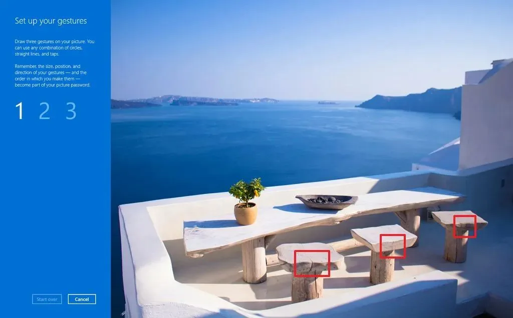

Microsoft без громких анонсов начала сворачивать ещё одну функцию из эпохи Windows 8 — пароли изображений. После июльского обновления безопасности 2026 года **новые пользователи Windows 11 больше не могут настроить этот способ входа. При этом уже существующие пароли продолжают работать.**

На первый взгляд новость выглядит мелочью. Но если посмотреть шире, это ещё один сигнал: Microsoft последовательно вычищает из Windows старые механизмы, которые не вписываются в современную модель безопасности.

## Что именно изменилось

Речь идёт **не об удалении функции целиком, а о прекращении новой регистрации**.

Если у вас уже был настроен пароль изображения, Windows 11 позволит им пользоваться дальше. Но в трёх случаях вернуть его не получится:
- вы удалили пароль изображения;
- отключили этот способ входа;
- никогда раньше его не настраивали.

После обновления соответствующий пункт исчезает из раздела Параметры → Учётные записи → Варианты входа для новых конфигураций.

Такой подход Microsoft использует всё чаще: **сначала прекращает развитие функции, затем скрывает её из интерфейса, а уже потом полностью удаляет из системы**.

## Напоминание: что такое пароль изображения

Эта функция появилась в Windows 8 в 2012 году. Тогда Microsoft активно продвигала сенсорные устройства и пыталась придумать более удобный способ входа для планшетов.

Пользователь выбирал картинку и выполнял на ней три жеста:
- касания,
- линии,
- круги.

Например, можно было провести линию по горизонту фотографии, нажать на лицо человека и обвести кругом какой-то объект.

Идея выглядела необычно и действительно хорошо подходила для сенсорного экрана.

## Почему Microsoft решила от него отказаться

Главная причина — **предсказуемость поведения людей**.

Большинство пользователей выбирают очевидные элементы изображения:
- глаза,
- кнопки,
- логотипы,
- контрастные объекты,
- центр фотографии.

Исследователи давно показывали, что по следам на сенсорном экране или по характерным движениям можно получить подсказки о последовательности жестов.

Это не означает, что любой пароль изображения легко взломать. Но по сравнению с современными методами аутентификации он выглядит устаревшим.

## Почему Windows Hello считается безопаснее

Microsoft продвигает три варианта:
- PIN-код Windows Hello;
- распознавание лица;
- сканер отпечатков пальцев.

Ключевое отличие PIN-кода Windows Hello от обычного пароля учётной записи — **он привязан к конкретному устройству**.

Даже если злоумышленник узнает этот PIN, использовать его для входа в вашу учётную запись Microsoft на другом компьютере нельзя.

На большинстве современных ПК PIN дополнительно защищается модулем TPM — специальным криптографическим чипом, который хранит ключи безопасности отдельно от операционной системы. О том, почему TPM важен при установке Windows 11 26H2, я рассказывал [в отдельной статье](https://trick32.ru/articles/windows-11-26h2-chistaya-ustanovka-nepodderzhivaemoe-oborudovanie/).

Проще говоря:
- пароль учётной записи можно использовать где угодно;
- **PIN Windows Hello работает только на этом компьютере**.

Именно поэтому Microsoft уже несколько лет пытается перевести пользователей с традиционных паролей на Windows Hello.

## Моё мнение: функция умерла ещё вместе с Windows 8

Честно говоря, я удивлён, что пароль изображения дожил до 2026 года.

На практике я почти не встречал людей, которые пользовались им постоянно. После первых экспериментов большинство возвращалось к обычному паролю или переходило на PIN.

Проблема функции была не только в безопасности, но и в удобстве:
- на ноутбуке с мышью выполнять жесты медленнее, чем ввести PIN;
- на большом мониторе движения рукой получаются менее точными;
- после смены изображения рабочего стола многие вообще забывали, какая картинка использовалась для входа.

Для планшетов Windows 8 это выглядело свежо. Для современных ноутбуков и настольных ПК — скорее как музейный экспонат.

## Это часть большой чистки Windows

За последние годы Microsoft уже избавилась или начала сворачивать:
- Internet Explorer,
- Cortana,
- старую панель управления для многих разделов,
- устаревшие сетевые компоненты,
- классические средства диагностики,
- ряд функций, оставшихся со времён Windows 7 и 8.

Любопытно, что параллельно Microsoft постепенно возвращает настройки [панели задач](https://trick32.ru/articles/taskbar-settings-windows-11/), которые раньше вырезала из интерфейса.

Пароль изображения отлично вписывается в этот список.

Компания явно движется к модели, где основными способами входа станут:
1. биометрия;
2. PIN Windows Hello;
3. ключи доступа (passkeys);
4. аппаратная аутентификация через TPM и FIDO2.

## Что делать пользователям

Если у вас уже настроен пароль изображения

Ничего срочного делать не нужно — он продолжит работать.

Если вы им пользуетесь регулярно

Я бы всё же рекомендовал заранее **настроить Windows Hello PIN как резервный вариант**. Это займёт меньше минуты:

Параметры → Учётные записи → Варианты входа → PIN-код (Windows Hello).

Если вы никогда не использовали эту функцию

Вы ничего не потеряли. Современный PIN-код быстрее, удобнее и безопаснее практически во всех сценариях.

Если понадобится чистая переустановка системы, полную инструкцию по скачиванию оригинального ISO Windows я собирал [в отдельном гайде](https://trick32.ru/articles/skachat-windows-original-iso-microsoft/).

## Вывод

Новость о сворачивании паролей изображений кажется незначительной, но она хорошо показывает направление развития Windows 11.

Microsoft больше не пытается поддерживать экзотические способы входа, придуманные для сенсорной революции времён Windows 8. Вместо этого компания делает ставку на Windows Hello, TPM, биометрию и беспарольную аутентификацию.

На мой взгляд, это правильное решение. Главное, что Microsoft не стала ломать существующие настройки и оставила пользователям возможность продолжать работать так, как они привыкли.

Но тенденция очевидна: **чем старше функция Windows, тем выше вероятность, что однажды она просто тихо исчезнет без отдельной презентации и фанфар**.