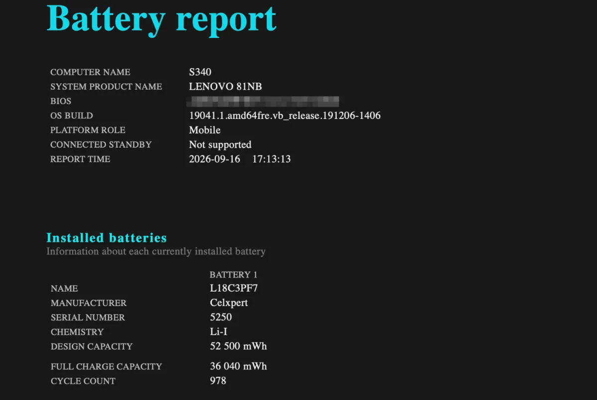
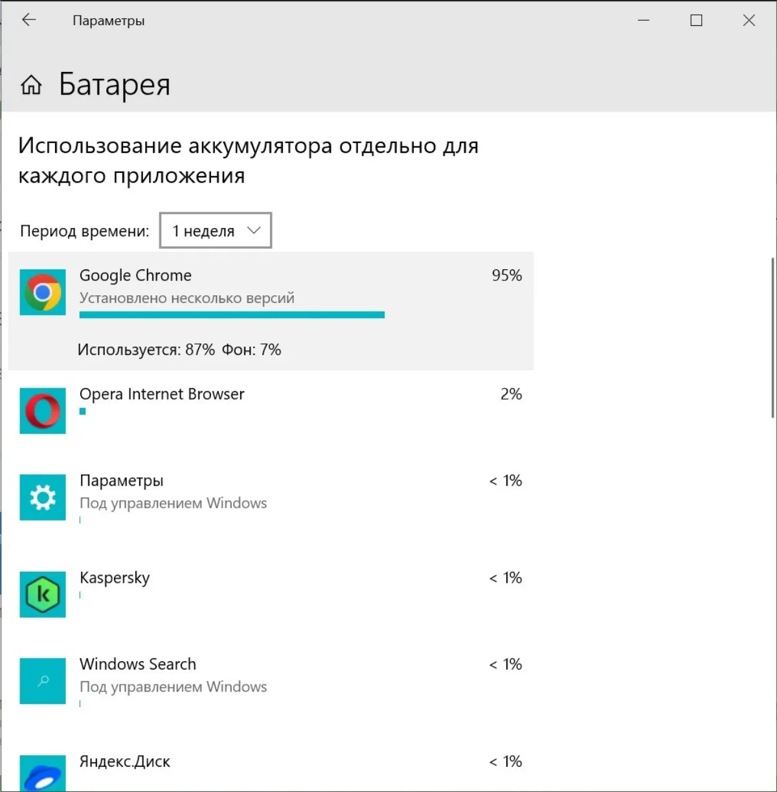
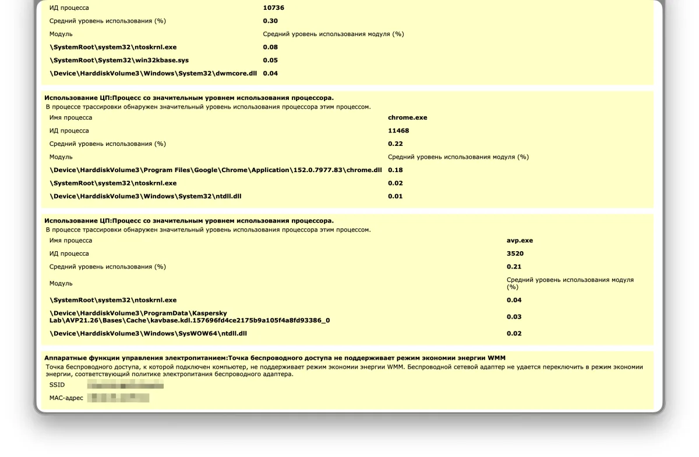
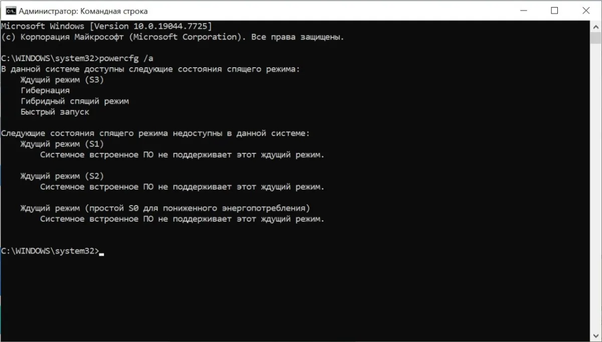
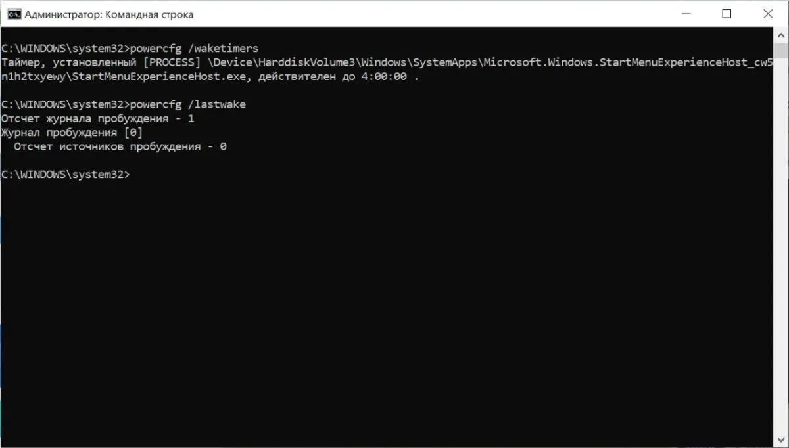

Ноутбук, который год назад держал шесть часов, теперь садится за два. Причин две: аккумулятор потерял ёмкость или заряд расходует сама система.

Проверяются они по очереди, и начинать надо не с настроек. Замена батареи не поможет, если виноват фоновый процесс. А чистка автозагрузки не вернёт мёртвые ячейки.

## Две причины и как их различить

| Что происходит | На что похоже | Чем проверять |
|---|---|---|
| Держит меньше часа даже в простое, заряд падает рывками | Батарея изношена | `powercfg /batteryreport` |
| В простое уходит 10–20% за час, кулеры шумят | Фоновые задачи | «Использование батареи» |
| Разряжается, пока лежит выключенный в сумке | Режим ожидания или зарядка портов | `powercfg /a`, `powercfg /sleepstudy` |

Дальше по шагам: сначала батарея, потом система, в конце — отдельный случай с выключенным ноутбуком.

## Шаг 1. Проверьте износ батареи

Откройте **Командную строку от имени администратора** и выполните:

```
powercfg /batteryreport
```

Отчёт строится за секунды. Файл `battery-report.html` появится в папке пользователя, точный путь команда напишет прямо в окне. Откройте двойным щелчком.

Смотреть надо на три строки:

**DESIGN CAPACITY** — сколько ёмкости было у новой батареи. **FULL CHARGE CAPACITY** — сколько она держит сейчас. **CYCLE COUNT** — число полных циклов зарядки.

Разделите второе на первое и посмотрите на результат:

| Осталось от заводской ёмкости | Что это значит |
|---|---|
| 80–100% | Батарея в норме, причина не в ней |
| 60–80% | Ёмкость просела, автономность заметно короче |
| 40–60% | Пора планировать замену |
| меньше 40% | Менять: настройками уже не помочь |



На снимке — 36 040 из 52 500. Это 69% от заводской ёмкости, то есть вторая строка таблицы. Ноутбук живой, но держит уже не столько, сколько обещал производитель.

**CYCLE COUNT** часто стоит с прочерком. Это не поломка: не все производители передают счётчик в Windows. Ориентируйтесь на ёмкость, а не на счётчик — приложение от производителя ноутбука может показать больше.

Ёмкость в норме — идём дальше. Если нет, следующий шаг покажет, не добивает ли систему батарея дополнительно.

## Шаг 2. Посмотрите, кто расходует заряд

Расход по приложениям Windows считает сама, но путь зависит от версии.

**Windows 11:** Параметры → Система → Питание и батарея → Аккумулятор → **Использование батареи**.
**Windows 10:** Параметры → Система → **Батарея**, раздел «Использование аккумулятора отдельно для каждого приложения».

Период поставьте на неделю: на нём видно картину целиком, а не разовый всплеск.



Первое место почти всегда занимает браузер. Это нормально: он открыт дольше всего. Смотрите не на первое место, а на строку под процентом. Там две цифры: **используется** и **фон**. Первая — сколько приложение съело, пока вы с ним работали. Вторая — сколько ушло, пока оно висело само. Вот она и показывает расход впустую.

На снимке браузер держит 95% расхода, но в фоне тратит только 7%. Бывает и наоборот: приложение, которое вы не открывали месяц, показывает пару процентов на экране и 40% в фоне. Такое отключайте первым.

Дальше два действия:

1. **Windows 11:** у приложения нажмите **три точки → Управление фоновой активностью** и поставьте **Никогда**. Уведомления от него приходить перестанут, заряд он тратить тоже. **Windows 10:** такого пункта нет — приложение придётся закрывать, убирать из автозагрузки или удалять.
2. Проверьте **Режим питания**. Если стоит «Наилучшая производительность», ноутбук работает на пределе постоянно. Для батареи нужен режим **Наилучшая энергоэффективность**.

Фоновые приложения едят и заряд, и трафик — [какие из них качают в фоне и как их отключить](/articles/fonovye-prilozheniya-zhrut-wi-fi-kak-ostanovit/), я уже разбирал.

## Шаг 3. Отчёт об энергии, если список пуст

Бывает, что в «Использовании батареи» ничего подозрительного нет, а ноутбук всё равно садится. Windows считает расход только по приложениям из магазина и части обычных программ. Службы, драйверы и задачи планировщика в список не попадают.

Тогда нужен отчёт об энергии:

```
powercfg /energy
```

Утилита наблюдает за системой **60 секунд** и собирает полный отчёт. Перед запуском закройте браузер и всё лишнее. Иначе она пожалуется на них, а не на реальную проблему.

Файл `energy-report.html` появится в папке `C:\Windows\System32`. Откройте в браузере и найдите раздел с ошибками и предупреждениями.



На снимке отчёт нашёл четыре предупреждения: система, диспетчер окон `dwm.exe`, браузер и антивирус. Каждое по отдельности мелочь — доли процента. Но отчёт показывает то, чего не видно в списке приложений: не «кто съел больше всех», а «кто вообще просыпался и работал в фоне».

Что искать:

* **USB-устройство не уходит в спящий режим.** Мышка, хаб или док-станция будят систему по кругу. Меняйте по очереди: кабель, порт, потом само устройство.
* **Завышен минимальный режим процессора.** В схеме питания это параметр «Минимальное состояние процессора». Часто его выставила какая-нибудь «игровая» программа-ускоритель.
* **Повышенное разрешение системного таймера.** Программа просит систему просыпаться чаще, чем нужно. Виновата обычно та, что играет музыку или рисует анимацию в фоне.
* **Деградация ёмкости батареи.** Это то самое падение, которое вы уже видели в отчёте о батарее.

## Шаг 4. Если ноутбук разряжается выключенным

Ноутбук в сумке теряет заряд не потому, что «выключен и всё равно ест». Причин три: он не выключается по-настоящему, его будят задачи и сеть, а часть заряда уходит на чужие устройства. Проверяются они отдельно.

**Проверьте, как ноутбук засыпает.** Выполните:

```
powercfg /a
```

Команда покажет, какие состояния сна поддерживает ваша машина. Ищите строку `S0 Low Power Idle` — это и есть **Modern Standby**.

* Строка стоит в списке **доступных** и рядом пометка `Network Connected` — у вас Modern Standby.
* Строка попала в список **недоступных**, а рядом написано, что системное встроенное ПО её не поддерживает — у вас обычный ждущий режим `S3`.



На снимке второй случай: машина умеет ждать в S3, уходит в гибернацию и быстро запускается, а S0 не поддерживает. Такой ноутбук закрытой крышкой уходит в обычный сон и заряд в сумке почти не тратит. Если у вас так же, читайте дальше про зарядку портов и саморазряд, а раздел про Modern Standby нужен вам для общего понимания.

Modern Standby — это не сон в привычном смысле: ноутбук гасит экран, но продолжает работать. Проверяет почту, синхронизирует облако, отвечает на уведомления. Закрытая крышка на такой машине ничего не выключает, поэтому заряд и уходит.

**Зарядка портов от выключенного ноутбука.** Часть моделей умеет заряжать телефон от USB, даже когда выключена. Настройка живёт не в Windows, а в firmware: в BIOS ищите пункты вида «Always On USB», «USB PowerShare» или «зарядка в выключенном состоянии». Отключите — и ноутбук перестанет отдавать заряд чужим устройствам.

**Саморазряд.** Литий-ионная батарея теряет заряд, даже когда лежит отдельно от ноутбука: примерно 1–3% в месяц. Стандарт IEC 61960 требует, чтобы элемент сохранял не меньше 85% заряда за 90 дней хранения. То есть ноутбук, пролежавший в шкафу месяц, потеряет несколько процентов просто так. А вот 10–20% за ночь — это уже не саморазряд, а работающий ноутбук.

**Если у вас Modern Standby.** Microsoft считает нормальным расход в этом режиме **до 0,33% в час** — это больше 12 дней простоя. От 0,33 до 1% в час — уже нездорово, а больше 1% в час — красная зона: четыре дня, и батарея пустая.

Точные цифры даёт отчёт:

```
powercfg /sleepstudy
```

Он открывается в браузере и показывает, что происходило с ноутбуком в каждой сессии ожидания: сколько он спал, что его будило, какой компонент держал систему в сознании. Ищите строки про сеть и USB. У машин без Modern Standby в колонках расхода будут прочерки: считать нечего, полноценного сна не было.

В параметрах питания есть пункт про работу сети в режиме ожидания. Выключите его — и почта с мессенджерами перестанут будить ноутбук в сумке.

**Узнайте, что будит ноутбук.** Это пригодится в любом случае:

```
powercfg /waketimers
powercfg /lastwake
```

Первая команда покажет задачи, которые поднимают машину по расписанию. Вторая расскажет, что разбудило её в последний раз.



На снимке журнал пуст: источников пробуждения ноль, в таймерах одна системная задача от меню «Пуск». Значит, сам по себе ноутбук не просыпается, и заряд уходит по другой причине.

**Крайняя мера.** Если расстраивает именно разряд в сумке, поменяйте действие при закрытии крышки на гибернацию: **Панель управления → Электропитание → Действия при закрытии крышки**. Гибернация сохраняет состояние на диск и выключает ноутбук полностью — мгновенного пробуждения, как из сна, не будет, зато заряд не уходит. Отключать Modern Standby через реестр тоже можно, но это уже вмешательство в firmware-логику: на части ноутбуков так теряется быстрое пробуждение, а на некоторых модель перестаёт корректно засыпать.

## Когда дело не в настройках

Если ёмкость батареи в отчёте ниже 40% от заводской — настройки уже не помогут. Мёртвые ячейки не восстанавливаются: автономность вернёт только новая батарея.

Отдельный случай — **перегрев**. Если корпус горячий, кулеры не замолкают, а ноутбук держит процессор на высокой частоте в простое, дело может быть в пыли и высохшей термопасте. Тут поможет чистка, а не настройки питания.

И третий случай, самый неприятный: **вздутая батарея**. Если тачпад стал хуже нажиматься, корпус выпирает снизу, а на ощупь крышка неровная — несите в сервис. Вздутый аккумулятор опасен, и чем раньше его заменят, тем лучше.

## Что не поможет

**«Ускорители батареи» из Microsoft Store.** Ставят таймеры, гасят службы и обещают прирост заряда. На деле выключают то, что выключит сама Windows в режиме энергосбережения.

**Чистильщики реестра.** Заряда не добавляют, а схему питания сломать могут.

**Отключение служб пачкой.** Если гасить всё подряд, что «звучит ненужно», ломаются Windows Update и защита. Начинайте с приложений из второго шага: их хватает чаще всего.

**Правка реестра ради USB selective suspend.** Эта опция в Windows 11 спрятана, и в интернете советуют разблокировать её через реестр. Если отчёт об энергии прямо не указал на USB, не трогайте.

## Итог

1. `powercfg /batteryreport` — посмотреть, сколько ёмкости осталось. Меньше 40% — менять батарею.
2. «Использование батареи» в параметрах — найти приложение, которое ест заряд, и запретить ему фоновую работу.
3. `powercfg /energy` — если список приложений чистый: отчёт найдёт проблемы в службах, таймерах и USB.
4. `powercfg /a` и `powercfg /sleepstudy` — если заряд уходит у выключенного ноутбука.

Порядок важен: сначала батарея, потом система. Иначе легко полдня чистить автозагрузку на ноутбуке с убитым аккумулятором.

## Нужна помощь?

Если не хочется самому разбираться с отчётами, службами и схемами питания — помогу удалённо. Посмотрю, что именно расходует заряд на вашем ноутбуке, отключу лишнее и настрою питание. Заодно поставлю оригинальный Microsoft Office 2024 или Microsoft 365 и помогу с активацией Windows — без репаков и торрентов.

→ [Удалённая установка Microsoft Office и помощь с активацией Windows](/articles/udalennaya-pomoshch-ustanovka-microsoft-office-word-excel/)

Нажмите кнопку «💬 Написать в чате» справа внизу.
