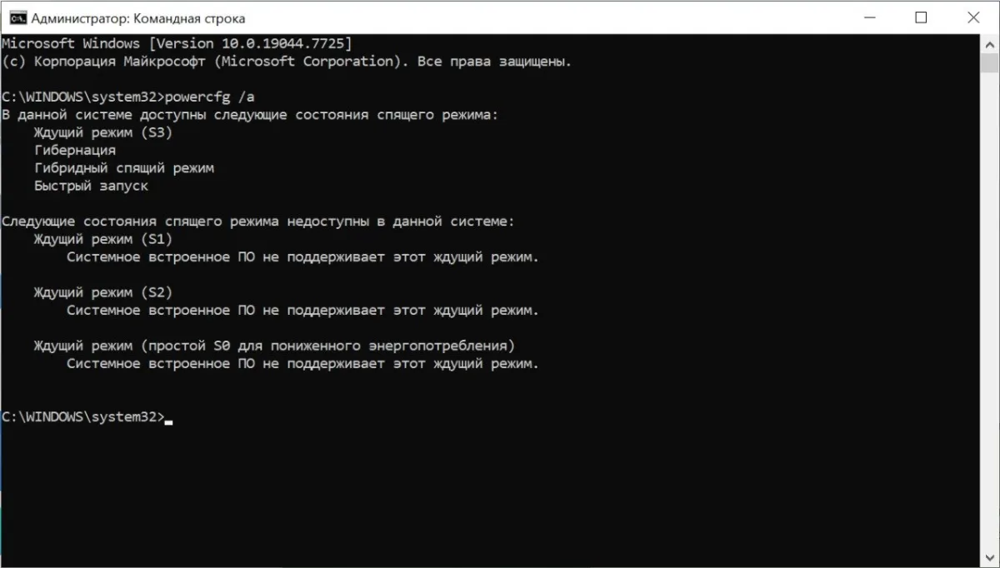
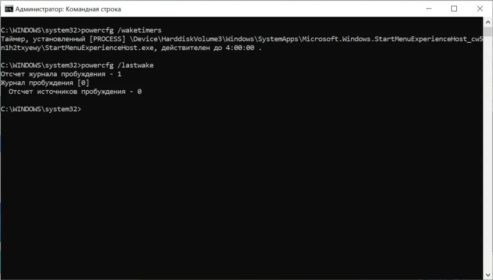
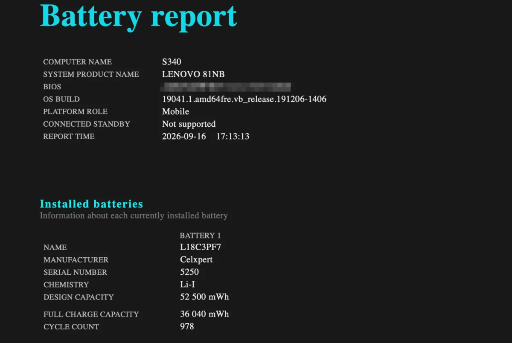

Ноутбук, выключенный вчера вечером, может потерять за ночь в сумке 10–20% заряда. Звучит нелогично: если он выключен, расходовать заряд нечему. Но чаще всего он **не выключен по-настоящему** — Windows ушла в Modern Standby (S0), и система всё это время работала.

Второй сценарий: ноутбук действительно обесточен, но заряд всё равно уходит — на USB-порты, которые кормят подключённое устройство, и на естественный саморазряд батареи. Причин четыре, и проверить их можно бесплатно, четырьмя командами из командной строки.

Отдельно разберём популярный совет «отключите Быстрый запуск» — он не помогает, потому что в выключенном ноутбуке этот механизм заряд не тратит.

## «Выключенный» и «выключенный по-настоящему» — не одно и то же

Когда вы закрываете крышку или нажимаете «Завершение работы», Windows может увести ноутбук в разные состояния. От этого и зависит, уходит заряд или нет.

| Что вы сделали | Что произошло | Тратит заряд в сумке |
|---|---|---|
| Закрыли крышку (по умолчанию) | Сон: Modern Standby (S0) или ждущий режим (S3) | S0 — да, S3 — почти нет |
| «Завершение работы» | Полное выключение или Fast Startup | Нет |
| Сон → прошло время | Windows решает, уйти ли в гибернацию | Зависит от настройки |

Ключевая разница — между **сном** и **выключением**. Закрытая крышка почти всегда означает сон, а не выключение. А на многих современных ноутбуках сон — это Modern Standby, который не выключает систему целиком.

## Причина 1. Modern Standby: ноутбук «спит», оставаясь включённым

**Modern Standby (S0 Low Power Idle)** — режим сна, где экран погашен, но процессор, память и сеть продолжают работать в фоне. Ноутбук проверяет почту, синхронизирует облако, отвечает на уведомления. Именно поэтому он возвращается к работе мгновенно — как телефон, а не как компьютер, выходящий из гибернации.

Закрытая крышка на такой машине **ничего не выключает**. Заряд уходит всю ночь.

Проверить, есть ли у вас этот режим:

```
powercfg /a
```

Команда покажет список состояний сна. Если в разделе **доступных** есть строка `Standby (S0 Low Power Idle)` — у вас Modern Standby. Если она попала в **недоступные**, а рядом сказано, что встроенное ПО её не поддерживает, — у вас обычный ждущий режим S3, и заряд в сумке почти не тратится.



Для машин с Modern Standby есть отдельный отчёт:

```
powercfg /sleepstudy
```

Он открывается в браузере и показывает каждую сессию ожидания: сколько ноутбук спал и что его держало активным. Ищите строки про сеть и USB. Цветовая шкала Microsoft задаёт ориентиры по расходу:

| Расход в ожидании | Цвет отчёта | Что значит |
|---|---|---|
| до 0,33% в час | зелёный | норма, больше 12 дней простоя |
| 0,33–1% в час | жёлтый | уже нездорово |
| больше 1% в час | красный | батарея пустая за четыре дня |

Больше 1% в час — красная зона: за ночь такой ноутбук отдаёт заметную часть заряда, даже если вы ничего не делали.

## Причина 2. Порты заряжают чужие устройства

Часть ноутбуков умеет отдавать энергию через USB, пока выключена. Мышка, повербанк или телефон, оставленные в порту, за ночь вытянут ощутимый процент ёмкости. Настройка живёт не в Windows, а в прошивке.

Заходите в BIOS/UEFI и ищите пункты вида **Always On USB**, **USB PowerShare** или «зарядка в выключенном состоянии». Отключите — и ноутбук перестанет кормить чужую технику от своей батареи.

Проверить, виноват ли этот режим, просто: на одну ночь уберите из портов всё и закройте крышку так же, как обычно. Если разряд пропал — дело было в USB.

## Причина 3. Саморазряд батареи

Литий-ионный аккумулятор теряет заряд, даже когда лежит отдельно от ноутбука: примерно **1–5% в месяц** при комнатной температуре. Это нормально, и это не работающая система.

Полезно помнить порядок величин. Стандарт IEC 61960-3 требует, чтобы элемент сохранял **не меньше 70% заряда после 28 дней** хранения и восстанавливал **не меньше 85% ёмкости после 90 дней** хранения. То есть ноутбук, пролежавший в шкафу месяц, по правилам теряет несколько процентов — но **10–20% за одну ночь это не саморазряд**, а работающий ноутбук.

## Причина 4. Ноутбук будят задачи и сеть

Даже выключенный на вид, ноутбук с подключённой сетью может просыпаться по расписанию: проверка обновлений, синхронизация, задача планировщика. В Modern Standby это разрешено — система остаётся «на связи».

Узнать, кто будит машину, помогут две команды:

```
powercfg /waketimers
powercfg /lastwake
```

Первая показывает запланированные задачи, которые поднимают систему сами. Вторая рассказывает, что разбудило её в последний раз. В параметрах питания есть пункт про работу сети в режиме ожидания — выключите его, и почта с мессенджерами перестанут дёргать ноутбук в сумке.



## Разбор: виноват ли «Быстрый запуск»

Самый частый совет в интернете: «отключите Быстрый запуск (Fast Startup), это он разряжает выключенный ноутбук». Совет популярен, но причина указана неверно.

**Fast Startup** — это гибридное завершение работы. При «Завершении работы» Windows сохраняет ядро и драйверы в файл `hiberfil.sys` и восстанавливает их при следующем старте, чтобы загружаться быстрее. Но сам ноутбук при этом **обесточен**. Пока машина выключена, Fast Startup энергию не потребляет — он влияет только на скорость следующего включения.

Путаница возникает, когда **выключение принимают за сон**: человек думает, что ноутбук выключен, а по факту закрыл крышку и отправил его в Modern Standby. Тогда заряд уходит — но из-за сна, а не из-за Fast Startup.

Отключить Fast Startup всё равно можно, если он мешает (например, при второй системе на диске). Но проблему с разрядом в сумке это не решает.

## Как понять свою причину

Идите по порядку от самого вероятного:

1. **`powercfg /a`** — есть ли Modern Standby (S0). Если да и крышка уводит в сон — виноват он.
2. **`powercfg /sleepstudy`** — на S0-машине покажет, что именно держало систему активной и сколько уходило в час.
3. **`powercfg /waketimers` и `/lastwake`** — если ноутбук просыпается сам.
4. **Ночь без устройств в портах** — проверка на USB-зарядку.
5. **`powercfg /batteryreport`** — посмотреть износ батареи. Если осталось меньше 40% от заводской ёмкости, разряд объясняется износом, и настройки уже не помогут.



Отчёт о батарее мы разбирали подробно в статье про быстрый разряд — [почему ноутбук быстро разряжается](/articles/pochemu-noutbuk-bystro-razryazhaetsya/). Там же есть `powercfg /energy`, если подозреваете не сон, а фоновые задачи.

## Что делать по каждой причине

**Modern Standby.** Бороться с режимом не нужно — смените действие при закрытии крышки на гибернацию: Панель управления → Электропитание → **Действия при закрытии крышки** → «Гибернация». Гибернация сохраняет состояние на диск и выключает ноутбук полностью: мгновенного пробуждения не будет, зато заряд не уходит.

**USB-зарядка.** Отключите Always On USB / USB PowerShare в BIOS и не оставляйте устройства в портах на ночь.

**Пробуждения по расписанию.** Выключите пункт про работу сети в режиме ожидания в настройках питания. Точечно запретить будить систему можно через `powercfg /devicedisablewake "название устройства"`.

**Изношенная батарея.** Если `powercfg /batteryreport` показывает меньше 40% от заводской ёмкости — поможет только замена. Мёртвые ячейки настройками не восстановить.

## Когда дело не в настройках

Если ноутбук горячий в сумке, кулеры не замолкают, а батарея вздулась (тачпад стал хуже нажиматься, корпус выпирает снизу) — это уже не питание, а железо. Вздутый аккумулятор опасен, несите в сервис.

Ещё один случай — аппаратная утечка на материнской плате. Если после всех проверок разряженный выключенный ноутбук теряет больше пары процентов в неделю, а батарея в норме, это к мастеру.

## FAQ

**Ноутбук разряжается за ночь на 30–40%. Это нормально?**
Нет. Такой расход означает либо глубокий износ батареи, либо работающий в фоне ноутбук. Проверьте `powercfg /a` и `powercfg /batteryreport`.

**Сколько заряда теряет действительно выключенный ноутбук?**
За счёт саморазряда — единицы процентов в месяц. Если теряет сильно больше, значит он не выключен.

**Можно ли оставить выключенный ноутбук в шкафу на полгода?**
Можно, если заряд около 50%: так батарея стареет медленнее. Раз в пару месяцев стоит подзаряжать до этого уровня.

**Fast Startup отключать?**
Для разряда в сумке — бесполезно. Смысл есть, если у вас вторая ОС на диске или мешают пробуждения после «Завершения работы».

## Итог

1. Сначала проверьте, выключается ли ноутбук вообще: `powercfg /a`. Modern Standby (S0) — самая частая причина.
2. На S0-машине смотрите `powercfg /sleepstudy`: он покажет расход в час и что будило систему.
3. Уберите устройства из портов на ночь и проверьте Always On USB в BIOS.
4. `powercfg /batteryreport` скажет, не пора ли менять батарею.
5. Быстрый запуск тут не виноват — он не тратит заряд у выключенного ноутбука.

## Нужна помощь?

Если не хочется самому разбираться с режимами сна, отчётами и действиями крышки — помогу удалённо. Найду, что расходует заряд на вашем ноутбуке, настрою питание и отключу лишние пробуждения. Заодно поставлю оригинальный Microsoft Office 2024 и помогу с активацией Windows — без репаков и торрентов.

→ [Установка и активация Windows и Office — удалённая помощь](/articles/pomoshch-windows-office/)

Нажмите кнопку «💬 Написать в чате» справа внизу.
