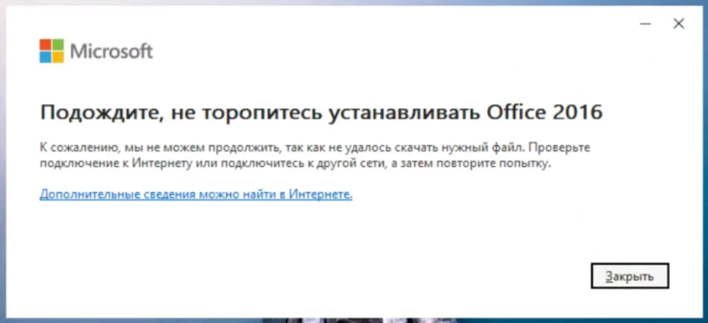

При установке Office иногда появляется странная ошибка.

**«Подождите, не торопитесь устанавливать Office 2016. К сожалению, мы не можем продолжить, так как не удалось скачать нужный файл. Проверьте подключение к Интернету или подключитесь к другой сети, а затем повторите попытку»**.

Особенно забавно это выглядит, когда пользователь устанавливает не Office 2016, а Office 2019, Office 2021 или Microsoft 365.



Первое желание: проверить интернет. Но если браузер открывает сайты, Windows обновляется, а остальные программы спокойно выходят в сеть, искать неисправность в роутере бессмысленно. В некоторых случаях установщик Office упирается в региональную блокировку Microsoft.

Для пользователей из России и Беларуси этот вариант стоит проверить первым.

## Почему установщик говорит про Office 2016

Само сообщение сбивает с толку. Вы скачали одну версию Office, а установщик упоминает другую.

Это не обязательно означает, что вы скачали неправильный пакет. Microsoft использует общий механизм Click-to-Run для разных выпусков Office, поэтому текст ошибки не всегда точно отражает продукт, который пользователь собирается установить.

Главная часть сообщения в другом месте: **«не удалось скачать нужный файл»**.

Установщик Office сначала должен получить необходимые компоненты с серверов Microsoft. Если загрузка не проходит, установка останавливается.

Причин может быть несколько: прокси, сетевой фильтр, антивирус, остатки предыдущего Office или проблемы на стороне серверов Microsoft. Но есть ещё одна причина, о которой в самой ошибке ничего не сказано: регион пользователя.

## Office проверяет регион

Microsoft определяет регион подключения по IP-адресу. Для некоторых стран действуют ограничения на отдельные сервисы и загрузки Microsoft.

В результате получается парадоксальная ситуация: интернет работает, сайт Microsoft открывается, но установщик Office не получает нужный файл.

Для пользователя всё выглядит как обычный сбой сети. На экране написано именно это: проверьте подключение или попробуйте другую сеть.

Но смена сети помогает не всегда. Почему? Потому что установщик может сохранить данные о регионе прямо в реестре Windows.

## Почему VPN иногда не помогает

Предположим, Office запустили с российского IP-адреса. Установщик определил регион и сохранил его в Windows.

После неудачной установки пользователь включает VPN с сервером в США и запускает установщик повторно. Теперь внешний IP другой, но ошибка остаётся.

Получается странная картина: VPN работает, а Office всё равно считает, что компьютер в России.

В реестре Windows для Office используется параметр `CountryCode`. Путь к разделу:

```text
HKEY_CURRENT_USER\Software\Microsoft\Office\16.0\Common\ExperimentConfigs\Ecs
```

В нём может храниться значение с кодом страны, например:

```text
std::wstring|RU
```

Именно поэтому одной сменой IP проблему иногда не решить.

## Как изменить регион для установщика

Если вы уже исключили обычные проблемы с сетью и уверены, что столкнулись именно с региональным ограничением, можно изменить этот параметр.

**Перед изменением реестра сделайте резервную копию.** Проще всего создать точку восстановления Windows или экспортировать раздел `Ecs` через редактор реестра. Если что-то пойдёт не так, настройки можно будет вернуть.

Команда ниже изменяет только параметр `CountryCode` в профиле текущего пользователя. Она не удаляет другие настройки Office и не затрагивает реестр других пользователей Windows.

Откройте обычную **Командную строку** и выполните:

```cmd
reg add "HKCU\Software\Microsoft\Office\16.0\Common\ExperimentConfigs\Ecs" /v "CountryCode" /t REG_SZ /d "std::wstring|US" /f
```

После этого запустите установщик Office ещё раз.

Здесь важно не перепутать назначение команды. Она не активирует Office и не предоставляет лицензию. Она меняет региональную информацию, которую использует установщик.

Если у вас есть действующая лицензия Office, процедура помогает решить проблему с загрузкой установочных файлов. Само право пользоваться Office от этого не появляется.

## Есть способ проще — автономная установка

Если онлайн-установщик продолжает выдавать ошибку, стоит попробовать автономный установочный пакет.

При обычной установке небольшой файл `OfficeSetup.exe` скачивает необходимые компоненты непосредственно во время процесса. Поэтому на этом этапе могут возникнуть проблемы с доступом к серверам Microsoft.

Автономный пакет работает иначе: установочные файлы заранее загружаются целиком, после чего Office устанавливается с локального носителя.

Такой вариант помогает и при региональной блокировке, и при обычных сетевых сбоях. Он не зависит от того, что происходит с загрузкой в момент установки.

Если автономный установщик доступен для вашей версии Office, я бы сначала попробовал его. Лезть в реестр стоит тогда, когда понятно, что проблема точно связана с региональным ограничением.

Подробно про версии и где взять оригинальный дистрибутив — в статье [Как выбрать и скачать Microsoft Office: разбираемся в версиях 2024, 2021, 2019 и Microsoft 365](/articles/kak-vybrat-skachat-microsoft-office-versii-2024-2021-2019-365/).

## Как понять, что дело именно в регионе

Одного сообщения об ошибке недостаточно.

Если Office не устанавливается, сначала стоит проверить обычные причины. Отключённый интернет, прокси, корпоративный фильтр, антивирус и остатки старой установки Office способны дать похожий результат.

Можно попробовать другую сеть. Например, вместо домашнего Wi-Fi использовать мобильную точку доступа.

Если установка проходит из другой страны или через VPN, это уже серьёзный повод подозревать региональное ограничение. Похожая геоблокировка встречается и при скачивании ISO Windows — разбирал в материале про [ошибку Sentinel в Rufus](/articles/oshibka-sentinel-rufus-ruberoid/).

Но если после смены IP ошибка остаётся, имеет смысл проверить сохранённый `CountryCode`.

Такой подход лучше, чем менять настройки Windows наугад. Сначала устанавливаем причину, потом исправляем её.

## А если Office всё равно не устанавливается?

Тогда проблема, скорее всего, не сводится к региону.

Проверьте, не остался ли на компьютере старый Office. Удалите предыдущую установку и перезагрузите Windows.

Проверьте настройки прокси. Если компьютер подключён к рабочей сети, загрузку Office может блокировать корпоративный фильтр.

Попробуйте автономный установщик.

И только после этого имеет смысл возвращаться к региональной блокировке.

Главное — не воспринимать сообщение **«Проверьте подключение к Интернету»** буквально. Если весь остальной интернет работает, это ещё ничего не доказывает.

## Что в итоге делать

Если Office не устанавливается и показывает сообщение про невозможность скачать нужный файл, действуйте по порядку.

Сначала исключите обычные проблемы с интернетом, прокси и старым Office. Затем попробуйте автономный установщик. Если компьютер находится в регионе с ограничениями Microsoft, проверьте вариант с геоблокировкой.

Когда проблема связана с сохранённым регионом, параметр `CountryCode` можно изменить командой из этой статьи и повторить установку.

И не забывайте главное: **обход региональной блокировки не заменяет лицензию Office**.

Если лицензия есть, мы просто пытаемся установить купленную программу. Если лицензии нет, изменение региона её не создаст.

А сообщение про Office 2016 в таком случае можно воспринимать спокойно. Оно не говорит, что Windows внезапно решила установить вам именно Office 2016. Важнее другая часть ошибки: установщик не смог получить нужный файл.

И вот здесь уже стоит искать не проблему с вашим интернетом, а причину, по которой Microsoft не отдаёт установщику этот файл.

## Нужна помощь с установкой Office?

Если нет времени разбираться с реестром, автономным установщиком и ошибками Click-to-Run — помогу удалённо. Ставлю оригинальный Office 2024 / Microsoft 365, проверяю `CountryCode`, чищу остатки старого Office и довожу до рабочего Word и Excel.

→ [Удалённая установка Microsoft Office — помощь с установкой Word и Excel, исправляю ошибки](/articles/udalennaya-pomoshch-ustanovka-microsoft-office-word-excel/)

Нажмите кнопку «💬 Написать в чате» справа внизу.
