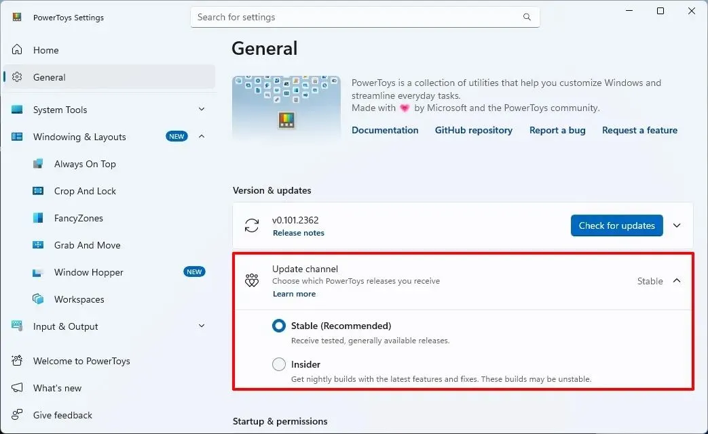
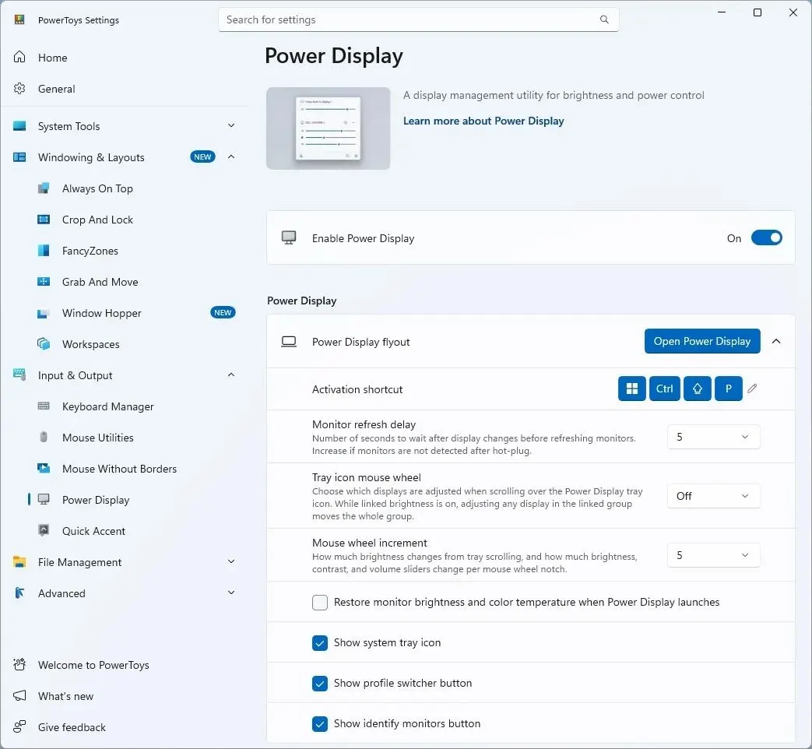
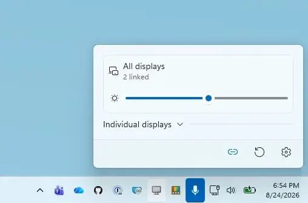
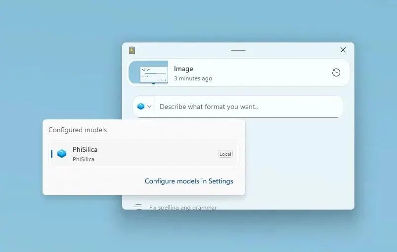
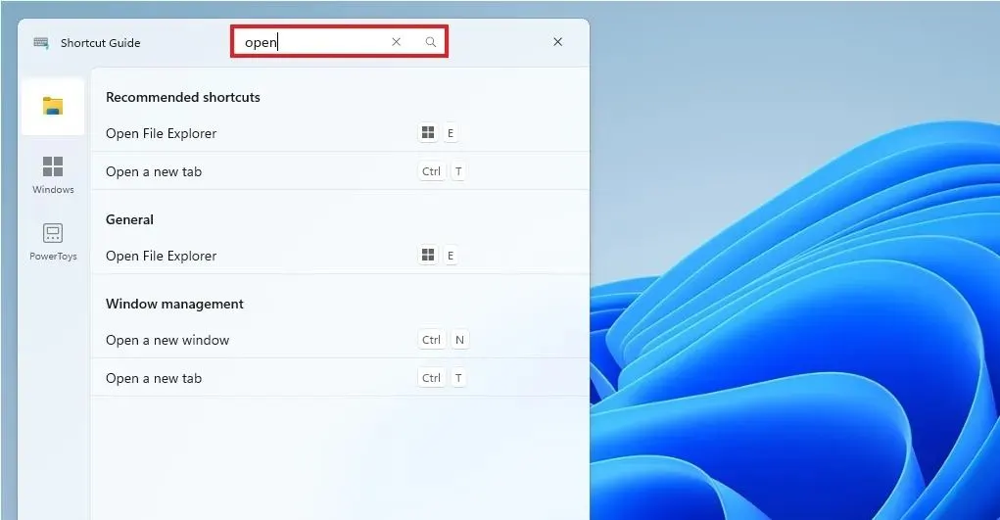
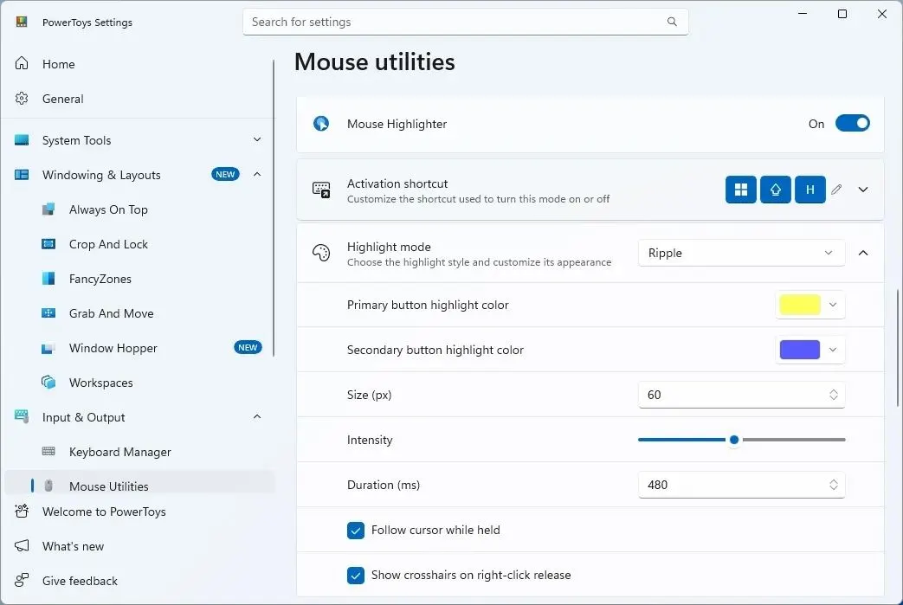
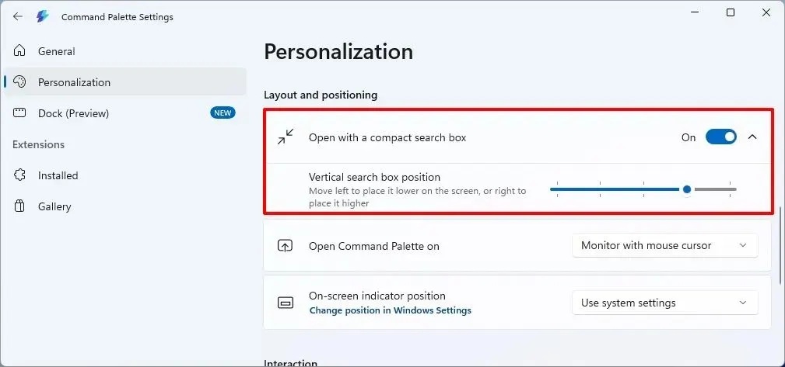

PowerToys давно перестал быть набором мелких игрушек для энтузиастов Windows. В версии 0.101 Microsoft снова не стала делать ставку на одну громкую функцию. Вместо этого разработчики взялись за десятки сценариев: от переключения окон и управления мониторами до локального ИИ, поиска горячих клавиш и демонстрации экрана.

Обновление PowerToys 0.101 вышло 25 августа 2026 года. Среди главных изменений: новая утилита Window Hopper, два канала обновлений Stable и Insider, локальная обработка ИИ через Phi Silica в Advanced Paste, компактный режим Command Palette и заметное расширение возможностей Power Display.

Но если отбросить длинный список изменений, возникает более интересный вопрос: что из этого пригодится человеку, который работает за Windows каждый день?

Ответ прост: самая интересная функция релиза не локальный ИИ.

## Window Hopper решает раздражающую проблему Alt + Tab

У Windows есть Alt + Tab. Мы привыкли к нему настолько, что почти не задумываемся о его логике.

Но есть сценарий, в котором этот механизм начинает мешать.

Допустим, у меня открыто три окна Проводника, два окна браузера и несколько терминалов. Я работаю в одном окне Проводника и хочу перейти во второе окно этого же приложения.

Alt + Tab начинает показывать все приложения подряд.

В PowerToys 0.101 появился Window Hopper. Он позволяет переключаться между окнами одного приложения отдельно от остальных. По умолчанию для этого используется сочетание Alt + `, но горячую клавишу можно настроить.

Это небольшое изменение, но именно такие функции я обычно ценю в PowerToys больше всего.

Не нужно учить новую систему управления Windows. Не нужно перестраивать рабочий процесс. Просто появляется ещё один способ быстро попасть в нужное окно.

Особенно хорошо это подходит для Проводника, браузеров, терминалов и редакторов, где одновременно может быть открыто несколько экземпляров.

## PowerToys теперь умеет обновляться через Stable и Insider

В настройках PowerToys появился выбор канала обновлений.

Есть Stable: обычная стабильная ветка. Она остаётся вариантом по умолчанию.

Есть Insider: предварительные сборки для тех, кто хочет получать новые функции раньше.

Мне нравится сам подход.

PowerToys развивается довольно быстро. Новые функции появляются регулярно, а значит, пользователю приходится выбирать между «получить новинки раньше» и «не трогать рабочую систему без необходимости».

Теперь этот выбор вынесен непосредственно в настройки.

При этом на основном рабочем компьютере я бы оставил Stable. PowerToys хоть и не критически важная часть Windows, но его утилиты могут вмешиваться в работу клавиатуры, мыши, окон и Проводника.

Экспериментировать лучше на тестовой системе.

## Power Display наконец становится инструментом для нескольких мониторов

Если вы работаете с двумя или тремя мониторами, Power Display получил несколько практичных изменений.

Теперь можно связать несколько дисплеев и управлять их яркостью одним ползунком. При этом индивидуальное управление отдельными мониторами сохраняется.

Появилось и управление яркостью через значок Power Display в системном трее.

Можно прокручивать колесо мыши над значком и менять яркость основного монитора либо всех связанных дисплеев.

Есть ещё одна интересная функция: пробуждение совместимых мониторов непосредственно через Power Display.

А для тех, кто любит автоматизацию, Microsoft добавила командную строку. Через неё можно получать информацию о дисплеях, менять параметры и применять сохранённые профили.

Последнее особенно интересно для администраторов и тех, кто собирает собственные сценарии PowerShell.

Например, можно представить рабочую конфигурацию, в которой утром применяется один профиль мониторов, а вечером другой.

PowerToys постепенно превращается из набора GUI-инструментов в набор компонентов, которыми можно управлять и из скриптов.

## Advanced Paste получил локальный ИИ

Теперь о функции, которая наверняка будет привлекать больше всего внимания.

Advanced Paste получил поддержку Phi Silica на совместимых устройствах. Обработка выполняется локально, без обращения к облачному endpoint и без API-ключа. При необходимости модель можно загрузить через настройки функции. О том, как Phi Silica появилась в предварительной версии PowerToys и почему она работает не на каждом ПК, я рассказал [здесь](https://trick32.ru/articles/phi-silica-powertoys-advanced-paste/).

Здесь важно не путать две вещи.

PowerToys не превратился в полноценный локальный аналог ChatGPT.

Phi Silica используется для действий Advanced Paste. Пользователь может выбрать его как провайдера для конкретных операций и настроить собственные запросы.

При этом остаётся возможность использовать разные провайдеры для разных задач.

Например, одну операцию выполнять локально, а для другой использовать облачную модель.

Microsoft также изменила работу пользовательских действий OpenAI и Azure OpenAI. Модели, которые не поддерживают параметр минимального уровня рассуждений, теперь могут использовать собственные значения по умолчанию.

Саму поддержку Phi Silica я бы не называл главной причиной обновляться.

Локальный ИИ интересен. Но если конкретная задача не возникает каждый день, это скорее приятное дополнение.

Локальные модели ИИ Microsoft внедряет и в другие инструменты Windows. Например, в [Intelligent Terminal](https://trick32.ru/articles/intelligent-terminal-windows-ai/), экспериментальной ветке терминала с нативной интеграцией ИИ-агентов.

А вот Window Hopper или управление несколькими мониторами могут экономить время постоянно.

## Shortcut Guide научился искать горячие клавиши

Shortcut Guide получил поиск.

Раньше логика была простой: открыть подсказку и глазами искать нужную комбинацию.

Теперь можно искать по названию сочетания, его описанию, модификаторам и отображаемым клавишам.

Появилась и новая схема активации через клавишу Windows.

Можно настроить удержание Win, выбрать, показывать ли индикаторы на панели задач или полную подсказку, а также задать время удержания.

На бумаге это небольшая функция.

На практике она полезна тем, кто постоянно забывает редкие сочетания клавиш.

## ZoomIt получил DemoMirror

ZoomIt, один из тех инструментов PowerToys, о котором многие вспоминают только после того, как начинают проводить демонстрации.

В версии 0.101 появился DemoMirror.

Он позволяет показывать содержимое одного экрана на другом. При этом можно зеркалить весь экран, выбранную область или окно под указателем. Картинка включает и указатель мыши.

Есть три сочетания:

* Ctrl + 9: весь экран;
* Ctrl + Shift + 9: выбранная область;
* Ctrl + Alt + 9: окно под указателем.

Есть и режим отслеживания окна. Если оно перемещается или меняет размер, область зеркалирования может следовать за ним.

Для обычного домашнего компьютера функция может никогда не понадобиться.

Для обучения и технических демонстраций совсем другой разговор.

Можно работать на одном дисплее, а зрителям показывать именно ту область, которую они должны видеть.

## Mouse Highlighter теперь умеет показывать «волну» от клика

В Mouse Highlighter появился Ripple Mode.

После клика вокруг указателя появляется визуальный эффект. Его параметры можно менять: размер, интенсивность, длительность и другие настройки.

На первый взгляд это украшательство.

Но для записи обучающих роликов такие вещи имеют смысл. Когда зритель смотрит видео, ему важно видеть, куда переместилась мышь и где именно произошёл клик.

Впрочем, если нужен просто снимок экрана без видео, все способы скриншотов в Windows я собрал [в отдельном гайде](https://trick32.ru/articles/kak-sdelat-skrinshot-na-kompyutere-windows-10-11/).

Microsoft отдельно переработала внутреннюю часть механизма отрисовки. Рендеринг, анимация, таймеры и управление окнами отделили от низкоуровневого перехвата мыши.

Это должно уменьшить проблемы вроде потерянных событий отпускания кнопки или «залипающего» визуального эффекта.

## Command Palette стал меньше

Command Palette получил компактный режим.

Вместо большого интерфейса сначала появляется небольшое поле поиска. После начала ввода оно раскрывается и показывает результаты. Развернуть интерфейс можно и с клавиатуры: стрелкой вниз или Tab.

По умолчанию режим выключен.

И это правильно.

Новая функция не должна ломать привычное поведение после установки обновления.

Для тех, кто постоянно запускает команды через Command Palette, компактный режим выглядит разумнее большого окна.

## PowerToys продолжает переход на WinUI 3

Microsoft продолжает перенос отдельных частей PowerToys на WinUI 3.

В этой версии обновили интерфейс Quick Accent и Mouse Jump.

Quick Accent получил улучшенное оформление, поддержку доступности и более точное позиционирование под разные DPI.

Появился и режим активации удержанием клавиши. Можно удерживать букву, после чего открыть выбор символа с диакритикой и выбрать нужный вариант клавишами.

Mouse Jump получил обновлённые элементы интерфейса и улучшенную работу с несколькими мониторами и разным масштабированием.

Для пользователя это не революция.

Но PowerToys давно страдает от визуальной неоднородности: разные утилиты ощущаются как отдельные маленькие программы.

Переход на WinUI 3 постепенно решает эту проблему.

## Мелких изменений тоже много

PowerToys 0.101 получил десятки менее заметных изменений.

FancyZones теперь применяет изменения раскладки сразу. Добавлен дополнительный режим перемещения окон между мониторами.

Keyboard Manager получил улучшения для Alt и AltGr.

Peek научился показывать предпросмотр Unreal Engine, а также работать с файлами .tar.gz и .tgz.

PowerToys Run получил исправления поиска и снова умеет находить рабочие области VS Code, включая UNC-пути.

File Explorer Add-ons получили предпросмотр Markdown через политики и улучшенные миниатюры SVG.

Image Resizer обновили в части пресетов, интеграции с Проводником и диагностики командной строки.

Mouse Without Borders получил улучшения безопасности соединения и стабильности.

Обновили также Always On Top, Grab and Move и Color Picker.

## Стоит ли обновляться?

Я бы обновился.

Но не из-за Phi Silica.

Для меня ценность PowerToys 0.101 складывается из нескольких маленьких изменений.

Window Hopper решает конкретную проблему с несколькими окнами одного приложения.

Power Display становится заметно интереснее для рабочих мест с несколькими мониторами.

Command Palette получает более компактный сценарий.

Shortcut Guide становится полезнее благодаря поиску.

ZoomIt получает функцию, которая может пригодиться при демонстрациях.

А локальный Phi Silica хороший бонус для совместимых компьютеров.

Именно такой путь развития PowerToys мне нравится больше всего.

Не обязательно каждый раз придумывать очередную большую функцию. Иногда достаточно убрать несколько раздражающих действий из рабочего дня.

Если каждый день открыть Проводник на один Alt + Tab быстрее, один раз вместо трёх изменить яркость мониторов или не тратить минуту на поиск нужной горячей клавиши, PowerToys постепенно начинает экономить вполне реальные минуты.

А из таких минут и складывается нормальная работа за компьютером.

Для обычного рабочего ПК я бы выбрал канал Stable. Insider оставил бы тем, кому интереснее тестировать новые функции, чем ждать их окончательной обкатки. Саму поддержку локального Phi Silica воспринимал бы как дополнительную возможность, а не как причину устанавливать PowerToys любой ценой.

PowerToys 0.101 в итоге выглядит не как «обновление ради галочки», а как очередной шаг к инструментарию, который постепенно закрывает мелкие, но постоянные неудобства Windows.
