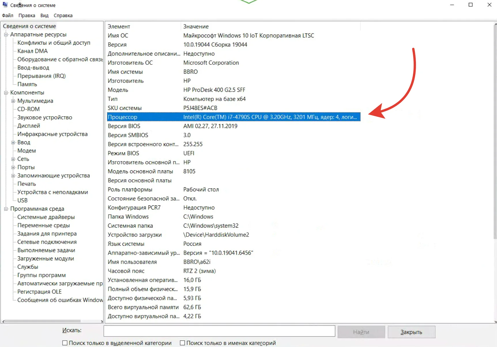
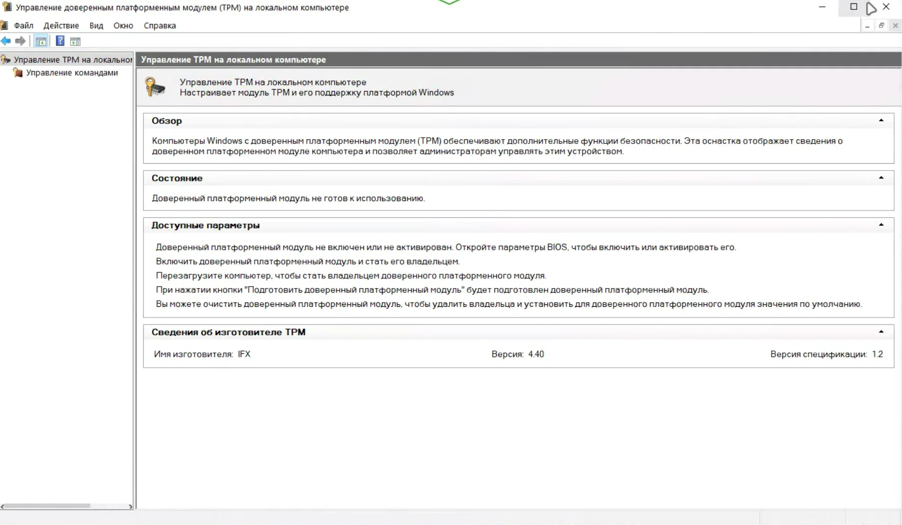
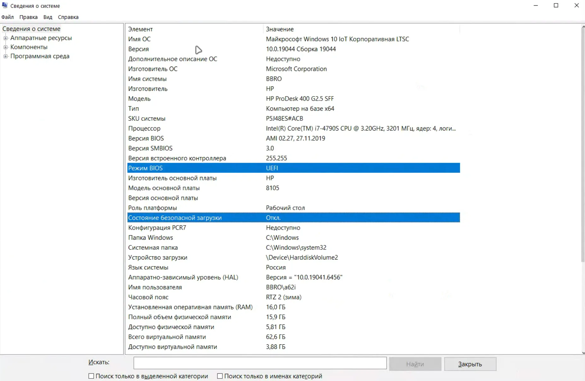
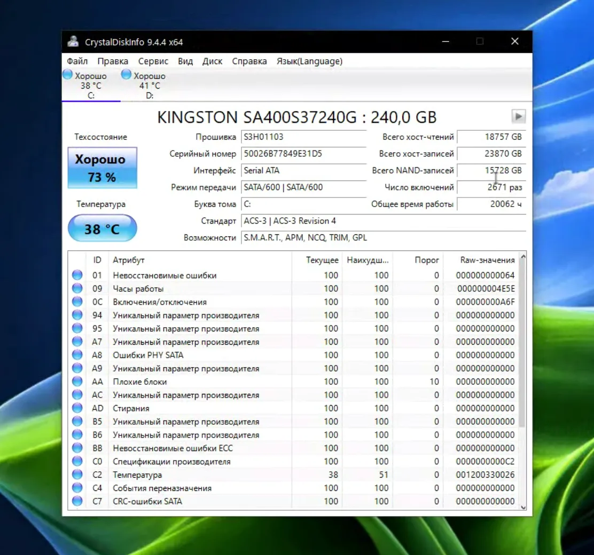
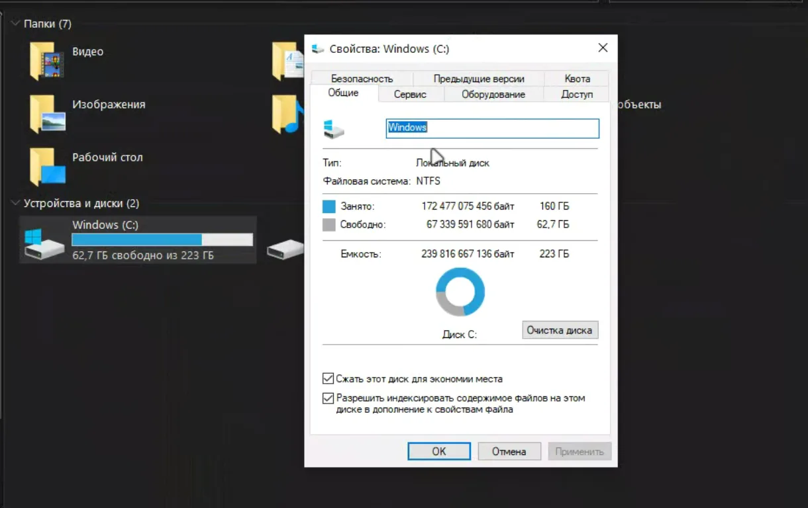

Покупая б/у компьютер, недостаточно посмотреть на объём оперативной памяти и состояние корпуса. Если на нём планируется Windows 11 26H2, лучше до покупки проверить ещё несколько вещей: процессор, TPM и режим загрузки, состояние накопителя и свободное место.

На всё это можно потратить около 15 минут. При этом проверка диска не даст гарантии, что SSD или HDD не выйдет из строя через месяц, но позволит заметить уже существующие проблемы и признаки износа.

## Проверка №1. Подходит ли процессор

Начать стоит с процессора. Нажмите **Win+R**, введите `msinfo32` и посмотрите модель CPU в разделе **Processor (Процессор)**.

Само наличие 64-битного процессора и частоты от 1 ГГц ещё не означает, что компьютер официально поддерживается Windows 11. Microsoft использует собственные списки совместимых процессоров, поэтому точную модель лучше проверить именно по ним.

Для Windows 11 требуется совместимый 64-разрядный процессор с двумя и более ядрами и частотой от 1 ГГц. В официальных списках Microsoft для Windows 11 24H2 присутствуют, например, многие процессоры Intel Core начиная с 8-го поколения и AMD Ryzen начиная со 2000-й серии, но ориентироваться только на поколение нельзя — есть исключения и отдельные модели.

Для очень старых компьютеров есть ещё один технический нюанс. Начиная с Windows 11 24H2 система требует поддержки инструкций **POPCNT и SSE4.2**. На некоторых старых процессорах без них Windows 11 24H2 уже не загружается. Поэтому компьютер с Core 2 Duo или другим очень старым CPU не стоит считать кандидатом на 26H2 только потому, что установщик Windows удаётся запустить.

При этом POPCNT нельзя называть отдельным новым требованием именно Windows 11 26H2. Версия 26H2 находится в той же ветке обслуживания, что 24H2 и 25H2, и распространяется для совместимых систем как enablement package. Поэтому техническое ограничение, появившееся с 24H2, сохраняется и здесь.

Если процессор официально не поддерживается Microsoft, это уже повод хорошо подумать перед покупкой. Обойти установщик технически иногда возможно, но Microsoft предупреждает, что Windows 11 на неподдерживаемом оборудовании не поддерживается официально, а обновления не гарантируются. Какие способы обхода ещё живы, а какие Microsoft уже закрыла, я разбирал отдельно — [какие обходы Windows 11 ещё работают в 2026](/articles/kakie-obhody-windows-11-rabotayut-v-2026/).

## Проверка №2. TPM 2.0, UEFI и Secure Boot

Следующий этап занимает пару минут.

Нажмите **Win+R**, введите `tpm.msc`. В открывшемся окне найдите **Specification Version (Версия спецификации)**. Для Windows 11 нужна версия TPM 2.0.

Если TPM не найден, не спешите списывать компьютер со счетов. На некоторых ПК модуль TPM отключён в прошивке. В настройках UEFI он может называться, например, **Intel PTT** или **AMD fTPM**.

После этого снова запустите `msinfo32`. Здесь интересуют два параметра:

* **BIOS Mode (Режим BIOS)** — желательно UEFI;
* **Secure Boot State (Состояние безопасной загрузки)** — показывает состояние Secure Boot.

Важный нюанс: для требований Windows 11 важна поддержка UEFI и Secure Boot. Сам Secure Boot не обязательно должен быть включён прямо сейчас — если компьютер поддерживает его и его можно включить в UEFI, отключённое состояние само по себе не означает несовместимость.

Самый простой способ дополнительно проверить компьютер — официальная утилита Microsoft **PC Health Check (Проверка работоспособности ПК)**. Она автоматически проверяет основные требования Windows 11 и сообщает, соответствует ли компьютер им.

## Проверка №3. Что происходит с SSD или HDD

Это самая полезная проверка при покупке б/у компьютера. Даже если Windows работает нормально, накопитель может уже иметь заметный износ.

Для быстрой проверки удобно использовать бесплатную **CrystalDiskInfo**. Программа показывает состояние накопителя и доступные SMART/NVMe-параметры.

В зависимости от диска можно увидеть статус **Good (Хорошо)**, **Caution (Тревога)** или **Bad (Плохо)**. Но смотреть только на общий статус не стоит.

Для HDD особенно важны параметры вроде **Reallocated Sectors Count**, **Current Pending Sector Count** и **Uncorrectable Sector Count**. Наличие проблемных или нестабильных секторов — серьёзный повод отнестись к накопителю с осторожностью.

У SSD набор показателей зависит от производителя и типа накопителя. Полезно посмотреть **Power On Hours**, **Power On Count**, общий объём записанных данных, температуру и показатель оставшегося ресурса, если производитель его предоставляет.

У NVMe также стоит обратить внимание на **Critical Warning**. При нормальном состоянии этот параметр не должен сообщать о критической проблеме.

Если производитель указывает ресурс в TBW, можно сравнить накопленный объём записи с заявленным ресурсом конкретной модели. Но TBW — это не таймер, после которого SSD обязательно выйдет из строя. Превышение или приближение к этому значению не означает автоматическую смерть накопителя.

По той же причине не стоит использовать универсальное правило вроде «после 70–80% TBW диск надо выбрасывать». У разных моделей и производителей разные контроллеры, память, алгоритмы износа и условия эксплуатации.

Интересная комбинация — небольшое время работы и очень большой объём записанных данных. Это говорит об интенсивной записи, но само по себе не доказывает, что накопитель использовался для майнинга. Причиной могли быть видеомонтаж, тестирование, серверные задачи и другие нагрузки. Почему объём записи вообще растёт быстрее, чем кажется, — показывал на отдельном примере: [износ SSD на MacBook Neo с 8 ГБ памяти](/articles/ssd-macbook-neo-mozhet-vyjti-iz-stroya-za-58-dnej/), где виртуальная память записала почти 900 ГБ за три часа.

И главное: зелёный статус SMART не означает, что SSD гарантированно проработает ещё несколько лет. SMART показывает доступные контроллеру признаки состояния накопителя, а не точную дату его отказа.

## Проверка №4. Хватит ли места для Windows

Последняя проверка — свободное место на системном разделе.

Откройте **File Explorer (Проводник)** → **This PC (Этот компьютер)** и посмотрите, сколько свободно на диске, куда будет установлена Windows.

Минимальное требование Windows 11 — накопитель объёмом от 64 ГБ. Но это именно минимальное системное требование, а не рекомендация по свободному месту после установки. Сколько система занимает на самом деле и какой запас оставлять, я считал отдельно — [реальные цифры по месту](/articles/skolko-mesta-zanyimaet-windows-11-realnye-cifry/).

Самой Windows и последующим обновлениям может потребоваться дополнительное пространство. Поэтому компьютер с небольшим системным SSD, который уже почти заполнен, — плохой кандидат для обновления даже в том случае, если формальным требованиям он соответствует.

Здесь важнее смотреть не на одну цифру, а на ситуацию целиком: объём самого накопителя, свободное место и то, что на нём уже установлено. Разобраться, куда деваются гигабайты, помогает [честный разбор на живой машине](/articles/disk-c-fantomy-i-realnye-gigabajty/) — там и WinSxS, и другие скрытые потребители места.

## Что считать стоп-сигналом

Не все найденные проблемы означают, что компьютер нужно сразу исключать.

Например, если TPM отключён в UEFI, Secure Boot выключен или системный раздел почти заполнен, это обычно можно исправить. Небольшой SSD тоже можно заменить, если компьютер позволяет это сделать.

Совсем другая ситуация — явно неподходящий старый процессор, отсутствие необходимых возможностей UEFI/TPM или накопитель с признаками серьёзных проблем.

Особенно осторожно стоит относиться к компьютерам, которые приходится переводить на неподдерживаемую Windows 11 обходными способами. Microsoft официально предупреждает, что такие устройства не поддерживаются, а получение обновлений не гарантируется.

## Почему эта проверка особенно актуальна перед Windows 11 26H2

Вопрос с совместимостью становится актуальнее из-за окончания поддержки старых версий Windows 11. Для Windows 11 24H2 Home и Pro поддержка заканчивается **13 октября 2026 года**.

Windows 11 26H2 уже появилась в Release Preview. Microsoft выпустила сборку **26300.9278** в конце августа 2026 года. Версия 26H2 использует ту же ветку обслуживания, что 24H2 и 25H2, поэтому для совместимых устройств переход выполняется как enablement package, а не как полностью новая система.

Именно поэтому перед покупкой старого компьютера имеет смысл проверить его не только на способность запустить текущую Windows, но и на совместимость с актуальной веткой Windows 11. Если решите обновляться — сначала пройдите [подготовку к 26H2 без проблем](/articles/windows-11-26h2-kak-izbezhat-problem-pri-obnovlenii/). А если на компьютере до сих пор стоит Windows 10, путь обновления другой — [через Центр обновления или ISO](/articles/obnovit-windows-10-do-windows-11-2026-cherez-parametry-i-iso/).

## Чек-лист перед покупкой

За несколько минут перед покупкой достаточно пройтись по четырём пунктам:

**Процессор:** точная модель входит в список поддерживаемых Microsoft; для очень старых CPU дополнительно учитываем SSE4.2 и POPCNT.

**TPM и загрузка:** TPM 2.0, UEFI и поддержка Secure Boot.

**Накопитель:** SMART/NVMe, часы работы, объём записанных данных, температура, показатели износа и критические ошибки.

**Место:** системный накопитель не должен быть почти заполнен.

Если все четыре проверки проходят нормально, риск купить компьютер, который вскоре упрётся в ограничения Windows 11 или уже изношенный накопитель, заметно ниже.

Но полностью исключить риск они не могут. Особенно это касается SSD и HDD: даже накопитель без явных SMART-проблем может выйти из строя неожиданно.

Поэтому при покупке б/у ПК лучше воспринимать эти 15 минут не как гарантию будущей надёжности, а как быстрый фильтр, который помогает не купить заведомо проблемный компьютер. А когда компьютер куплен и система стоит, следующий шаг — [7 настроек, которые я меняю сразу после установки](/articles/7-nastroek-windows-11-posle-ustanovki/).
