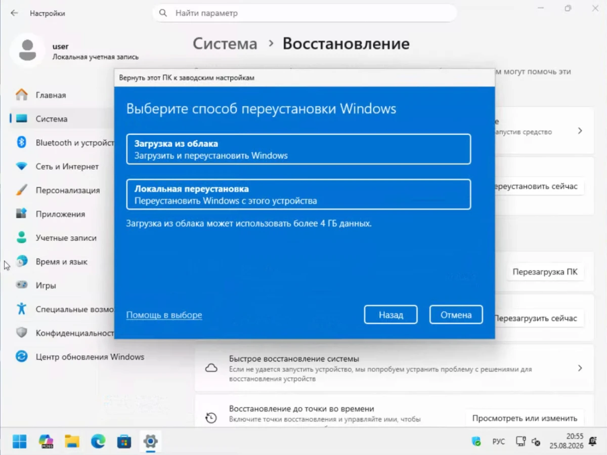
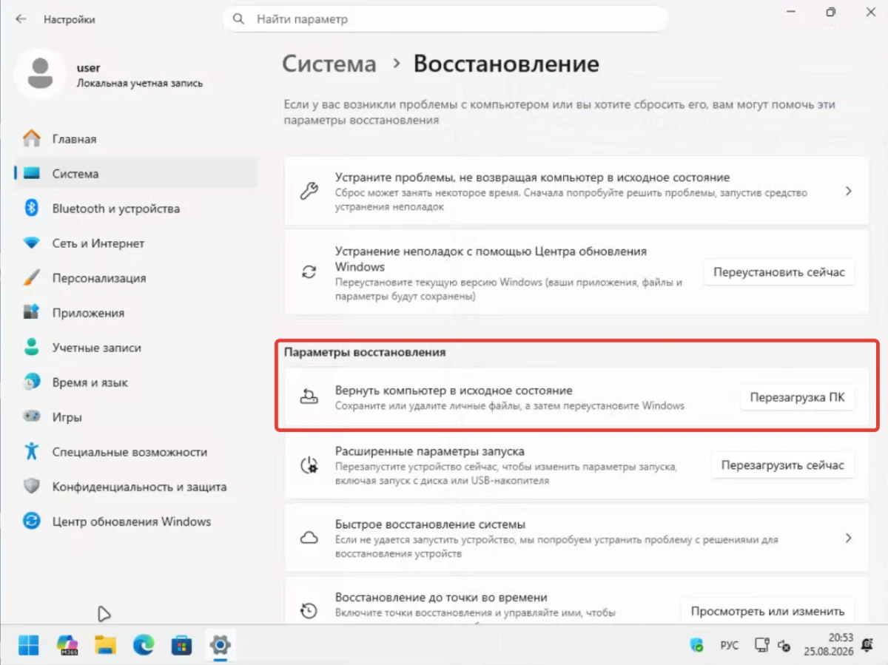
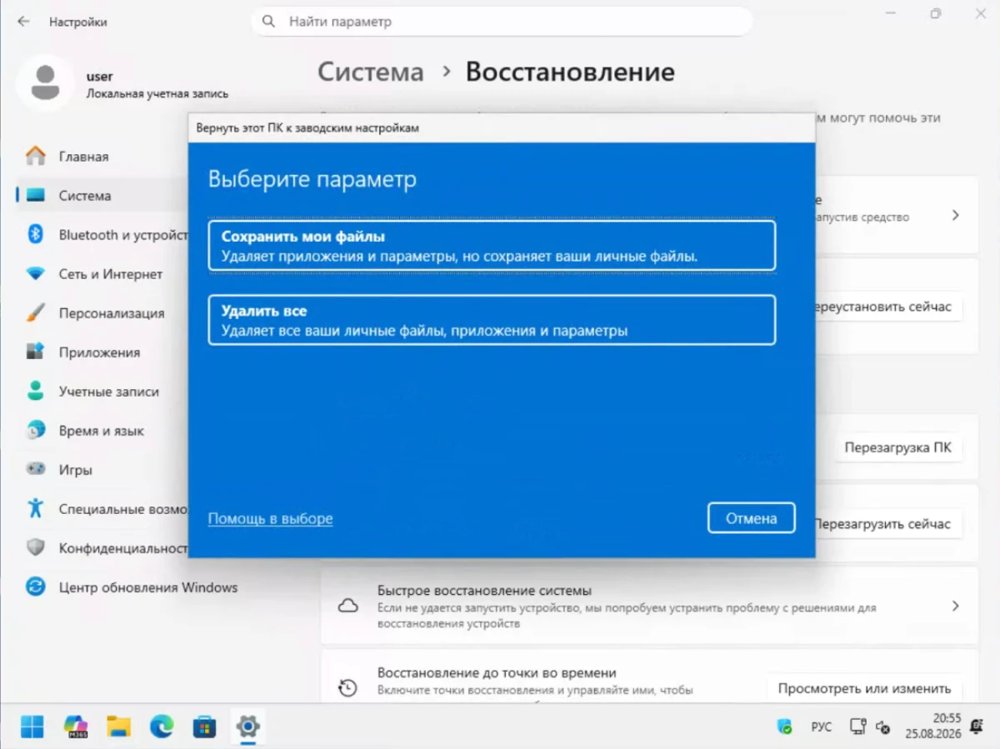
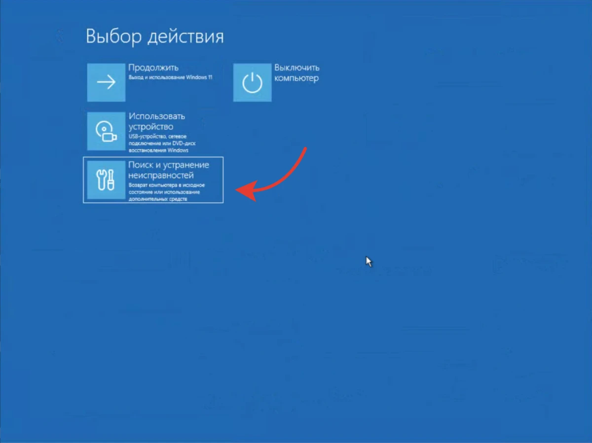
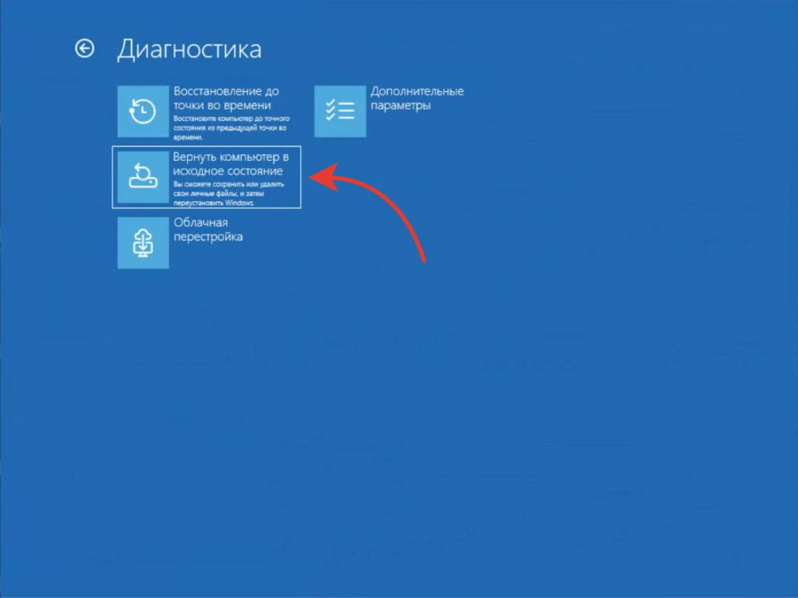
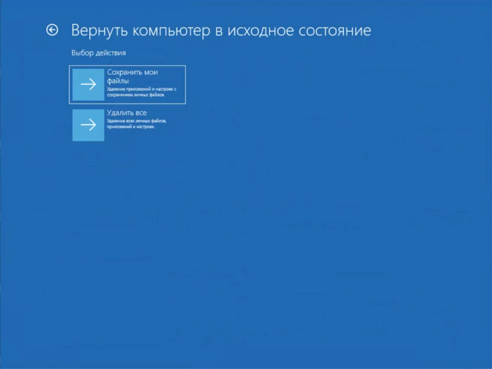

Windows начинает тормозить, сыпятся ошибки, появляются странные окна. Первая мысль: переустановить систему.

Но для обычной переустановки нужна флешка с Windows. Сначала скачать ISO, записать его на USB-накопитель, загрузиться с него, установить систему и заново поставить программы.

Есть вариант проще — встроенный сброс Windows. Система переустановит саму себя, без флешки и танцев с установочным образом.

В Windows эта функция называется «Вернуть компьютер в исходное состояние» или Reset this PC. В интернете её часто называют сбросом Windows до заводских настроек. Но это не совсем одно и то же: обычный сброс не обязательно возвращает компьютер к тому состоянию, в котором его продал производитель.

Разберём все варианты — что сохранится, что удалится и когда сброс лучше не использовать.

## Что делает сброс Windows

Сброс переустанавливает Windows и возвращает системные настройки к значениям по умолчанию.

При запуске сброса Windows предлагает два основных варианта:

* **«Сохранить мои файлы»** — личные файлы пользователя сохраняются, но установленные программы и приложения удаляются.
* **«Удалить всё»** — удаляются личные файлы, программы и настройки.

В обоих случаях Windows устанавливается заново.

Это не то же самое, что восстановление системы. Точка восстановления возвращает системные файлы и настройки к состоянию на определённую дату, а сброс заново устанавливает Windows.

### Почему это называют «заводскими настройками»

Название закрепилось из-за внешнего сходства с заводским сбросом смартфона.

Разница вот в чём.

Если на ноутбуке был специальный заводской образ производителя, обычный Reset this PC не обязательно восстановит именно его. Программы производителя могут вернуться, если включить в настройках сброса восстановление предустановленных приложений, но это не гарантирует полного восстановления исходного заводского образа.

Поэтому правильнее считать эту функцию переустановкой Windows с удалением выбранных данных, а не точным восстановлением состояния компьютера из магазина.

## Что сохранится после сброса Windows

Главный вопрос перед сбросом — как сбросить Windows до заводских настроек без потери файлов.

### Если выбрать «Сохранить мои файлы»

Windows сохраняет личные файлы пользователя, например документы, фотографии, видео и другие данные в пользовательских папках.

При этом удаляются:

* установленные программы;
* игры;
* приложения из Microsoft Store;
* внесённые пользователем изменения системных настроек;
* установленные пользователем драйверы.

После сброса программы придётся установить заново.

Перед началом всё равно стоит сделать резервную копию важных файлов. Ошибка пользователя, сбой диска или неудачный процесс восстановления — достаточная причина не доверять единственной копии фотографий или документов.

### Если выбрать «Удалить всё»

Этот режим удаляет личные файлы, приложения и настройки.

Используйте его, когда нужно начать работу с чистой системой или подготовить компьютер к продаже.

Перед этим обязательно сохраните данные, которые хотите оставить.

### Что будет с диском D

Сброс не означает автоматически, что Windows сотрёт каждый физический диск компьютера.

Перед запуском процесса Windows показывает дополнительные настройки удаления данных. В зависимости от версии системы и выбранного режима можно указать, нужно ли удалять данные с других дисков.

Перед нажатием последней кнопки внимательно проверьте настройки.

Если на D: лежит архив фотографий, не рассчитывайте на правило «сброс всегда трогает только C:». Сначала убедитесь, какие диски выбраны для очистки.

## «Загрузка из облака» или «Локальная переустановка»

После выбора режима сброса Windows предложит способ получения файлов для переустановки.

### Загрузка из облака

Windows скачивает свежую копию системы с серверов Microsoft.

Полезен, если локальные файлы Windows повреждены или отсутствуют.

Минус один — понадобится интернет и несколько гигабайт трафика.

### Локальная переустановка

Windows использует файлы, которые уже находятся на компьютере.

Интернет для загрузки самой системы не нужен. Поэтому этот вариант может быть быстрее.

Но если необходимые локальные файлы Windows повреждены, проблема может помешать переустановке.

Если система работает нестабильно именно из-за повреждения компонентов Windows, я бы сначала попробовал «Загрузку из облака».

## Способ 1. Как сбросить настройки Windows через «Параметры»

Это основной способ, если Windows запускается и вы можете войти в систему.

1. Нажмите **Win + I**.
2. Откройте **«Система» → «Восстановление»**.
3. Найдите раздел **«Вернуть компьютер в исходное состояние»**.
4. Нажмите **«Сбросить ПК»**.
5. Выберите **«Сохранить мои файлы»** или **«Удалить всё»**.
6. Выберите **«Загрузка из облака»** или **«Локальная переустановка»**.
7. Проверьте дополнительные параметры.
8. Нажмите кнопку запуска сброса.

Название отдельных пунктов может немного отличаться между Windows 10 и Windows 11.

Процесс может занять от десятков минут до нескольких часов. Всё зависит от скорости накопителя и выбранного способа переустановки.

Во время сброса не выключайте компьютер и не отключайте питание.

На ноутбуке подключите зарядное устройство.

Если процент несколько минут не меняется, не спешите принудительно перезагружать компьютер. Microsoft предупреждает, что экран во время сброса может оставаться чёрным длительное время, иногда до 15 минут. Принудительная перезагрузка в этот момент может сорвать сброс.

## Способ 2. Сброс Windows с экрана входа

Если Windows запускается до экрана входа, но войти в учётную запись не получается, сброс можно запустить оттуда. Не можете войти в систему — восстановить пароль я разбирал [тут](https://trick32.ru/articles/zabyl-parol-ot-noutbuka-kak-vosstanovit-dostup-k-windows/).

1. На экране входа нажмите кнопку питания.
2. Зажмите **Shift**.
3. Нажмите **«Перезагрузка»**.
4. После перезагрузки откройте **«Поиск и устранение неисправностей»**.
5. Выберите **«Вернуть компьютер в исходное состояние»**.
6. Выберите режим сброса.
7. Выберите способ переустановки.

Он спасает, когда рабочий стол уже недоступен, но до экрана входа Windows доходит.

## Способ 3. Сброс Windows из среды восстановления WinRE

Если Windows не доходит даже до экрана входа, можно использовать **среду восстановления Windows (WinRE)**.

После двух последовательных неудачных запусков Windows может автоматически перейти в среду восстановления.

Попасть в WinRE можно и другими способами.

Например, можно загрузиться с установочной флешки Windows и выбрать **«Восстановление системы»**. После этого откроется среда восстановления.

В ней выберите:

**«Поиск и устранение неисправностей» → «Вернуть компьютер в исходное состояние»**

Дальше Windows предложит те же основные варианты:

* сохранить личные файлы или удалить всё;
* использовать облачную или локальную переустановку.

### Не путайте WinRE и Recovery Drive

Есть ещё отдельный инструмент — **диск восстановления Windows (Recovery Drive)**.

Если загрузиться именно с него, используется другой сценарий — **Recover from a drive**.

Он не предназначен для сохранения личных файлов. Перед таким восстановлением нужно сделать резервную копию данных.

Установочная флешка Windows, среда WinRE и Recovery Drive — это разные инструменты, хотя все они могут использоваться для восстановления компьютера.

## Что будет с активацией Windows

На компьютере с цифровой лицензией Windows обычно активируется автоматически после переустановки и подключения к интернету.

Лицензия для устройства не исчезает из-за обычного сброса.

Если после установки Windows не активировалась, проверьте:

* установлена ли та же редакция Windows;
* подключён ли компьютер к интернету;
* отображается ли цифровая лицензия в параметрах активации.

Вход в тот же аккаунт Microsoft может помочь восстановить связанную с ним цифровую лицензию, но аккаунт сам по себе не обязателен для активации.

## Что делать с BitLocker

Если системный диск зашифрован BitLocker, среда восстановления может запросить **ключ восстановления**.

Перед сбросом проверьте, что ключ у вас есть.

Это как запасной ключ от квартиры: потеряли — и получить доступ к зашифрованным данным может уже не получиться.

Он может находиться:

* в личной учётной записи Microsoft;
* в рабочей или учебной учётной записи;
* в сохранённом файле;
* на распечатке;
* в другом месте, которое было выбрано при настройке шифрования.

Если ключ нужен для доступа к зашифрованным данным, не начинайте сброс, пока не убедитесь, что сможете его найти. Где искать ключ восстановления — [в разборе BitLocker](https://trick32.ru/articles/bitlocker-avtomatizaciya-klyuchi-vosstanovleniya/).

## Вернутся ли программы производителя

Здесь всё зависит от настроек сброса.

На некоторых компьютерах можно включить восстановление предустановленных приложений производителя.

Тогда после переустановки Windows снова появятся программы и настройки, которые производитель добавил к системе.

Это могут быть утилиты Lenovo, ASUS, Dell, HP и других производителей.

Если компьютер нужен без фирменного набора программ, проверьте этот параметр перед началом сброса.

## Что делать, если нужно продать компьютер

Для продажи недостаточно просто удалить свои документы и выбрать «Удалить всё».

В настройках сброса есть дополнительная функция очистки данных.

Она выполняет более тщательную очистку диска и затрудняет восстановление удалённых файлов.

Но есть нюанс: Microsoft прямо указывает, что эта функция рассчитана на потребительские сценарии и не соответствует государственным и отраслевым стандартам удаления данных.

Если на диске были действительно конфиденциальные данные и требования к их уничтожению высокие, одного штатного сброса Windows может быть недостаточно.

Для обычной продажи домашнего компьютера такая очистка снижает вероятность восстановления удалённых файлов.

## В Windows 11 есть ещё один вариант

Полный сброс нужен не всегда.

В некоторых версиях Windows 11 в разделе восстановления есть пункт **«Исправление проблем с помощью Windows Update»** с действием **«Переустановить сейчас»**.

Переустановка идёт через Windows Update и при этом сохраняет:

* личные файлы;
* установленные приложения;
* настройки.

Функция устанавливает ту же версию Windows заново и восстанавливает системные файлы и компоненты.

Это полезно, если Windows работает, но появились проблемы с системными компонентами или обновлением.

Если такой пункт доступен, я бы попробовал его раньше полного сброса.

## Когда сброс Windows не поможет

Сброс — не панацея. Когда он бессилен?

### Неисправен накопитель

Если SSD или HDD физически выходит из строя, переустановка Windows проблему не исправит.

Симптомы могут быть разными:

* система зависает;
* появляются ошибки чтения и записи;
* файлы повреждаются;
* Windows периодически теряет диск;
* установка завершается ошибкой.

Сначала нужно проверить состояние накопителя.

### Компьютер перегревается

Если процессор или видеокарта перегреваются и из-за этого снижают частоты, сброс Windows ничего не изменит.

Пыль, высохшая термопаста или неисправная система охлаждения требуют ремонта, а не переустановки системы.

### Есть подозрение на серьёзное заражение

Если вы подозреваете заражение компьютера, Microsoft рекомендует переустановить Windows с установочного носителя. Если заподозрили вирус — что делать, расписано [в статье](https://trick32.ru/articles/vredonosnye-programmy-kak-najti-i-udalit/).

В такой ситуации я бы не ограничивался обычным сбросом из работающей системы.

### Сам сброс завершается ошибкой

Если Windows не может выполнить сброс или постоянно возвращается к исходному состоянию, причина может быть в повреждении системы, накопителе или среде восстановления.

Тогда установочная флешка часто становится следующим шагом.

## Когда лучше сразу сделать чистую установку

Чистая установка имеет смысл, если:

* сброс Windows не запускается;
* сброс постоянно завершается ошибкой;
* Windows не загружается;
* есть подозрение на серьёзное заражение;
* нужно полностью удалить старую систему;
* компьютер готовится к продаже и требуется более тщательная очистка;
* после сброса проблема быстро возвращается.

При чистой установке Windows запускается с установочного носителя — как получить оригинальный ISO без торрентов, [отдельная инструкция](https://trick32.ru/articles/skachat-windows-original-iso-microsoft/). При необходимости можно удалить существующие системные разделы и установить систему заново.

Но за это приходится платить временем: после установки нужно заново настроить Windows, поставить драйверы, программы и вернуть данные из резервной копии. Какие настройки Windows я меняю сразу после установки, я разбирал [в отдельной статье](https://trick32.ru/articles/7-nastroek-windows-11-posle-ustanovki/).

## Что выбрать

Windows работает, но начала сбоить — начните с **«Сохранить мои файлы»**.

Windows 11 работает, но появились проблемы с системными компонентами или обновлениями — сначала проверьте **«Переустановить сейчас»** через Windows Update.

Системные файлы повреждены — выберите **«Загрузка из облака»**.

Windows не загружается до рабочего стола — используйте **WinRE**.

Есть подозрение на серьёзное заражение или сброс не работает — переходите к **установочной флешке**.

И в любом случае перед сбросом сохраните важные файлы. Даже если выбран режим «Сохранить мои файлы», резервная копия занимает несколько минут, а восстановление потерянных фотографий может оказаться невозможным.