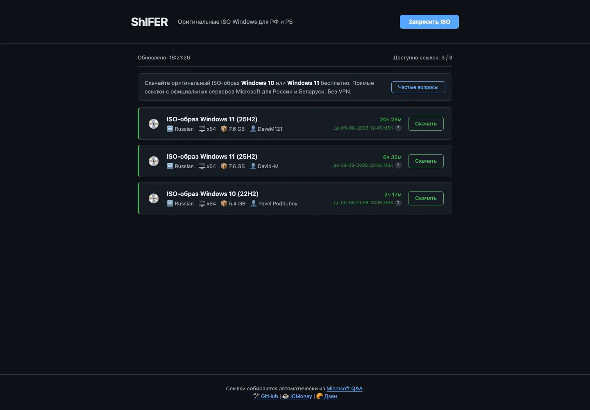
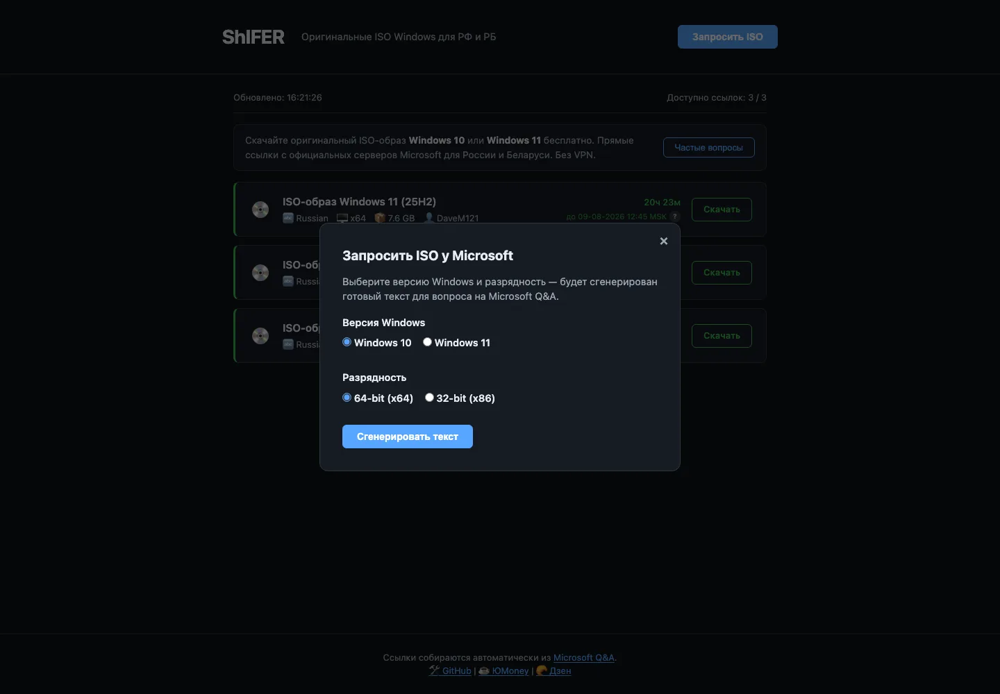
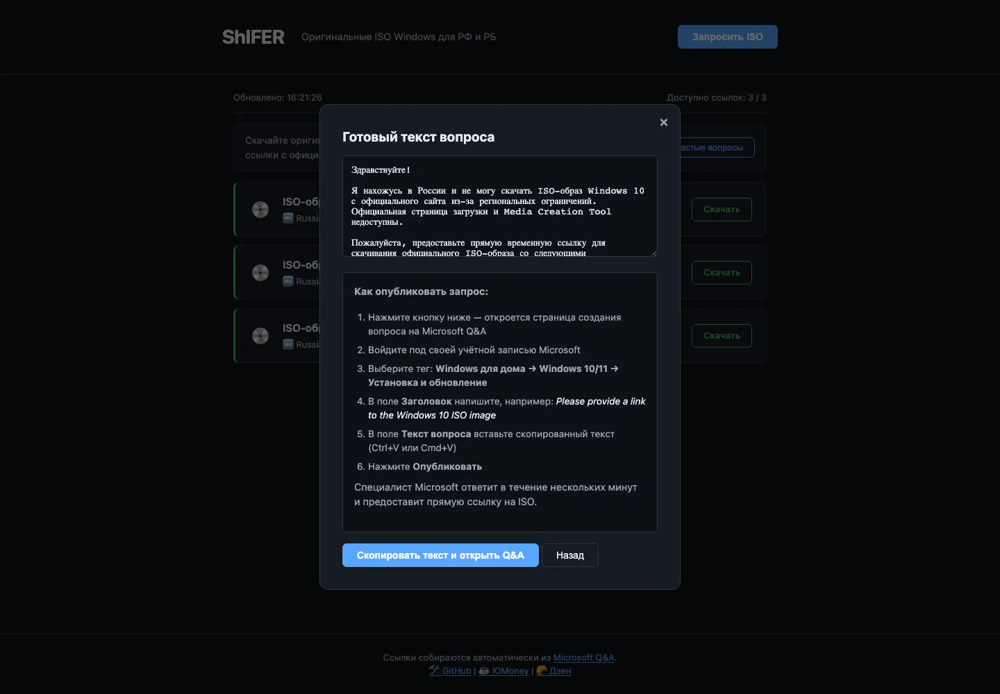

Нужно установить Windows, а с сайта Microsoft она не скачивается. В России и Беларуси загрузка ISO-образов и утилиты Media Creation Tool заблокирована. Многие машут рукой и уходят на торренты. И это лотерея: в сборке, собранной неизвестно кем, может оказаться майнер или вирус.

Расскажу, как получить **оригинальный ISO Windows 10 и Windows 11 напрямую с серверов Microsoft**. Бесплатно и легально.

## Почему не получается скачать с сайта Microsoft

Microsoft определяет страну по IP-адресу. Когда в блок попадает Россия и Беларусь, загрузку ISO и Media Creation Tool блокируют. VPN не помогает: компания научилась вычислять и отсеивать смену IP.

Остаются торренты. Но сборка с торрента — это чужой файл размером в несколько гигабайт. Что внутри — сюрприз: скрытый майнер, вирус, бэкдоры. Рисковать такой системой, где хранятся пароли и важные файлы, не стоит.

## Официальный способ: ссылки от инженеров Microsoft

У Microsoft есть публичный форум техподдержки — Microsoft Q&A. Любой пользователь может создать тему «нужен образ Windows», и инженеры компании дают в ответе прямые ссылки на скачивание со своих серверов.

Это легально, без пиратов. Образ настоящий, оригинальный, скачивается напрямую с сервера Microsoft. Об этом способе я писал отдельно: [подробнее про форум поддержки](https://dzen.ru/a/ajBCfs2680Ax1L4N).

Проблема одна — это ручной процесс. Написал тему, ждёшь ответа. А ссылки от инженеров живут недолго и быстро «сгорают». Через день-два процесс нужно повторять заново.

## ShIFER: процесс на автомате

Я сделал бесплатный сайт ShIFER, который повторяет этот процесс за вас.

Каждые 30 минут программа заходит на форум Microsoft Q&A и забирает из свежих ответов инженеров рабочие ссылки на ISO-образы Windows 10 и Windows 11. Собранные ссылки появляются на сайте.

Рядом с каждой ссылкой горит таймер обратного отсчёта. Вы видите, сколько часов осталось до того, как ссылка «сгорит». Пока таймер тикает — образ скачивается, оригинальный и чистый.

ShIFER не хранит и не перезаливает ни одного файла. Он только собирает ссылки с официального форума Microsoft. Скачивание идёт напрямую с серверов Microsoft.

## Если нужной версии в списке нет

Список обновляется регулярно, но живая ссылка могла истечь. Для этого в ShIFER есть кнопка **«Запросить ISO»**.

Выбираете версию Windows — сайт сам генерирует готовый текст обращения на русском. Ничего придумывать не нужно, просто копируете.

Дальше три простых шага:

1. Нажмите **«Скопировать текст и открыть Q&A»** — текст в буфере, форум открыт.
2. Вставьте текст и укажите тег: Windows для дома → Windows 10/11 → Установка и обновление.
3. Нажмите **«Опубликовать вопрос»**.

Инженер Microsoft пришлёт прямую ссылку. Вы её используете, а ShIFER добавит её в общий список — она пригодится всем остальным. Один запрос работает на многих.

## Кратко: как скачать Windows 10 или 11

1. Откройте [westdvina.github.io/shifer](https://westdvina.github.io/shifer/).
2. Найдите свою версию — Windows 10 или Windows 11.
3. Проверьте таймер: пока он не обнулился, ссылка рабочая.
4. Нажмите на ссылку — начнётся скачивание с сервера Microsoft.
5. Распакуйте ISO и установите систему как обычно.

Это весь процесс. Без VPN, торрентов и переживаний за содержимое файла.

## Честность и безопасность

Исходный код ShIFER открыт — он лежит на [GitHub](https://github.com/WestDvina/shifer). Любой может посмотреть, как работает сервис: что парсится, куда ведут ссылки, что происходит с данными. Ничего не спрятано, ссылки только на официальные серверы Microsoft.

Сайт бесплатный и без рекламы. Сделал я его по той же причине, по которой делал RuBeRoID: у людей должен быть честный доступ к оригинальному софту, а не к сомнительным сборкам с неизвестным содержимым.

## Поддержать

Если ShIFER сэкономил вам время на поиске рабочей ссылки — можно угостить автора чашкой кофе:

- [ЮMoney](https://yoomoney.ru/to/410016940425865)
- [Донат в Дзене](https://dzen.ru/trick32?donate=true)

Это добровольно. Сайт работает бесплатно при любом раскладе.

## Итог

Оригинальный ISO Windows 10 и 11 для России и Беларуси получить можно — через прямые ссылки инженеров Microsoft. ShIFER автоматизирует этот процесс и собирает живые ссылки с обратным отсчётом в одном месте. Скачивайте чистые дистрибутивы без риска и в два клика.