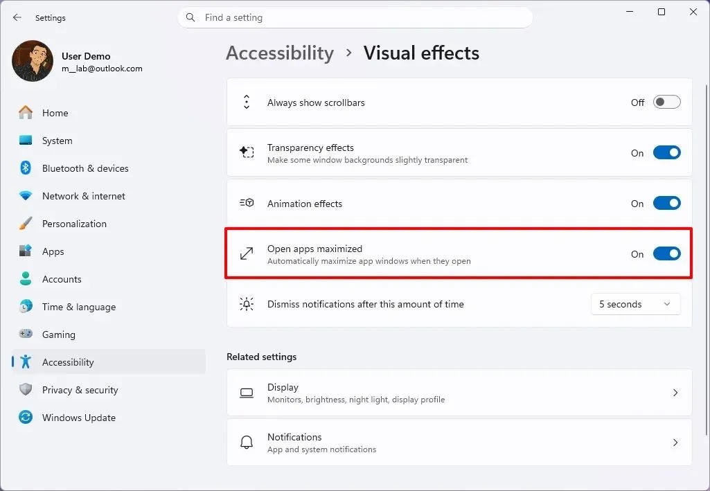
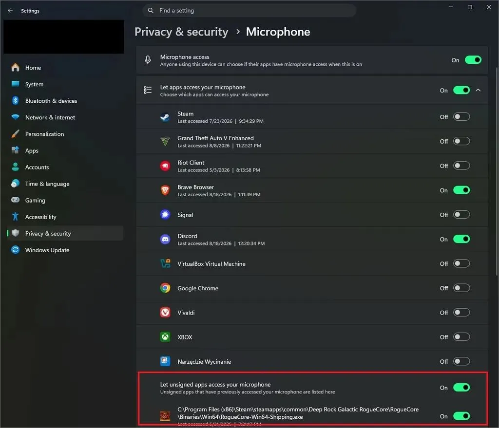
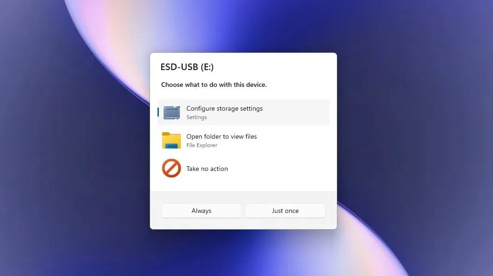

Microsoft продолжает тестировать Windows 11 26H2. В предварительных сборках уже нашли несколько изменений, которые компания пока не вынесла в официальные анонсы. Среди них — запуск приложений сразу в развёрнутом окне, более точные разрешения для классических Win32-программ и новый диалог «Автозапуска».

Ранее мы уже разбирали другие изменения 26H2: [настройки панели задач](https://trick32.ru/articles/taskbar-settings-windows-11/) и [новое меню «Пуск»](https://trick32.ru/articles/menyu-pusk-windows-11-26h2/).

Все три функции пока находятся в разработке. Они могут измениться или вообще не попасть в финальную версию Windows 11 26H2. Но сами идеи интересны — особенно новая модель разрешений для обычных настольных программ.

## Приложения смогут запускаться сразу развёрнутыми

В Windows давно есть одна маленькая странность.

Допустим, я работаю с браузером или Проводником в развернутом окне. Закрываю программу. При следующем запуске Windows обычно пытается восстановить предыдущее состояние окна.

Если перед закрытием приложение оказалось маленьким, оно может снова открыться маленьким.

В Windows 11 26H2 тестируют отдельную настройку, которая меняет это поведение.

Она называется **«Открывать приложения развёрнутыми»** и находится в разделе:

**Параметры → Специальные возможности → Визуальные эффекты.**

После включения Windows будет пытаться запускать приложения в максимизированном состоянии независимо от того, каким было их окно при предыдущем закрытии.



Это не то же самое, что восстановление положения окна.

Разница простая:

* раньше приложение было маленьким — Windows может снова открыть его маленьким;
* новая настройка включена — система пытается открыть приложение развёрнутым.

Для пользователя с большим монитором это мелочь. Но мелочь ежедневная.

Если вы открываете десятки программ за день, постоянное растягивание окон быстро превращается в раздражающий ритуал.

Особенно это касается рабочих компьютеров, где большую часть времени используются браузер, Проводник, терминал, редактор кода или офисные программы.

### Как включить функцию через ViveTool

В тестовой сборке **26340.9212** функцию можно активировать с помощью ViveTool:

```text
vivetool /enable /id:62915050
```

После изменения скрытой функции может потребоваться перезагрузка.

Здесь стоит сделать важную оговорку: ViveTool работает с внутренними функциями тестовых сборок Windows. Идентификатор, команда и само поведение функции могут измениться.

Поэтому включать такие возможности на рабочем компьютере я бы не стал без необходимости.

## Microsoft готовит отдельные разрешения для Win32-программ

Вот это изменение мне нравится гораздо больше.

Windows уже давно позволяет контролировать доступ приложений к камере, микрофону, местоположению и другим ресурсам. Но с классическими программами Win32 ситуация исторически была менее удобной.

Современные приложения из Microsoft Store получили более детальную модель разрешений. А обычные настольные программы долгое время во многом рассматривались как единая группа.

В Windows 11 26H2 Microsoft тестирует другой подход.

Пользователь сможет управлять разрешениями **для отдельных Win32-приложений**.

Например, на компьютере установлены Chrome и ещё одна программа, которая умеет работать с камерой.

Раньше настройка могла относиться к настольным приложениям в целом.

Новая модель предполагает другой сценарий:

**Chrome — доступ к камере разрешён.**

**Другая программа — доступ к камере запрещён.**

И это гораздо логичнее.



То же касается микрофона. В тестах также обнаружили элементы управления для местоположения и голосовой активации.

Получается более привычная модель:

> приложение попросило доступ — пользователь решил, давать его или нет.

Для Win32 это особенно важно. Старые настольные программы никуда не исчезли. На обычном ПК именно они часто составляют основную часть установленного программного обеспечения.

### Как попробовать функцию

В сборке **26340.9212** соответствующий эксперимент можно включить командой:

```text
vivetool /enable /id:60730253
```

После этого в настройках конфиденциальности могут появиться дополнительные элементы управления.

Но слово «могут» здесь важно.

Microsoft пока тестирует функцию. Её наличие зависит от конкретной сборки и состояния эксперимента.

Если после команды ничего не появилось — это не обязательно означает, что ViveTool работает неправильно.

## «Автозапуск» наконец избавляется от старого интерфейса

Третье изменение менее значительное, но хорошо показывает направление развития Windows 11.

Речь идёт о диалоге **AutoPlay**, или «Автозапуск».

Этот интерфейс появляется, когда Windows обнаруживает подключённый накопитель, карту памяти или другое устройство, для которого можно выбрать действие.

Microsoft тестирует новый вариант окна в стиле WinUI.



Изменился не только внешний вид.

Обновлённый диалог позволяет понятнее указать, что выбранное действие нужно выполнять:

* каждый раз;
* только один раз.

Есть и ещё одна деталь.

Окно перемещается в центр экрана.

В текущем интерфейсе подобные уведомления появляются в другой части рабочего стола. Новый вариант больше напоминает классический системный диалог.

И тут есть забавный момент.

Microsoft пытается сделать Windows 11 визуально последовательной, а заодно возвращает поведение, которое пользователи старых Windows уже видели много лет назад.

Windows 7, например, показывала диалог AutoPlay по центру рабочего стола.

Получается своеобразный круг: старый интерфейс убрали, потом признали его неудобства и постепенно возвращают знакомое поведение, но уже с новым оформлением.

### Как включить новый AutoPlay

В сборке 26340.9212 для эксперимента используется команда:

```text
vivetool /enable /id:62141177
```

После активации новый вариант диалога должен появиться вместо старого интерфейса.

Опять же — это функция предварительной сборки. В стабильной Windows она может выглядеть иначе.

## Почему Microsoft не рассказывает обо всех функциях

У Microsoft давно есть две параллельные реальности.

Первая — официальные анонсы. Компания показывает то, что считает готовым для публичного представления.

Вторая — тестовые сборки Windows Insider. В них постоянно появляются функции, которые ещё не готовы для массового использования.

Часть таких возможностей активируют постепенно. Другие тестируют на небольшой группе пользователей. Некоторые функции появляются в системе, а затем исчезают.

Подобные изменения мы уже видели на примере [настраиваемого контекстного меню](https://trick32.ru/articles/kontekstnoe-menyu-windows-11-nastrojka/) — функцию тоже долго тестировали, прежде чем показать официально.

Поэтому обнаружение новой настройки в Insider-сборке ещё не означает, что она обязательно появится в финальной Windows 11 26H2.

ViveTool в этом плане лишь показывает, что соответствующий код уже присутствует в сборке.

Это не обещание Microsoft.

## Какая из трёх функций действительно нужна

Если выбирать одну, я бы поставил на первое место **индивидуальные разрешения Win32-приложений**.

Развёрнутые окна — приятная мелочь. Новый AutoPlay — косметика плюс небольшое изменение поведения.

А вот разрешения для классических программ закрывают реальную дыру в логике Windows.

Странно, когда система позволяет отдельно управлять доступом одного приложения к камере, но для другого типа программ предлагает более грубую настройку.

Win32-программы всё ещё остаются огромной частью Windows. Это браузеры, архиваторы, графические редакторы, бухгалтерские программы, инженерный софт, корпоративные приложения и множество старых утилит.

Поэтому перенос детальной модели разрешений на Win32 выглядит давно назревшим решением.

## Стоит ли уже устанавливать Insider ради этих функций

Нет.

По крайней мере, я бы не устанавливал тестовую сборку Windows только ради трёх перечисленных изменений.

Причина простая — все они пока экспериментальные.

Функцию могут изменить.

Могут изменить расположение настройки.

Могут убрать идентификатор ViveTool.

Могут полностью отказаться от возможности.

А вместе с новыми функциями Insider-сборки приносят и другие изменения, которые не всегда полезны на основном компьютере.

Если хочется посмотреть, что Microsoft готовит для Windows 11 26H2, лучше следить за тестовыми сборками и ждать, когда нужные возможности перейдут в стабильный канал. Тем, кто всё же захочет опробовать 26H2 пораньше, поможет [инструкция по чистой установке](https://trick32.ru/articles/windows-11-26h2-chistaya-ustanovka-nepodderzhivaemoe-oborudovanie/) на несовместимое оборудование.

## Моё мнение

Windows 11 не всегда получает изменения, которые заметны на скриншотах. Иногда гораздо интереснее посмотреть на небольшие настройки, которые экономят несколько секунд каждый день.

Запуск приложений сразу развёрнутыми — как раз такой случай.

Новый AutoPlay — попытка привести старый интерфейс к общей визуальной системе Windows 11.

А индивидуальные разрешения Win32 — уже более серьёзное изменение. Если Microsoft доведёт эту функцию до стабильного релиза, Windows станет чуть предсказуемее с точки зрения безопасности и конфиденциальности.

Именно такие небольшие изменения, на мой взгляд, важнее очередного изменения значка или анимации.

Пока же всё это остаётся тестом. **Windows 11 26H2 ещё может измениться до финального релиза.**

Если Microsoft сохранит эти функции, две из трёх я бы оставил включёнными сразу после обновления — развёрнутый запуск приложений и отдельные разрешения для Win32.