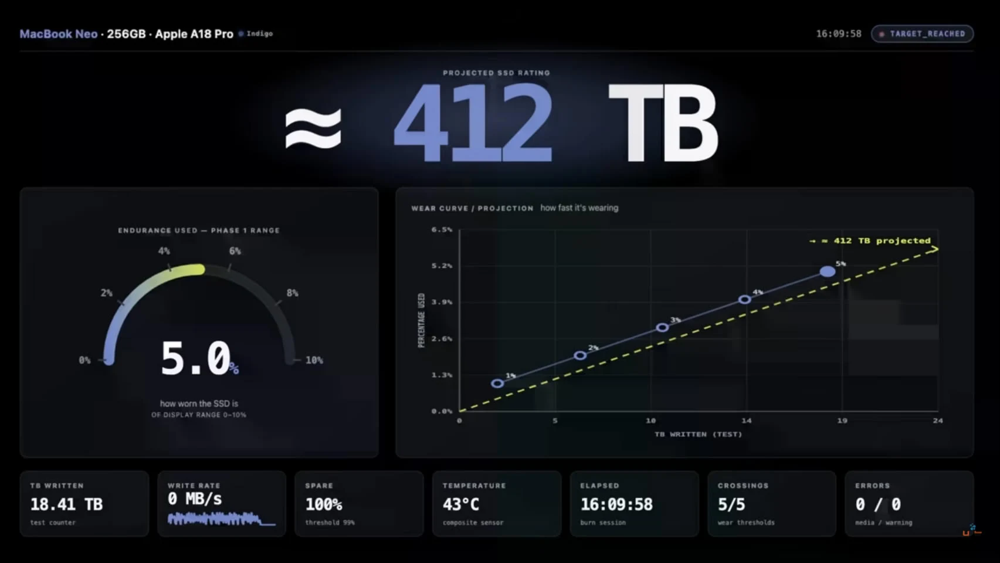

MacBook Neo не ломается через 58 дней. Эта цифра появилась в результате стресс-теста, где ноутбук записывал на SSD почти 900 ГБ за три часа.

Тест провёл YouTube-канал UFD Tech. Автор запускал Chrome, WhatsApp и Discord на MacBook Neo с 8 ГБ объединённой памяти. Когда памяти не хватало, macOS переносила данные на SSD через swap.

Такой режим может ускорить износ накопителя. Особенно неприятно это выглядит в MacBook Neo: память нельзя расширить, а NAND-чип SSD припаян к системной плате.

## Что именно измерял UFD Tech

Сначала автор проверил ресурс накопителей отдельным тестом. На версии MacBook Neo с SSD 256 ГБ он записал около 20 ТБ. Система показала примерно 5% израсходованного ресурса.

Из этого получилась оценка около **414 ТБ** полной записи.

Затем автор перешёл к обычной работе. Открыл браузер, мессенджеры и начал пользоваться ноутбуком как рабочим компьютером.

За три часа SSD получил почти **900 ГБ записей**. Пользователь при этом не сохранял на диск сотни гигабайт файлов. Запись шла из-за работы виртуальной памяти.

На кадре из ролика видно, как автор показывает схему **Memory Pressure → SSD Swap** и объём записи более 900 ГБ.

Кадр: UFD Tech / YouTube, через TechPowerUp.

## Почему 8 ГБ превращаются в проблему

Оперативная память хранит данные, с которыми прямо сейчас работают программы. Чем больше вкладок и приложений открыто, тем больше памяти им требуется.

Если свободного места не остаётся, macOS сначала сжимает данные. Если и этого мало, часть данных отправляется на SSD. Этот участок диска называют **swap** — виртуальной памятью.

Схема простая:

1. Приложение запрашивает память.
2. macOS освобождает место сжатием данных.
3. Часть данных переносится на SSD.
4. При повторном обращении система читает их обратно.

SSD в этот момент работает как медленная добавка к оперативной памяти. Пользователь видит открытые вкладки и мессенджеры. Система параллельно выполняет скрытые записи.

Сам swap не ошибка. Он есть в macOS, Windows и Linux. Неприятность начинается, когда компьютер обращается к нему постоянно.

## Почему результат выглядит настолько большим

В тесте получилось около **300 ГБ записи в час**. Это не значит, что любой MacBook Neo будет писать столько каждый час.

Автор создал конкретный сценарий и получил конкретный результат. Другой набор программ, меньше вкладок или более короткая сессия дадут другие цифры.

Но порядок величины важен. Пользователь может скачать документ на 10 МБ, а macOS за это время несколько раз переместит страницы памяти между RAM и SSD. Размер файла и объём записи на накопитель — разные вещи.

В этом и состоит неприятный сюрприз: счётчик записи показывает работу операционной системы, а не только действия пользователя.

## Откуда взялись 414 ТБ

414 ТБ — не характеристика Apple. Это расчёт UFD Tech по результату собственного теста.

Логика такая:

- на SSD записали около 20 ТБ;
- индикатор показал примерно 5% израсходованного ресурса;
- 20 ТБ разделили на 0,05;
- получили около 400 ТБ, точнее — примерно 414 ТБ в оценке автора.

На экране теста для версии 256 ГБ видна оценка около **412 ТБ**. В публикациях, пересказывающих ролик, встречается значение **414 ТБ**. Разница связана с округлением и моментом фиксации показателя.

Кадр: UFD Tech / YouTube, через TechPowerUp.

Apple не публикует для MacBook Neo показатель TBW. Поэтому корректно говорить не «SSD рассчитан на 414 ТБ», а «в этом тесте получилась оценка около 414 ТБ».

TBW тоже не работает как таймер. После достижения этого числа SSD не обязан мгновенно выйти из строя. Это ориентир, а не обещание конкретного срока службы.

## Почему появились 58 дней

Если взять оценку 414 ТБ и темп 900 ГБ за три часа, получится около 1400 часов такой нагрузки.

1400 часов — это примерно 58 суток.

Но это не прогноз для человека, который вечером открывает браузер на два часа. Это пересчёт лабораторного сценария на непрерывную работу.

Поэтому фраза «MacBook Neo умрёт через 58 дней» неверна. Правильнее так: **при сохранении тестовой нагрузки расчётный ресурс SSD на 256 ГБ будет выбран примерно за 58 дней непрерывной работы**.

Обычный владелец будет пользоваться ноутбуком меньше часов в день и с другой нагрузкой. Насколько меньше окажется износ, заранее сказать нельзя.

## Что меняется у версии на 512 ГБ

UFD Tech получил для SSD на 512 ГБ оценку около **1,52 ПБ**, то есть примерно 1521 ТБ записи.

Это примерно в 3,7 раза больше оценки для версии на 256 ГБ. При том же сценарии расчёт даёт около **5000 часов**.

| Версия | Оценка ресурса в тесте | Расчёт при нагрузке теста |
| --- | ---: | ---: |
| 256 ГБ | около 414 ТБ | около 1400 часов |
| 512 ГБ | около 1521 ТБ | около 5000 часов |

Больший SSD получает не только дополнительное место для файлов. В нём больше NAND-памяти, по которой контроллер может распределять записи. Поэтому версия на 512 ГБ в этом тесте получила заметно больший запас.

Это не гарантия. Результат зависит от конкретного накопителя, прошивки, алгоритмов контроллера и режима работы. Но разница между двумя версиями достаточно велика, чтобы учитывать её при покупке.

## Что нельзя будет исправить после покупки

У MacBook Neo память объединена с системой и не меняется после покупки. Выбрать другой объём позже нельзя.

SSD тоже нельзя заменить обычным M.2-накопителем. В Neo NAND-чип припаян к плате. Теоретически мастер может перепаять чип, но это не обычный апгрейд для владельца.

Получается жёсткий выбор до покупки:

- 8 ГБ памяти чаще отправляют данные в swap;
- 256 ГБ SSD оставляют меньше пространства для распределения записи;
- после покупки увеличить память нельзя;
- самостоятельная замена накопителя не предусмотрена.

Поэтому при одинаковых 8 ГБ памяти версия на 512 ГБ выглядит разумнее. Она стоит дороже, зато даёт больше места и больший расчётный запас записи по результатам теста.

## Стоит ли покупать MacBook Neo на 8 ГБ

Для браузера, документов, почты, видео и нескольких мессенджеров 8 ГБ могут хватить. Сам тест UFD Tech этого не опровергает.

Он показывает другое: даже лёгкая работа способна создать большой поток записи, если одновременно открыто много программ.

Если ноутбук нужен на несколько лет, я бы не выбирал базовую версию автоматически только из-за низкой цены. Сначала стоит оценить свою нагрузку.

**256 ГБ** подойдут для простой работы с небольшим числом программ и файлов.

**512 ГБ** предпочтительнее, если ноутбук будет основным, браузер обычно открыт с десятками вкладок, а заменить накопитель потом нельзя.

Это не делает SSD вечным. Это уменьшает один из рисков, который показал тест.

## Что делать владельцу Neo

Не отключайте swap вручную. Он нужен macOS, чтобы программы продолжали работать при нехватке памяти. После отключения приложения могут закрываться или перестать запускаться.

Лучше следить за нагрузкой на память в **Мониторинге системы**. Если график долго остаётся жёлтым или красным, системе не хватает запаса RAM.

В такой ситуации помогают простые действия:

1. Закрыть ненужные вкладки Chrome.
2. Завершить мессенджеры, которыми вы не пользуетесь.
3. Не держать одновременно несколько тяжёлых приложений.
4. Проверить состояние SSD и заранее настроить резервное копирование.

Резервная копия нужна независимо от результатов теста. Встроенный накопитель нельзя быстро вынуть и подключить к другому компьютеру.

## Вывод

История с MacBook Neo не доказывает, что каждый SSD на 256 ГБ выйдет из строя через 58 дней. Она показывает цену недостатка памяти в компьютере с несъёмными компонентами.

В тесте UFD Tech 8 ГБ памяти привели к почти 900 ГБ записи за три часа. Из этого автор вывел около 414 ТБ ресурса для версии 256 ГБ и около 1521 ТБ для версии 512 ГБ. Все сроки — расчёт по тестовой нагрузке, а не гарантия Apple.

Если Neo нужен для простых задач, базовая версия может справиться. Но при покупке на несколько лет я бы выбрал 512 ГБ. Это не отменяет ограничение в 8 ГБ памяти, зато оставляет SSD больший запас.

Главный вывод простой: в MacBook Neo объём памяти и накопителя нельзя рассматривать отдельно. Сэкономленные на базовой конфигурации деньги могут превратиться в постоянный swap, а исправить этот выбор после покупки будет сложно.
