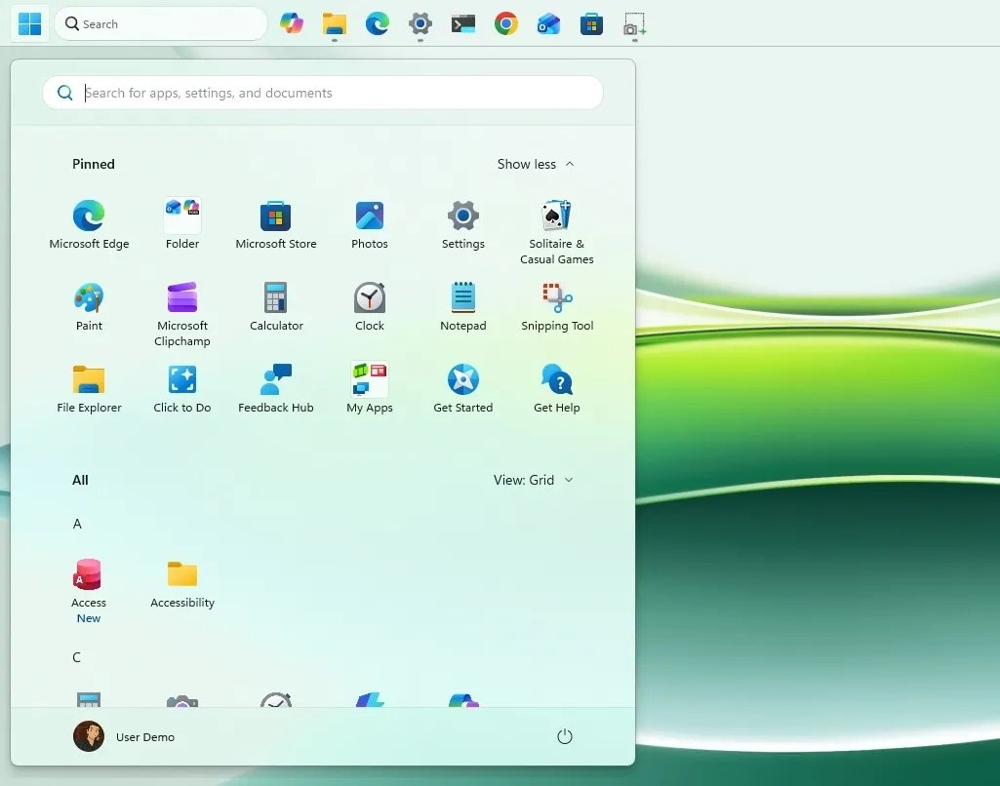
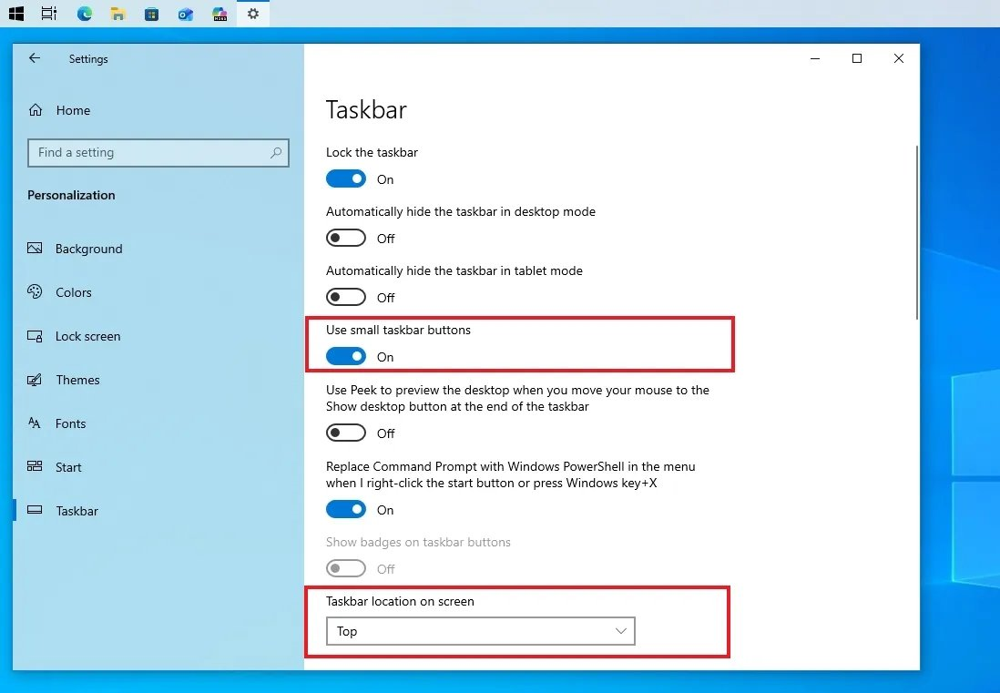
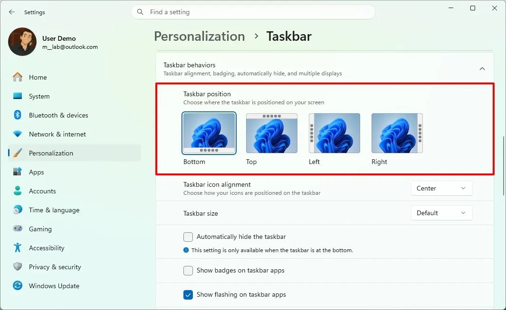
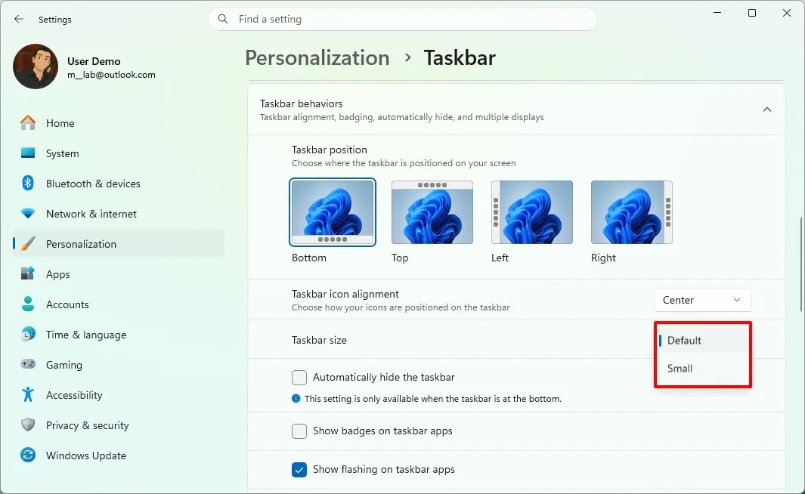

В обновлении Windows 11 26H2 Microsoft планирует вернуть ключевые параметры настройки панели задач, удалённые с выходом системы. Изменения внедряют в рамках масштабной инициативы Windows K2 — программы по устранению главных проблем операционной системы: низкой производительности, багов интерфейса и высокой прожорливости к ресурсам.

Если вам интересно, почему Microsoft пошла на этот шаг, как проект связан с падением доходов компании и что именно инженеры меняют «под капотом» системы — читайте в моём подробном разборе Project K2.

Хотя новшества панели задач заявлены для сборки 26H2, они не будут эксклюзивом этой версии. Windows 11 26H2 построена на той же платформе, что и версии 24H2 и 25H2. Это означает, что новые функции появятся у всех пользователей Windows 11 в рамках регулярных ежемесячных обновлений.

## Свободное перемещение панели задач

Главное нововведение — возможность зафиксировать панель задач у любого края экрана: вверху, внизу, слева или справа.

Эта функция особенно критична для пользователей ультраширокоформатных мониторов, планшетов и сенсорных устройств, где нижнее расположение панели не всегда удобно для работы.

### Чем реализация отличается от Windows 10

В Windows 10: панель задач можно было открепить в контекстном меню и свободно перетащить мышью в любую сторону.

В Windows 11: перетаскивание мышью не поддерживается. Перемещение выполняется строго через системные настройки.

Как изменить положение: Параметры → Персонализация → Панель задач → Положение панели задач.

При изменении позиции панели задач все всплывающие уведомления, подсказки и системные анимации автоматически подстраиваются под выбранный край экрана.

## Компактный режим для небольших экранов

Для владельцев компактных ноутбуков и планшетов добавляют специальную настройку размера панели задач. Она позволяет уменьшить высоту панели и размер иконок, освобождая полезное пространство на экране.

Как включить компактный режим: Параметры → Персонализация → Панель задач → Размер панели задач.

<strong>Важные нюансы работы:</strong>

<strong>Совместимость:</strong> опция «Никогда не объединять кнопки» продолжает работать при любом расположении и размере панели.

<strong>Блокировка настроек:</strong> при включении новой опции «Размер панели задач» система блокирует самостоятельную настройку размера значков.

<strong>Альтернативный вариант:</strong> функция «Показать меньшие значки приложений» (которая уменьшает только иконки, не меняя высоту самой панели) остаётся доступной отдельно.

## Что по-прежнему нельзя сделать (главное ограничение)

Несмотря на возврат функций, полноценной свободы настройки из прошлых версий Windows пользователи не получат.

<strong>Нельзя сделать панель больше.</strong> В Windows 10 и более ранних ОС можно было потянуть мышью за край панели задач и увеличить её высоту, создав 2–3 ряда для значков запущенных программ.

<strong>Нельзя менять размер ручным перетаскиванием.</strong> Высота панели регулируется только переключателем в меню, растянуть её вручную мышью невозможно.

## Резюме

Microsoft исправляет ошибки первого релиза Windows 11, возвращая гибкость интерфейса. Однако до полного восстановления функционала Windows 10 разработчики пока не дошли: размер панели задаётся жёстко, а ручное растягивание отсутствует.
