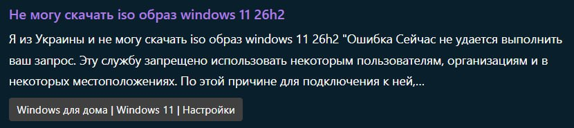
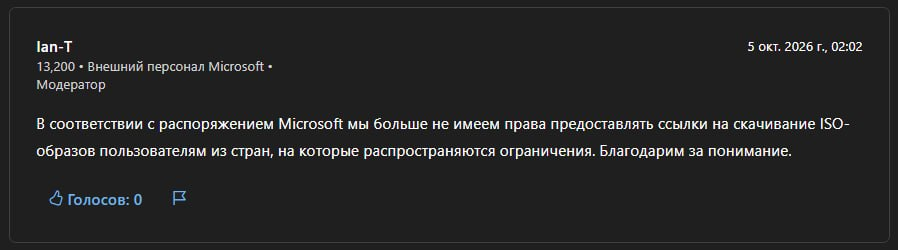

Просили образ у инженеров Microsoft — получали временный адрес загрузки с серверов компании. Теперь в ответ приходит отказ: **в соответствии с распоряжением Microsoft ссылки пользователям из стран под ограничениями больше не предоставляются**.

**Быстрый ответ:** канал через вопросы и ответы Microsoft для России и Беларуси закрыт. Судя по скриншотам от 5 октября 2026 и наблюдениям за последние несколько дней, временные ссылки техподдержка Microsoft больше не выдаёт.

Что осталось пользователям Windows: **оригинальные образы с CDN Microsoft через ShIFER, бота и RuBeRoID**, живут около суток. Ниже — что именно закрылось, кого это касается и что делать.

## Что случилось 5 октября

*Два скриншота из Microsoft Q&A.*

Сначала меня зацепила просьба в ветке Q&A: человек выпрашивает временный адрес загрузки ISO Windows 11 26H2, жалуется, что с официального сайта файл не забирается. Представляется жителем Украины. Странно, подумал я: впервые слышу, будто Украина угодила в санкционные списки Microsoft. Позже дошло — так юзер пытался обвести техподдержку вокруг пальца, мол, я не из России и не из Беларуси, мне положено.

Картинка сложилась сегодня, когда я случайно наткнулся на ответ службы поддержки в одной из веток. Модератор Ian-T, внешний персонал Microsoft, 5 октября в 02:02 закрывает обсуждение одной формулировкой: «по распоряжению корпорации ссылки на скачивание ISO пользователям из стран под ограничениями больше не выдаются».

Без сроков, без исключений, с сухим «благодарим за понимание».

То есть инженерам запретили то, чем они занимались годами, — вручную доставать временные дистрибутивы тем, у кого заблокирована страница загрузок.

Оговорка сразу: **ответ одного модератора — не пресс-релиз Microsoft**. Но он ложится на картину последних дней: по моим наблюдениям, инженеры уже несколько дней не делятся адресами загрузки с теми, у кого файл не забирается с официальной страницы. Прежде такие образы раздавали постоянно — и на Windows 10, и на 11. Теперь — нет.

## Первый запрет и второй: в чём разница

Первый запрет — 2022 год. Microsoft закрыла прямое скачивание ISO и Media Creation Tool, а также оплату своих продуктов с российских и белорусских IP. Об этом была отдельная статья [«Начало конца: как Microsoft, отключив русских от Windows...»](https://dzen.ru/a/YsAhguauRnb5bogu).

Оставалась лазейка: упросить инженера в Q&A поделиться временным образом. Инженер отвечал, файл жил день-два. На этой лазейке держался и автомат ShIFER: каждые 30 минут забирал свежие адреса из ответов инженеров, показывал таймер. Плюс ручная кнопка «Запросить ISO» — сайт готовил текст обращения, посетитель публиковал его в Q&A.

Второй запрет, октябрь 2026, прихлопнул именно этот обходной путь: инженерам запретили делиться образами с пользователями из стран под ограничениями. Форумные ссылки в ShIFER больше не появятся. Кнопка «Запросить ISO» теряет смысл и будет убрана.

## Что осталось: ShIFER на своём скрипте

ShIFER жив — это мой сайт. Механика сменилась: **только мой собственный скрипт**, как в моём Telegram-боте и форке [RuBeRoID](/articles/oshibka-sentinel-rufus-ruberoid/). Файлы по-прежнему оригинальные, напрямую с CDN Microsoft, живут около 24 часов. Таймеры рядом с раздачами остаются — пока тикает, качается.

Подробно про общий способ без торрентов — в материале [«Скачать Windows 10 и 11: оригинальный ISO с серверов Microsoft»](/articles/skachat-windows-original-iso-microsoft/). Про ошибку Sentinel и геоблок в Rufus — в разборе [про RuBeRoID](/articles/oshibka-sentinel-rufus-ruberoid/).

Что это меняет на практике:

- просить образ в Q&A больше не работает для RU/BY — придёт отказ со ссылкой на распоряжение;
- ShIFER, бот и RuBeRoID раздают адреса со скрипта, а не с форума;
- раздача одноразовая по времени: увидел живую — забирай сразу, завтра её не будет;
- нужной версии в списке нет — дождись следующего сбора или загляни на [windows-64.ru](https://windows-64.ru), а инженеру писать бесполезно.

## Кого касается

Тех, у кого официальная страница загрузок Microsoft не отдаёт ISO: IP России и Беларуси. Проверка простая: сайт Microsoft → выбор версии и языка → ошибка 715-123130 / Sentinel или «службу запрещено использовать». Если качается — оба запрета вас не затрагивают.

Редакции и версии: речь про Windows 10 и 11, включая 26H2. Ознакомительные Evaluation ISO с их 90 днями и без русского — отдельная история (подробно разбирал [в материале про Evaluation 26H2](/articles/windows-11-26h2-evaluation-iso-90-dney/)), не путать с полными образами.

## Ограничения и честные неизвестные

Номер и текст распоряжения Microsoft неизвестны, есть лишь формулировка модератора. Время жизни файла с моего скрипта — сутки.

Мои планы по ShIFER — поддерживать по мере возможности сервис прямых адресов с CDN Microsoft. Добавить ответы на частые вопросы: где скачать ISO, как активировать, как получить Office, типовые ошибки скачивания и активации. Напомню, это план, а не готовый раздел.

## Что делать сегодня

Не пишите инженерам за ссылкой из RU/BY — придёт тот же отказ. Откройте ShIFER, смотрите таймер, качайте живой ISO сразу. Для флешки — Rufus-RuBeRoID вместо сломанного FIDO. Если ссылки на нужную версию нет — вернитесь через несколько часов, сбор идёт постоянно.

## FAQ

**Это официальный запрет Microsoft?**
Официального пресс-релиза нет. Есть ответ модератора Q&A от 05.10.2026 плюс несколько дней без выдач по моим наблюдениям. Считайте это рабочей картиной, а не документом.

**А Украина тут при чём?**
Ни при чём: Украина не в санкционных списках. «Я из Украины» — слова запросившего ссылку из скрина, вероятно попытка обойти проверку.

**Ссылки ShIFER — пиратка?**
Нет. Оригинальные файлы с CDN Microsoft, без перезалива. Живут около суток, дальше сгорают.

**Кнопка «Запросить ISO» куда делась?**
Убирается как неактуальная: просить у инженеров больше нечего, форумных ссылок не будет.
