Ваш компьютер работает отлично, но Microsoft считает его слишком старым для Windows 11: нет совместимого процессора, TPM 2.0 или Secure Boot. Обновление не приходит, официальные инструменты установки отказываются работать. Решение — чистая установка с собственного загрузочного носителя, который обходит проверку оборудования.

В этом руководстве показываю, как поставить новейшую Windows 11 26H2 на неподдерживаемое оборудование: от скачивания ISO до первого входа в систему. Инструкция протестирована в августе 2026 года на сборке 26300.9032.

## Почему чистая установка

Я предпочитаю этот подход, потому что он стирает диск и ставит новую копию системы. Уходит всё, что накопилось за годы: старые драйверы, остатки программ, сбитые настройки. При переходе с Windows 10 или более ранней версии Windows 11 чистая установка даёт системе лучший старт.

## Что делает систему «неподдерживаемой»

Windows 11 26H2 — следующее функциональное обновление Windows. Microsoft официально поддерживает его только на устройствах, которые отвечают требованиям: совместимый процессор, TPM 2.0, Secure Boot. Устройства без этих компонентов обновление не получают, а официальные инструменты Microsoft (Media Creation Tool, помощник по установке) блокируют установку намеренно.

Ограничения обходятся. Создавая собственный установочный USB-носитель через Rufus, вы обходите проверку совместимости и ставите Windows 11 26H2 на неподдерживаемое устройство.

Но, как говорится, есть нюанс и прежде чем продолжить, поговорим о компромиссах. Установка Windows 11 на старое оборудование создаёт неподдерживаемую конфигурацию: Microsoft не гарантирует совместимость, обновления системы, наличие драйверов и техническую поддержку. Будущие обновления могут привести к сбоям. Продолжаете — на свой страх и риск.

## Требования

Процессор должен поддерживать инструкцию POPCNT — без неё Windows 11 не запустится. У процессоров, выпущенных после 2008 года, она обычно есть, но проверить не помешает.

Рекомендуется сделать полную резервную копию компьютера перед началом установки. После удаления диска вернуть данные будет некуда.

Windows 11 26H2 выйдет ориентировочно в сентябре-октябре 2026 года. О дате выхода и способах обновления я рассказал в этой статье: [Когда выйдет Windows 11 26H2 и как пройдет обновление](https://dzen.ru/a/anNuM_mXN3biFf9g) 

Метод, описанный в статье, неофициальный, и инструкции могут перестать работать в любой момент — Microsoft может изменить правила или сломать совместимость следующим обновлением.

## Шаг 1. Скачать образ Windows 11 26H2

Официальная страница Windows Insider требует регистрации и входа в аккаунт Microsoft. Чтобы получить образ Windows 11 26H2, мы используем [UUP Dump](https://uupdump.net/) — сервис, который собирает готовый ISO из файлов Microsoft с серверов обновления Windows.

Выполните следующие действия:

1. Откройте сайт [uupdump.net](https://uupdump.net/).

В разделе Windows 11 выберите сборку серии 26300.хххх (это и есть 26H2). Самый простой способ — кнопка **Канал разработчиков**на главной странице, либо зайти в категорию Dev и выбрать нужную сборку.

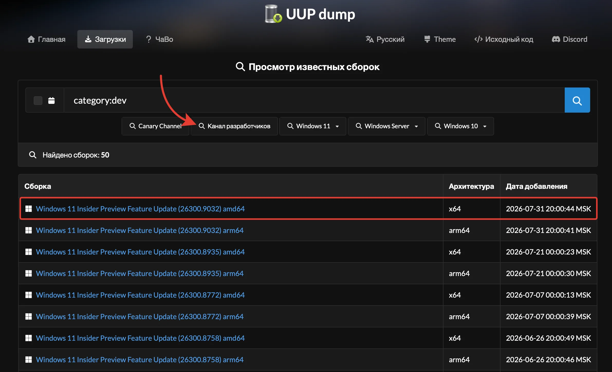

2. Нажмите на выбранную сборку.

3. Выберите язык продукта (например, Русский) и нажмите **Далее**.

4. Выберите редакцию — Windows 11 Pro или Home — и нажмите **Далее**.

5. На странице сведений выберите способ загрузки **Скачать и преобразовать в ISO**.

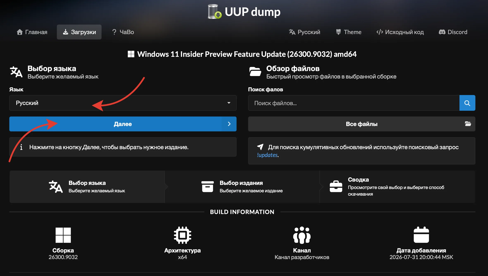

6. Скачайте архив со скриптами и распакуйте его в отдельную папку.

7. Запустите файл `uup_download_windows.cmd` (для Windows) или `uup_download_linux.sh` (для macOS/Linux).

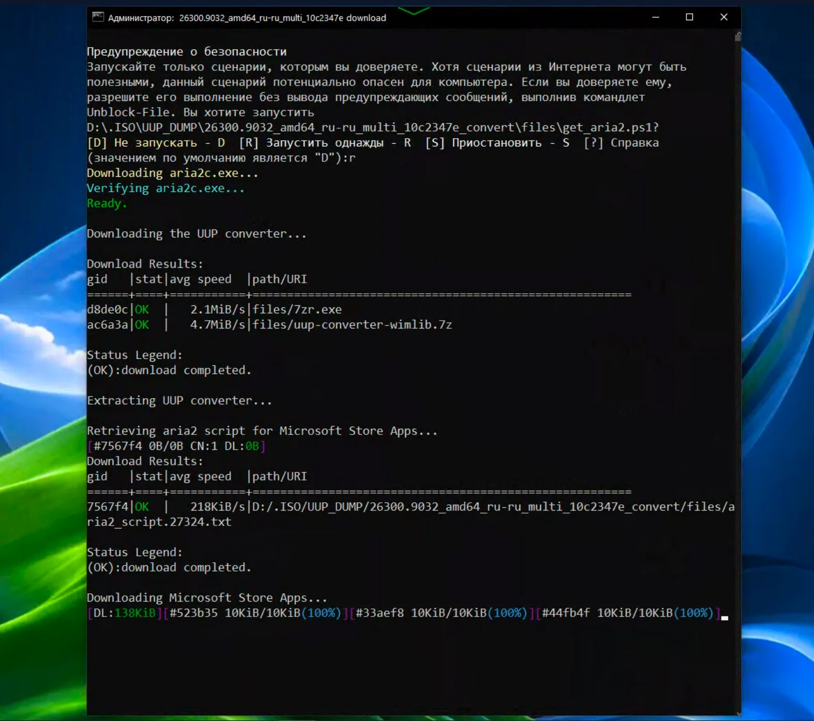 

Скрипт скачает все компоненты с серверов Windows Update и соберёт готовый ISO-файл в той же папке. Это займёт время и трафик, несколько гигабайт.

## Шаг 2. Создать загрузочный USB-носитель в Rufus

1. Подключите USB-накопитель объёмом от 16 ГБ и выполните следующие действия:

2. Откройте официальный сайт [rufus.ie](https://rufus.ie/).

3. Скачайте последнюю версию Rufus в разделе «Скачать».

4. Запустите файл `rufus.x.xx.exe`.

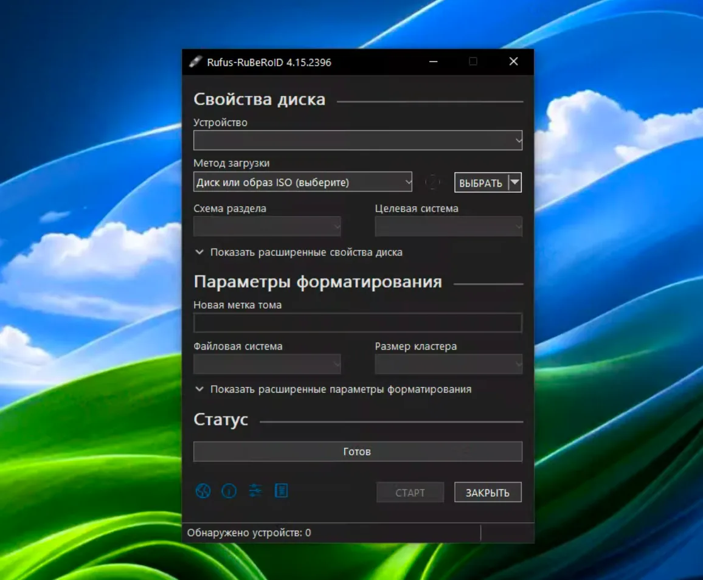

5. Выберите ваш USB-накопитель в меню «Устройство».

6. Нажмите кнопку **Выбрать** и укажите скачанный ISO-файл Windows 11 26H2.

- В параметрах оставьте: Вариант образа — **Стандартная установка Windows 11**, Схема раздела — **GPT**, Целевая система — **UEFI (не CSM)**.

- В поле «Метка тома» задайте имя накопителя, например `Windows 11 26H2 Setup`.

- Файловую систему и размер кластера оставьте по умолчанию. Отметьте «Быстрое форматирование».

7. Нажмите кнопку **Пуск**.

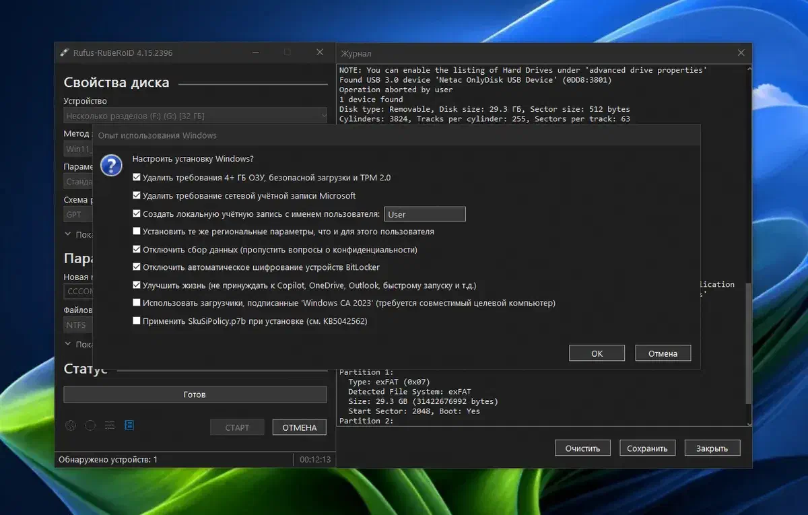

8. В открывшемся окне установите флаг **«Удалить требование для 4 ГБ+ ОЗУ, Secure Boot и TPM 2.0»** — это ключевой пункт для неподдерживаемого оборудования.

9. Установите флаг **«Удалить требование для онлайн-учётной записи Microsoft»** — он убирает обязательный вход в аккаунт Microsoft и даёт создать локальную учётную запись.

10. (Необязательно) Отметьте **«Создать локальную учётную запись с именем пользователя»** и укажите имя — установка создаст её автоматически.

11. Отметьте **«Отключить автоматическое шифрование устройств BitLocker»**, чтобы BitLocker не включался сам во время установки. О том как теряют данные при автоматическом включении Bitlocker при установке Windows 11 я рассказывал в этой статье: [Ключ BitLocker утерян. Как вернуть доступ к ноутбуку](https://dzen.ru/a/aFg2i1P4AUWHWlRW)

12. Нажмите **ОК**.

Rufus создаст загрузочный носитель с установочными файлами Windows 11 26H2. Если вы выбрали автоматическое создание локальной учётной записи, она будет без пароля — после установки задайте пароль и PIN на странице «Параметры входа».

## Шаг 3. Установка Windows 11 26H2

1. Загрузите компьютер с USB-накопителя. При включении откройте меню загрузки (обычно клавиша F11, F12 или Esc) или настройте приоритет загрузки в UEFI. Настройки прошивки у каждого компьютера свои — за подробностями обратитесь к сайту поддержки производителя.

2. Нажмите любую клавишу, когда появится запрос.

3. Выберите язык и формат установки, нажмите **Далее**.

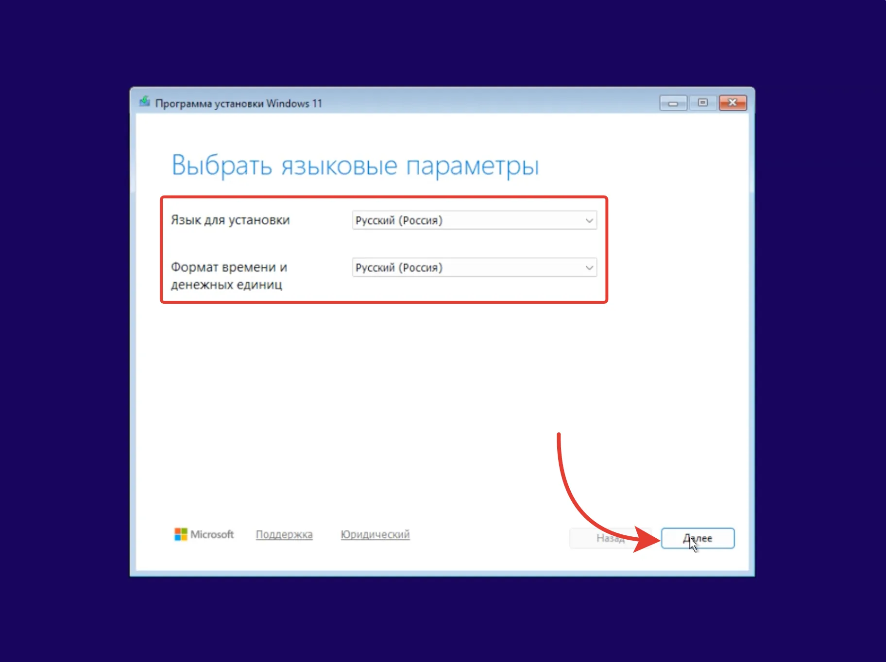

4. Выберите раскладку клавиатуры, нажмите **Далее**.

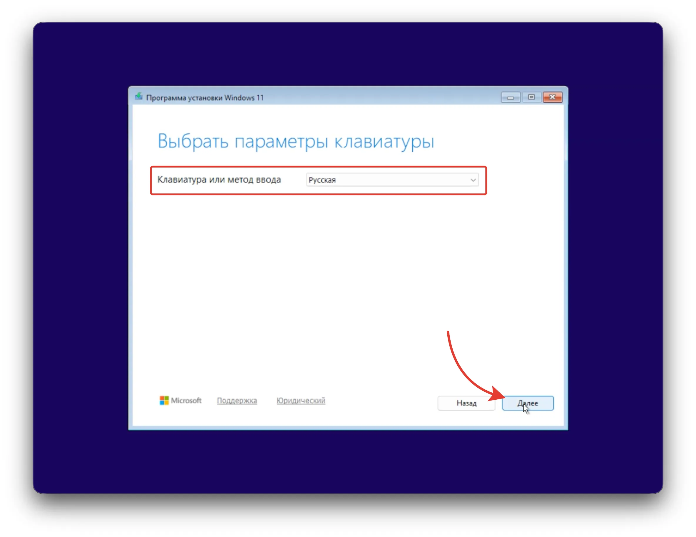

5. Нажмите **Установить Windows 11**.

6. Установите флаг «Я принимаю всё» (лицензионное соглашение).

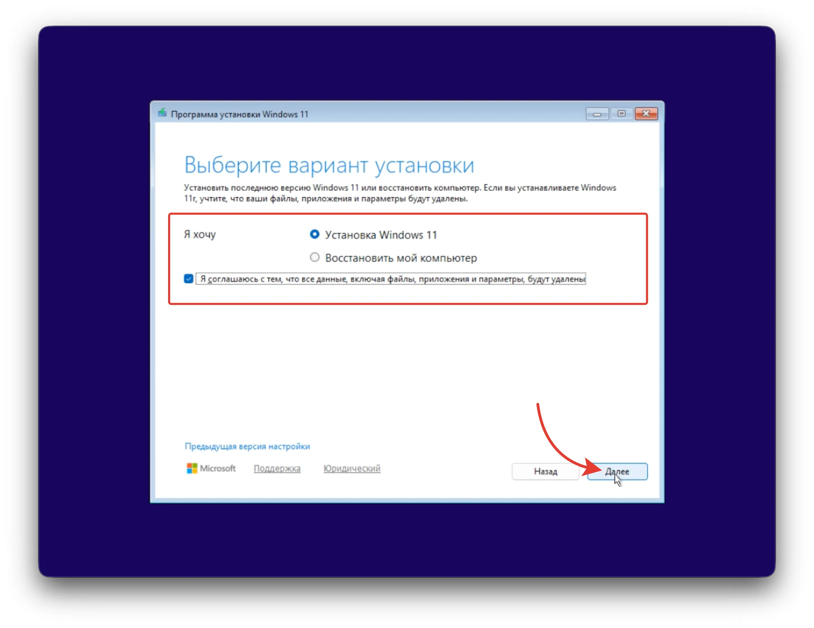

7. Нажмите **У меня нет ключа продукта**.

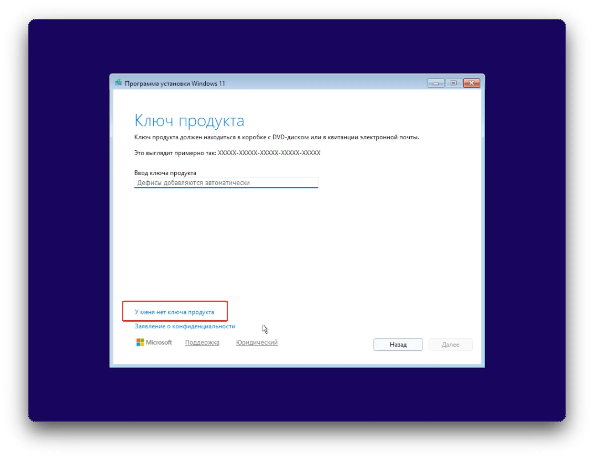

8. Выберите редакцию Windows 11, которую активирует ваш лицензионный ключ (если применимо).

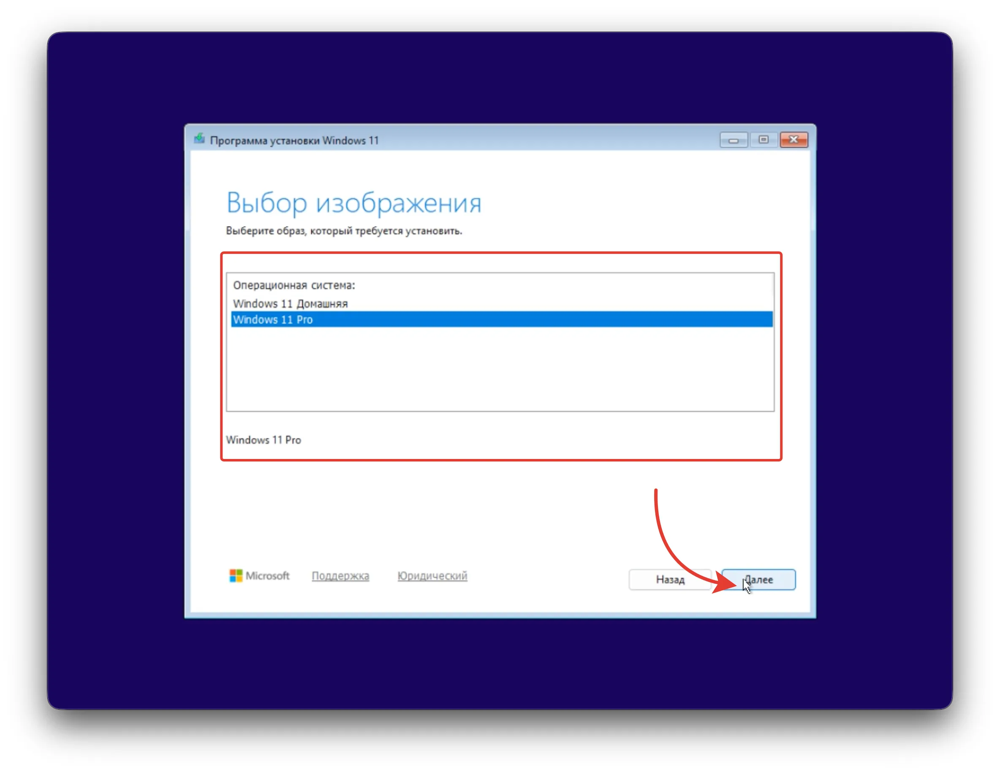

9. Нажмите **Далее**, затем **Принять**.

10. Выберите каждый раздел жёсткого диска, на который ставится система (обычно это «Диск 0»), и нажмите **Удалить**. Все данные на диске будут стёрты.

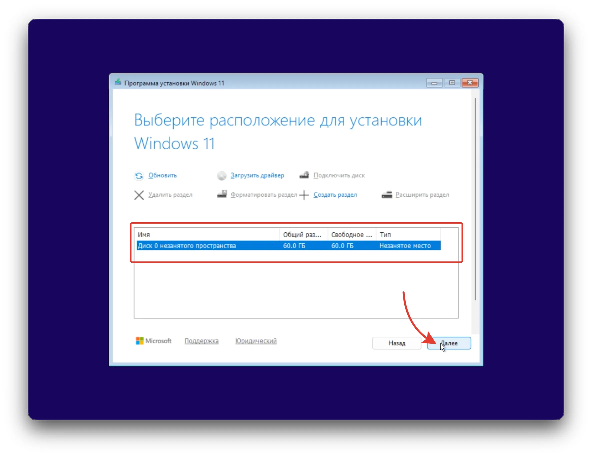

11. Выберите диск с нераспределённым пространством и нажмите **Далее**, затем **Установить**.

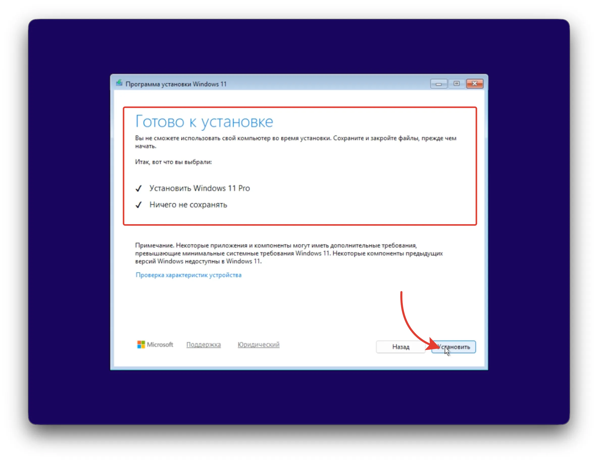

Начнётся копирование файлов и установка. После перезагрузки откроется экран начальной настройки (OOBE).

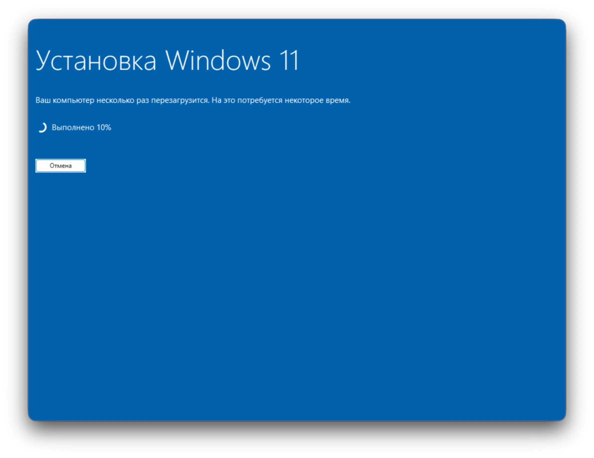

## Начальная настройка (OOBE)

1. Выберите регион, нажмите **Да**.

2. Выберите раскладку клавиатуры, нажмите **Да**.

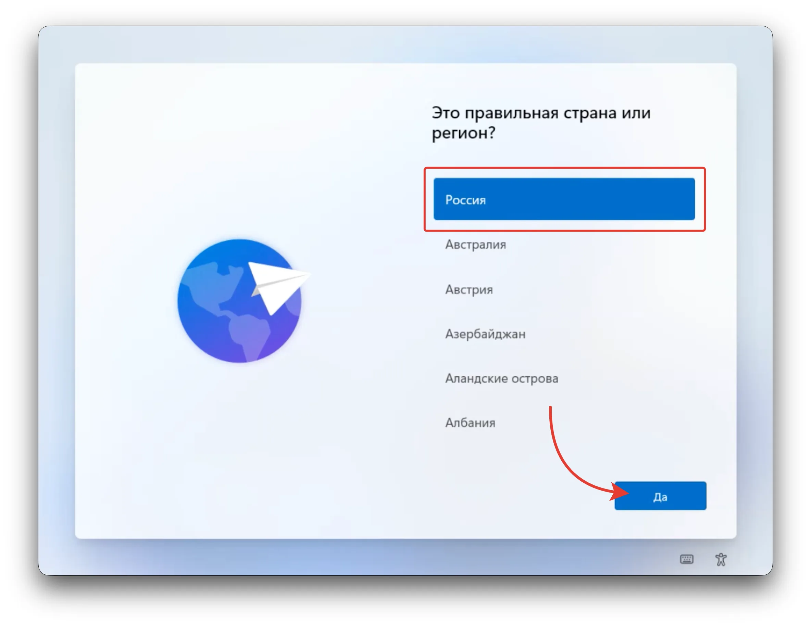

3. Нажмите **Пропустить**, если второй макет не нужен.

4. Компьютер сам подключится к сети по Ethernet. Для Wi-Fi настройте соединение вручную — может понадобиться ключ безопасности.

5. (Необязательно) Подтвердите имя компьютера.

6. (Необязательно) Нажмите **Показать дополнительные параметры**.

7. Введите имя папки пользователя, нажмите **Далее**.

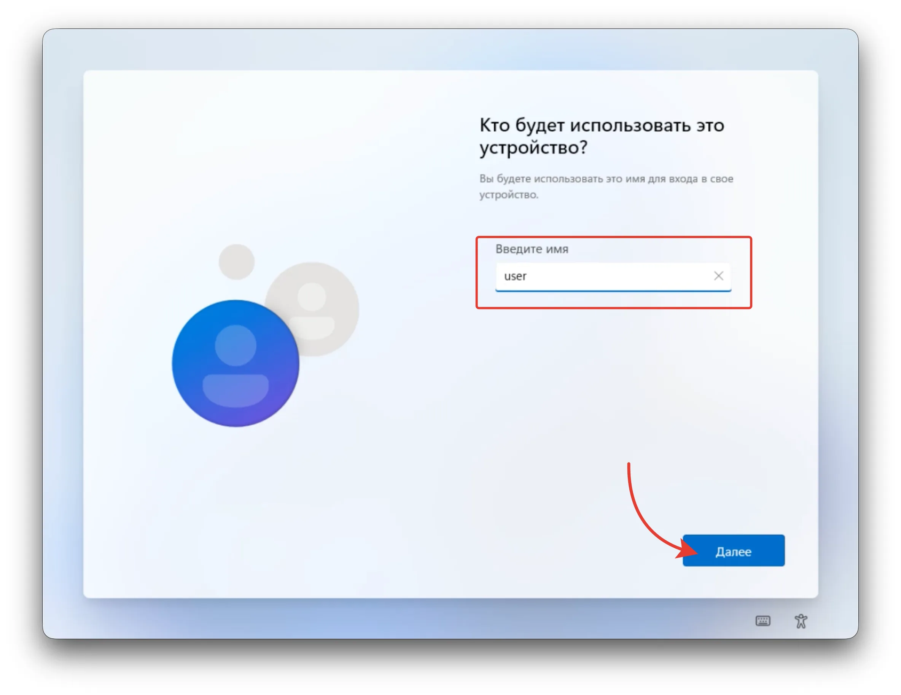

8. Выберите **«Настройка для личного использования»** — эта опция доступна только для Windows 11 Pro. В версии «Домашняя» её нет.

9. Нажмите **Далее**.

10. Войдите в учётную запись Microsoft: подтвердите адрес почты, пароль, создайте четырёхзначный PIN-код Windows Hello. Если вы отметили в Rufus создание локальной учётной записи — просто подтвердите её имя.

11. Настройте параметры конфиденциальности под себя, нажмите **Далее**, **Далее**, **Принять**.

12. На странице резервного копирования выберите **«Устройство "Ещё"»**. Быстрый совет: кнопка «Восстановить с этого ПК» переносит файлы, приложения, настройки и учётные данные из резервной копии OneDrive.

13. Нажмите **«Настроить как новый ПК»** и подтвердите ещё раз.

14. (Необязательно) На странице «Давайте настроим ваш опыт» отметьте способы использования устройства — система предложит подходящие инструменты и настройки.

15. Продолжайте по инструкциям на экране.

После выполнения этих шагов Windows 11 26H2 завершит чистую установку на компьютере, который не соответствует минимальным требованиям к оборудованию.

Microsoft периодически обновляет экран начальной настройки (OOBE), поэтому ваш опыт может немного отличаться в зависимости от времени установки и региона.

## Резюме

Я много раз ставил Windows 11 на неподдерживаемые компьютеры, и в большинстве случаев система работала стабильно. Но это компромисс: запуск неподдерживаемой конфигурации означает, что Microsoft может изменить правила или внести проблемы совместимости в будущих обновлениях.

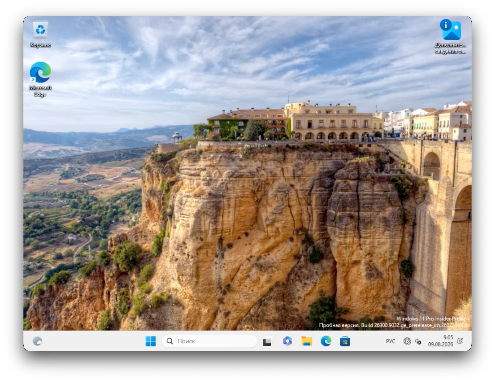

Чистая установка — лучший способ заставить это работать. Она убирает накопленные годами драйверы и настройки, которые вызывают проблемы после обновления, и даёт Windows 11 максимальный шанс работать стабильно.

Если ваш компьютер всё ещё работает хорошо и поддерживает POPCNT — попробуйте, прежде чем примите решение заменить "железо". Только сначала сделайте полную резервную копию: после удаления диска пути назад не будет.
