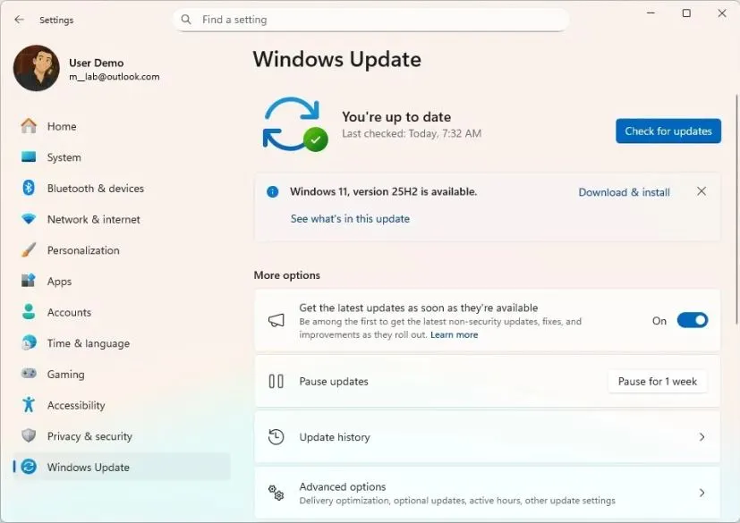
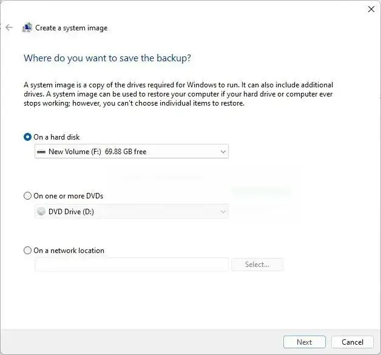
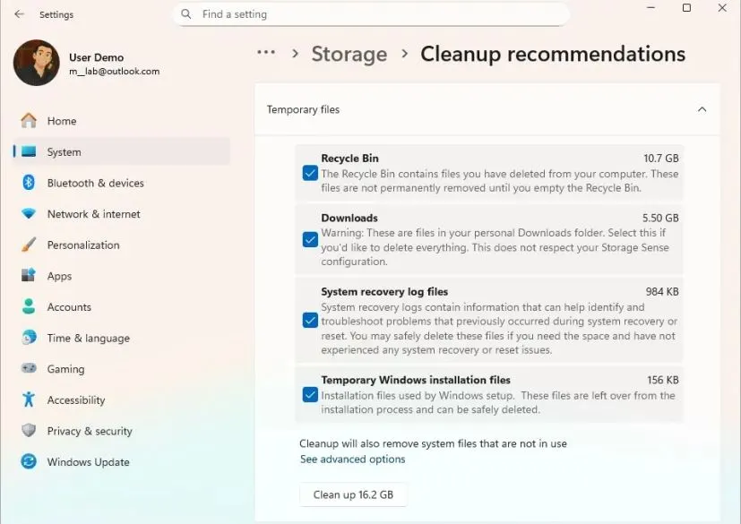
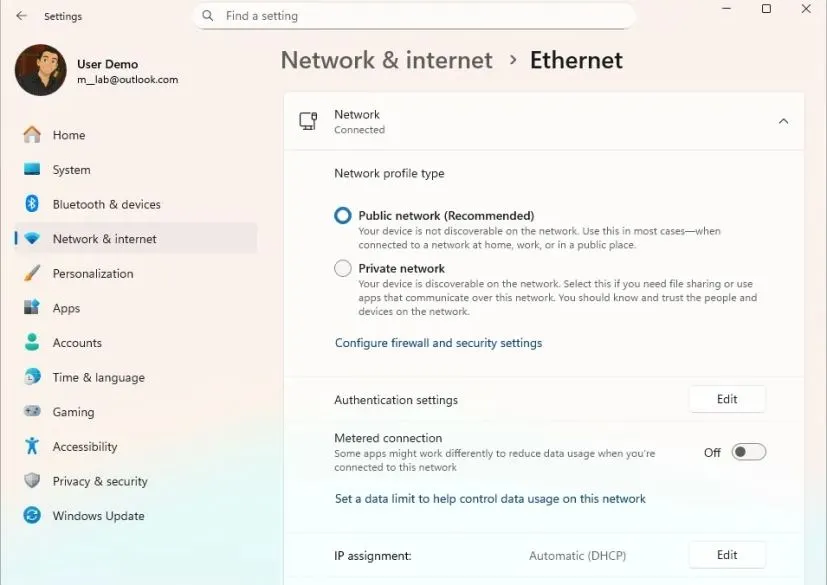
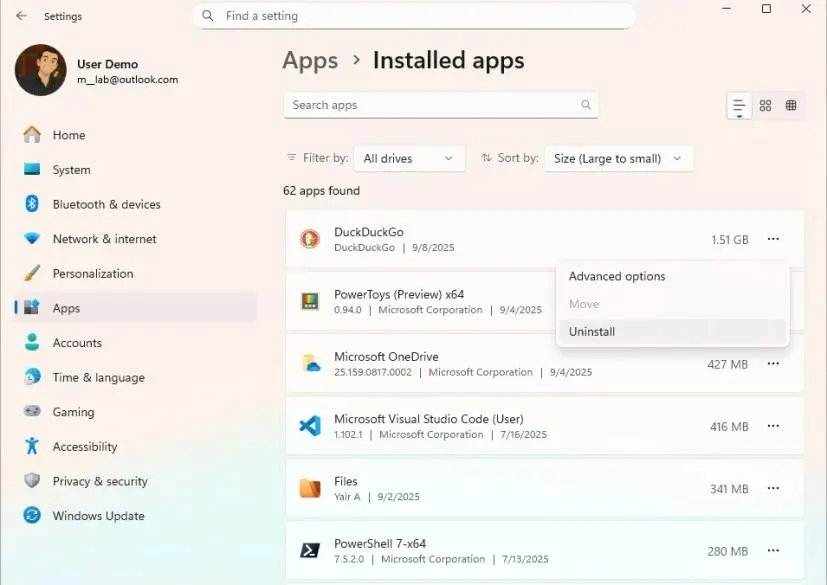

Windows 11 26H2 выходит позже в 2026 году и ставится проще старых крупных обновлений. Если у вас 24H2 или 25H2 — это один маленький пакет включения (enablement package, eKB) и одна перезагрузка. Новые компоненты уже приехали с ежемесячными обновлениями, пакет только включает их. Но даже такое обновление спотыкается на забитом диске, сломанном Центре обновления, лишних драйверах и программах. Несколько минут подготовки экономят часы починки.

## 1. Ставьте 26H2 только через Центр обновления Windows

Для 24H2 и 25H2 рекомендованный путь — **Параметры → Центр обновления Windows**. Включите **Получать последние обновления, как только они будут доступны** и нажмите **Проверить наличие обновлений**.

Если обновление доступно — появится кнопка **Скачать и установить**. Если не появилось — не форсируйте. Microsoft ставит временные блоки (safeguard hold), когда видит риск для конкретного железа, драйвера или программы. Отсутствие предложения — не всегда поломка, часто это защита.

Перед установкой загляните на [панель состояния выпусков Windows (Windows release health dashboard)](https://learn.microsoft.com/en-us/windows/release-health/windows11-release-information) — там публикуют известные проблемы и блоки для каждой версии.

## 2. Сделайте полный бэкап

Перед любым крупным обновлением — полная резервная копия. Да, 26H2 на 24H2/25H2 ставится мягче обычной переустановки. Но сбой обновления, битые файлы, несовместимый драйвер или неудачная настройка всё равно сделают компьютер незагружаемым.

Сделайте образ системы на внешний диск. Минимум — скопируйте документы, фото и видео в облако или на отдельный носитель. Без копии не начинают.

## 3. Освободите место на системном диске

Формально Windows 11 требует от 64 ГБ под систему, но для обновления нужно свободное место под загрузку, распаковку и временные файлы. На 24H2/25H2 это не гигабайты образа, но без запаса установка всё равно упрётся.

Откройте **Параметры → Система → Память** и проверьте свободное место на диске C:. Если тесно — зайдите в **Рекомендации по очистке**: удалите временные файлы, старые установки, большие загрузки. Папку **Загрузки** проверьте отдельно — там годами копятся установщики и ISO на несколько гигабайтов. Только убедитесь, что не удаляете нужное.

Возможные коды нехватки места при обновлении:

- `0x80070070 – 0x50011`
- `0x80070070 – 0x50012`
- `0x80070070 – 0x60000`

Чаще они встречаются при переходе с 23H2 или Windows 10. На 24H2/25H2 через eKB — реже, но запас всё равно нужен.

## 4. Почините Центр обновления Windows заранее

Если Центр обновления уже сбоит — 26H2 не время это игнорировать. Компьютер, который не ставит ежемесячные накопительные обновления, скорее не примет и пакет включения.

Если обновления зависают или падают с ошибками — запустите **Параметры → Система → Устранение неполадок → Другие средства устранения неполадок → Центр обновления Windows**.

Не помогло — сбросьте компоненты Центра обновления. И обязательно доведите текущую 24H2/25H2 до последних накопительных пакетов: 26H2 делит с ними общую ветку обслуживания, и недостающие компоненты должны уже быть в системе.

## 5. Снимите блоки, которые мешают скачать 26H2

Иногда обновление не предлагают не из-за блока Microsoft, а из-за настроек.

Проверьте лимитное подключение: **Параметры → Сеть и Интернет → Wi-Fi** (или **Ethernet**) → выберите свою сеть → выключите **Лимитное подключение**.

На рабочих компьютерах бывают политики организации, которые специально держат версии. Не снимайте все политики подряд ради появления 26H2. Сначала убедитесь, что это не намеренный *safeguard* — форсирование защитного блока превращает отсрочку в поломку.

## 6. Удалите лишний софт

Сторонний софт — частый источник сбоев при обновлении.

Перед 26H2 откройте **Параметры → Приложения → Установленные приложения** и удалите то, чем не пользуетесь: нажмите **… → Удалить** рядом с приложением.

Особое внимание — сторонним антивирусам, чистильщикам, твикерам интерфейса и программам, которые ставят драйверы в ядро. Не нужно вычищать всё до голой системы — уберите лишнее, что лезет в систему на низком уровне. Переустановить после обновления успеете.

## 7. Отключите лишнюю периферию

Оставьте подключёнными только необходимое:

- монитор
- клавиатуру
- мышь
- сеть

Временно отключите внешние диски, флешки, принтеры, камеры, USB-хабы, геймпады, карты захвата. В **Параметры → Bluetooth и устройства** выключите Bluetooth, если не нужен.

После успешного обновления и перезагрузки подключайте устройства по одному. Меньше устройств — меньше драйверов, меньше переменных для диагностики, если что-то пойдёт не так.

## 8. Что делать, если 26H2 не ставится: читайте код ошибки

Не меняйте настройки наугад — запишите точный код ошибки. По нему понятно, куда копать: драйвер, приложение, место, Центр обновления или совместимость.

Коды `0xC1900101` обычно указывают на драйвер:

- `0xC1900101 – 0x20004`
- `0xC1900101 – 0x2000c`
- `0xC1900101 – 0x20017`
- `0xC1900101 – 0x30018`
- `0xC1900101 – 0x3000D`
- `0xC1900101 – 0x4000D`
- `0xC1900101 – 0x40017`

Код `0xC1900208 – 0x4000C` — несовместимое приложение. Коды `0x80070070 – 0x50011/0x50012/0x60000` — нехватка места.

Перед повторной попыткой снова проверьте [Windows release health dashboard](https://learn.microsoft.com/en-us/windows/release-health/) и сайт производителя железа — обновите драйверы видеокарты, чипсета, контроллера хранения, сети, Wi-Fi/Bluetooth и BIOS/прошивку ноутбука. Если ошибка повторяется после обновления драйверов и починки Центра обновления — проблема в текущей установке, а не в 26H2.

## 9. Ручная установка — только если иначе никак

Для 24H2 и 25H2 лучший ручной путь — [пакет включения 26H2 (enablement package)](/articles/windows-11-26h2-kb5121794-obnovlenie/). Он активирует 26H2 без замены всей системы.

Альтернативы — официальный ISO и [обновление на месте](/articles/windows-11-26h2-nepodderzhivaemyj-pk-bez-pereustanovki-kb5121794/) или [чистая установка](/articles/windows-11-26h2-chistaya-ustanovka-nepodderzhivaemoe-oborudovanie/). In-place сохраняет файлы, приложения и настройки — подходит для повреждённой системы. Чистая установка — крайняя мера: бэкап, носитель, установка с нуля, возврат программ и данных.

Не обходите блоки Microsoft без проверки. Если Центр обновления не предлагает 26H2 — сначала убедитесь на панели release health, что ваша конфигурация не под safeguard, и только потом ставьте вручную.

Если после обновления что-то пошло не так, удалить 26H2 можно через **Параметры → Центр обновления Windows → Журнал обновлений → Удалить обновления** — ищите пакет с именем Windows 11 версии 26H2 / Windows 11 2026 Update. При переходе с Windows 10 откат делается через **Параметры → Система → Восстановление**.

## Итог

26H2 на 24H2/25H2 — самое безболезненное крупное обновление за последние годы: общая ветка обслуживания и enablement package вместо переустановки. Но безболезненно не значит без подготовки. Бэкап, свободное место, исправный Центр обновления и чистка от лишнего софта и железа — дешёвая страховка, которая окупается с первой же ошибки `0xC1900101`.

Подробнее про сам механизм перехода — в материале про пакет включения: [KB5121794: обновление Windows 11 24H2 и 25H2 до 26H2 без переустановки](/articles/windows-11-26h2-kb5121794-obnovlenie/).
