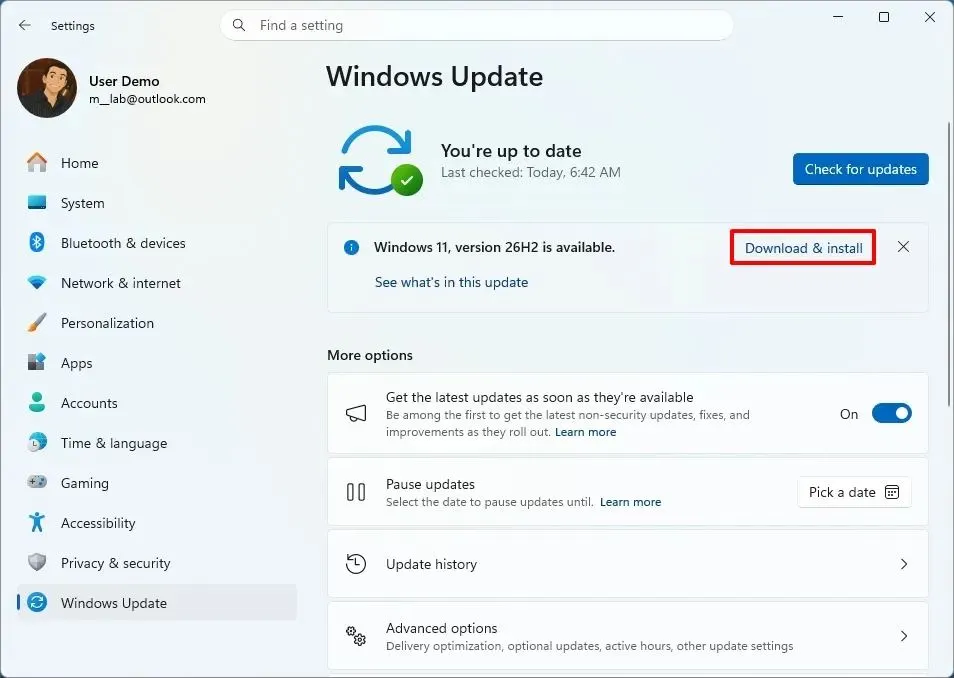
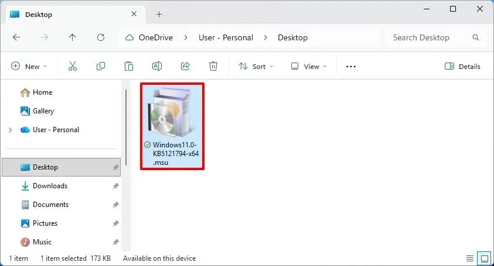
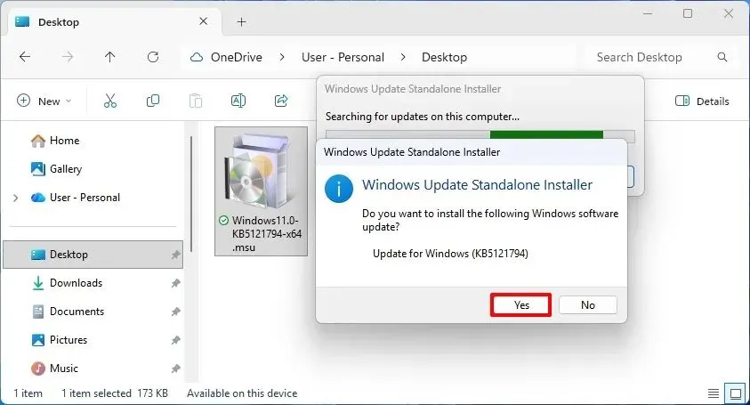

Windows 11 на компьютере без TPM 2.0, Secure Boot и с древним процессором. В этом случае переход на новую версию - отдельный квест. Приходится искать ISO, обходить проверки установщика и надеяться, что после обновления всё заработает как раньше.

С Windows 11 26H2 ситуация интереснее.

Если на компьютере уже установлена Windows 11 24H2 или 25H2, перейти на 26H2 можно без чистой установки и без Rufus, Ventoy и прочих инструментов. Для этого Microsoft использует небольшой пакет включения — **KB5121794**.

И здесь есть нюанс: пакет не «снимает» ограничения Microsoft для неподдерживаемого железа. Компьютер от этого не становится официально совместимым с Windows 11. Просто переход между версиями происходит внутри уже установленной системы.

На момент публикации Windows 11 26H2 находится в [канале Release Preview](https://trick32.ru/articles/windows-11-26h2-release-preview/). Microsoft выпустила сборку 26300.9278 27 августа 2026 года. Общедоступный выпуск ожидается позднее в этом году.

## Почему 26H2 можно поставить обычным пакетом

Microsoft подготовила довольно необычную схему.

Windows 11 24H2, 25H2 и 26H2 используют общую ветку обслуживания. Поэтому переход между этими версиями не требует замены всей операционной системы. Основные компоненты новой версии уже могут находиться в системе, а пакет включения только активирует нужные изменения.

Microsoft уже использовала такой принцип при переходе с 24H2 на 25H2. В документации компания прямо описывает enablement package как небольшой пакет, который активирует уже присутствующие функции новой версии.

Для 26H2 схема повторяется.

KB5121794 — это не новый установщик Windows и не урезанный ISO. Это небольшой пакет `.msu`, который переключает систему на новую версию. После установки и перезагрузки вместо Windows 11 24H2 или 25H2 вы получаете Windows 11 26H2 со сборкой 26300.9278. Именно поэтому не нужно заново устанавливать приложения, создавать загрузочную флешку или форматировать системный раздел.

## Что происходит с неподдерживаемым компьютером

Важно не перепутать две разные вещи.

Допустим, Windows 11 25H2 уже работает на старом компьютере с процессором, который Microsoft не внесла в список поддерживаемых. Или на машине нет TPM 2.0. Если система уже установлена и нормально работает, установка KB5121794 не начинает заново проверять компьютер так, как это делает обычный установщик Windows с ISO.

Поэтому пакет может сработать и на таком компьютере.

Но это **не означает, что Microsoft официально поддержала устройство**. Центр обновления Windows по-прежнему не предложит вам 26H2 автоматически. Это логично: возможность установить пакет вручную и устройство в списке официально поддерживаемых - разные вещи.

Я бы воспринимал KB5121794 именно как способ обновить уже работающую систему, а не как новый универсальный способ обхода требований Windows 11. Общий сценарий для поддерживаемых ПК — [в отдельной инструкции по KB5121794](https://trick32.ru/articles/windows-11-26h2-kb5121794-obnovlenie/).

## Сначала проверяем текущую версию Windows

Перед началом стоит узнать, какая версия Windows установлена сейчас.

Нажмите `Win + R`, введите:

```text
winver
```

и нажмите Enter.

Для этого способа нужна **Windows 11 24H2 или 25H2**.

Есть ещё один момент. На момент выхода KB5121794 Microsoft требует предварительно установить накопительное обновление **KB5120998**. После него система должна иметь одну из двух сборок:

* Windows 11 24H2 — **26100.9278**;
* Windows 11 25H2 — **26200.9278**.

Именно эти сборки Microsoft выпустила 27 августа 2026 года.

Если у вас номер ниже, сначала установите все доступные обновления Windows 11.

## Шаг 1. Обновляем Windows 11 до актуальной сборки

Откройте:

**Параметры → Центр обновления Windows**

Нажмите **«Проверить наличие обновлений»**.



Установите обновления и перезагрузите компьютер.

После перезагрузки снова выполните:

```text
winver
```

Если у вас 24H2, нужна сборка **26100.9278** или новее.

Если 25H2 — **26200.9278** или новее.

Нужная предварительная сборка KB5120998 распространяется Microsoft для обеих версий Windows 11.

Если Центр обновления Windows не предлагает KB5120998, его можно получить через каталог Microsoft Update.

## Шаг 2. Скачиваем KB5121794

Теперь нужен пакет включения **Windows 11 26H2 — KB5121794**.

Для обычных компьютеров с процессорами Intel и AMD нужен пакет **x64**:

[Скачать Windows11.0-KB5121794-x64.msu](https://catalog.sf.dl.delivery.mp.microsoft.com/filestreamingservice/files/94520a88-858f-4832-a57d-7211f6d84a4e/public/Windows11.0-KB5121794-x64_5e20a3cce48d6611b16bdec42b07167f5456586a.msu)

Для компьютеров на ARM — вариант **ARM64**:

[Скачать Windows11.0-KB5121794-arm64.msu](https://catalog.sf.dl.delivery.mp.microsoft.com/filestreamingservice/files/9d8dc3d0-9cbf-4eb1-9411-722e3e6a19b3/public/Windows11.0-KB5121794-arm64_77a76caf2d362bb293a4d18058388f2717365abe.msu)

Пакет распространяется в формате `.msu`. Если прямые ссылки не открываются — найдите пакет по номеру в [каталоге Microsoft Update](https://www.catalog.update.microsoft.com/Search.aspx?q=KB5121794).



Здесь есть оговорка. На 30 августа 2026 года Windows 11 26H2 ещё в Release Preview. Поэтому ручная установка KB5121794 фактически означает установку предварительно распространяемой версии 26H2, даже если сам пакет предназначен для будущего обычного выпуска. Microsoft объявила 27 августа о выпуске 26H2 именно в Release Preview.

Если компьютер рабочий и от него зависит бизнес, я бы не спешил.

Если это домашний ПК или тестовая машина — ситуация другая.

## Шаг 3. Устанавливаем пакет

После загрузки найдите файл:

```text
Windows11.0-KB5121794-x64.msu
```

или соответствующий пакет ARM64.

Дважды щёлкните по файлу.



Windows запустит автономный установщик обновлений.

Подтвердите установку.

Затем понадобится перезагрузка.

Никаких специальных команд в PowerShell здесь не требуется. Не нужно менять реестр, запускать установщик Windows с ключами обхода совместимости или создавать загрузочную флешку.

В этом и заключается главное преимущество метода.

## Шаг 4. Проверяем результат

После перезагрузки снова нажмите:

`Win + R` → `winver`.

В окне должна отображаться:

**Windows 11, версия 26H2**

А номер сборки должен начинаться с:

**26300**

Для текущего выпуска Release Preview Microsoft указывает сборку **26300.9278**.

Если вы видите 26H2 — переход выполнен.

Ваши программы, документы и настройки при этом должны остаться на месте. Мы не запускали чистую установку и не меняли системный диск.

## А что будет с TPM 2.0 и Secure Boot?

Ничего.

Если до обновления компьютер не соответствовал требованиям Windows 11, после обновления он не станет соответствовать им автоматически.

Например, если в системе нет TPM 2.0, он никуда не появится.

Если процессор официально не поддерживается, его модель не станет поддерживаемой.

Если Secure Boot отключён, пакет не включит его сам.

Формулировка «обновление неподдерживаемого ПК до 26H2» может звучать так, будто Microsoft сняла ограничения.

Нет.

Вы просто используете другой механизм обновления.

## Почему Центр обновления Windows сам этого не предлагает

Именно здесь многие могут столкнуться с парадоксом.

Windows уже работает. Пакет для 26H2 существует. Компьютер технически способен установить этот пакет. Но в **«Центре обновления Windows»** кнопки «Обновиться до Windows 11 26H2» может не быть.

Это не ошибка.

Microsoft распространяет обновления с проверкой совместимости и других условий. Неподдерживаемое устройство не превращается в поддерживаемое только потому, что пакет включения (eKB) технически способен переключить версию.

Поэтому ручная установка пакета и официальное предложение обновления через Windows Update — два разных сценария.

## Какие версии Windows так обновить нельзя

Метод рассчитан не на любую Windows.

Если сейчас установлена Windows 10, KB5121794 не поможет. То же самое касается Windows 11 23H2 и более старых версий. Пакет включения рассчитан на системы, которые уже находятся на общей ветке обслуживания с 26H2. Поэтому переход, например, с Windows 10 сразу на 26H2 по этой схеме невозможен. В таком случае потребуется обычное обновление на месте или [чистая установка с ISO на неподдерживаемом ПК](https://trick32.ru/articles/windows-11-26h2-chistaya-ustanovka-nepodderzhivaemoe-oborudovanie/).

Есть ещё один важный момент — **Windows 11 26H1**.

Не стоит ориентироваться только на название версии. 26H1 существует как отдельная ветка Windows 11 и не входит в описанный здесь маршрут 24H2 → 26H2 или 25H2 → 26H2. В актуальной документации Microsoft 26H1 фигурирует как отдельный выпуск со своей сборкой и сроками поддержки.

Поэтому KB5121794 не стоит устанавливать на 26H1 только потому, что цифра «26» выглядит знакомо.

## Нужно ли перед обновлением делать резервную копию?

Да.

Не потому, что KB5121794 обязательно что-нибудь сломает. А потому, что любое крупное изменение Windows лучше начинать с резервной копии. Особенно если компьютер работает на неподдерживаемом железе.

Минимальный вариант — сохранить важные документы, фотографии и рабочие файлы на внешний диск или в облако.

Если используется BitLocker или шифрование устройства, заранее проверьте наличие ключа восстановления.

Это занимает несколько минут.

Восстановление системы после неудачного обновления может занять заметно больше.

## Что делать, если KB5121794 не устанавливается

Первое, что нужно проверить, — текущую сборку.

Если стоит старая сборка 24H2 или 25H2, сначала установите KB5120998 и перезагрузитесь.

Второе — архитектуру системы.

Для Intel и AMD нужен x64. Для ARM — ARM64.

Третье — текущую версию Windows.

Если у вас 23H2, Windows 10 или 26H1, этот способ не подходит.

И наконец, не стоит пытаться устанавливать разные пакеты включения подряд в надежде, что какой-нибудь из них «попадёт».

Для 26H2 сейчас можно встретить несколько пакетов с похожими номерами. Например, KB5122776 относится к Insider Refresh для другой ветки предварительных сборок, тогда как KB5121794 предназначен для перехода к 26H2 в рассматриваемом сценарии.

## Что я думаю об этом способе

Мне этот вариант нравится больше, чем очередная инструкция с модифицированным ISO.

Причина простая — мы не трогаем установщик Windows и не пытаемся заставить его поверить, что старый компьютер вдруг стал новым.

Если Windows 11 уже нормально работает на конкретном ПК, гораздо логичнее использовать штатный механизм обслуживания той же системы. Особенно это актуально для старых компьютеров, на которых Windows 11 уже несколько лет работает без особых проблем.

Но есть важное «но».

**26H2 сейчас ещё не финальный общедоступный выпуск.**

Microsoft выпустила его в Release Preview 27 августа 2026 года. Поэтому на рабочем компьютере я бы сначала подождал общего релиза.

Для тестового ПК — наоборот, это интересный момент. Можно проверить, насколько спокойно старое железо переживёт очередное обновление Windows.

## Итог

Если у вас Windows 11 24H2 или 25H2 на неподдерживаемом компьютере, переход на 26H2 не обязательно означает переустановку системы.

Сначала обновляем систему до актуальной сборки через **KB5120998**.

Затем устанавливаем **KB5121794**.

Перезагружаемся.

Проверяем `winver`.

В результате получаем Windows 11 26H2 без форматирования диска, удаления программ и создания установочной флешки.

Но статус железа от этого не меняется. Компьютер остаётся неподдерживаемым, а автоматического предложения обновления через Windows Update может не появиться.

И это самый важный момент всей истории: **KB5121794 упрощает переход между версиями Windows, но не отменяет требования Microsoft к оборудованию.**