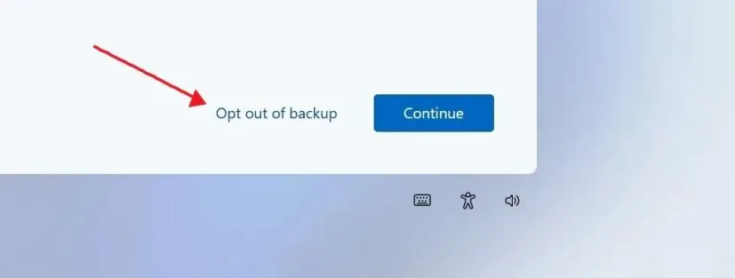

Windows 11 научилась принимать отказ. В навязчивом промпте OneDrive появилась кнопка **Opt out of backup (Отказаться от резервного копирования)** - нажать один раз и больше не откладывать решение на 3 дня.

Раньше такого выбора не было. Система предлагала только **Continue (Продолжить)** или **Remind me in 3 days (Напомнить через 3 дня)**. Отказаться по-честному было нельзя.

Microsoft начала раскатывать изменение на Windows 11 25H2. Пока промпт видят не все, но логика уже понятна.

## Что изменилось

В полноэкранном окне OneDrive теперь три варианта. Раньше было два.

Было:

- **Continue (Продолжить)** - включить резервное копирование
- **Remind me in 3 days (Напомнить через 3 дня)** - отложить

Стало:

- **Continue (Продолжить)** - включить
- **Opt out of backup (Отказаться от резервного копирования)** - отказаться насовсем

Кнопка отказа - это не синяя плашка, а серая текстовая ссылка. Её легко пропустить, если кликать на автомате.

*Новый промпт OneDrive: синяя кнопка Continue (Продолжить) и малозаметная ссылка Opt out of backup (Отказаться от резервного копирования). Скриншот: Windows Latest via Pureinfotech*

Разница принципиальная. **Remind me in 3 days (Напомнить через 3 дня)** не означал «нет». Он означал «спроси меня снова». **Opt out** означает «я не хочу, не спрашивай».

## Почему старый вариант раздражал

Тот же приём Microsoft использовала в начальной настройке Windows 11.

На этапе OOBE появлялся экран **Backup is recommended (Рекомендуется создать резервную копию)** с кнопками **Continue (Продолжить)** и **Skip for now (Пропустить пока)**.

**Skip for now (Пропустить пока)** тоже не был отказом. Система запоминала его как «пока пропустим», а через время показывала промпт снова. Получался цикл: пропустил - напомнили - пропустил - напомнили.

Рекомендация - нормально. Бесконечное напоминание без возможности сказать «нет» - нет.

Новая кнопка разрывает этот цикл.

Подробнее про экран начальной настройки - в руководстве по чистой установке 26H2: [Windows 11 26H2 на неподдерживаемом ПК: чистая установка с обходом TPM 2.0](/articles/windows-11-26h2-chistaya-ustanovka-nepodderzhivaemoe-oborudovanie/)

## Где появляется новый промпт

Это не настройка, которую нужно искать в параметрах. Это окно, которое Windows сама показывает.

Условия:

- Windows 11 25H2
- Вошли с учётной записью Microsoft
- Резервное копирование OneDrive ещё не включено

Microsoft рассылает промпт волнами, как и другие изменения 25H2. Если у вас его нет - появится позже или не появится, если бэкап уже настроен.

Проверить вручную: **Параметры - Учётные записи - Архивация Windows**. Там видно, что уходит в OneDrive: папки, приложения, настройки, учётные данные.

## Тёмный паттерн остался

Microsoft сделала отказ возможным, но не равным.

Кнопка, которую хочет нажать компания, - большая, синяя, контрастная. Ссылка отказа - серая, без фона, мелким шрифтом. Глаз цепляется за синее.

Это знакомый приём. Формально выбор есть, визуально - подсказка, куда кликать.

Если хотите отказаться - ищите именно текст **Opt out of backup (Отказаться от резервного копирования)** внизу или сбоку от основной кнопки. Не путайте с закрытием окна крестиком - крестик тоже часто работает как «напомнить позже».

## Что будет, если отказаться

Ничего страшного не произойдёт.

- Файлы останутся на диске. Никуда не удалятся.
- Папки **Документы**, **Изображения**, **Рабочий стол** не уйдут в облако.
- Синхронизация OneDrive не включится автоматически.
- Лимит 5 ГБ в OneDrive не будет тратиться на бэкап.

Включить бэкап позже можно вручную. Тот же путь: **Параметры - Учётные записи - Архивация Windows (Accounts - Windows backup) - OneDrive**. Или через иконку OneDrive в трее - **Параметры - Синхронизация и резервное копирование (Sync and backup - Manage backup) - Управление резервным копированием**.

Отказ не удаляет OneDrive с компьютера. Если хотите убрать сам сервис, это делается отдельно через **Параметры - Приложения - Установленные приложения - OneDrive - Удалить**.

Как приглушить остальные напоминания OneDrive и облака, разбирал в [7 настройках Windows 11 после установки](/articles/7-nastroek-windows-11-posle-ustanovki/) - пункт про «Показывать уведомления поставщика синхронизации» в Проводнике.

## Кому отказ подходит, а кому нет

Отказывайтесь, если:

- храните файлы локально или в другом облаке
- не хотите, чтобы система переносила рабочий стол и документы в OneDrive без спроса
- у вас медленный интернет или лимитный тариф — фоновые приложения могут съедать трафик даже без бэкапа, [как найти пожирателей Wi-Fi](/articles/fonovye-prilozheniya-zhrut-wi-fi-kak-ostanovit/)
- вам хватает бесплатного объёма OneDrive только для документов, а не для всего ПК

Оставляйте бэкап, если:

- часто меняете компьютеры и хотите быстро перенести настройки и файлы
- боитесь потерять данные при поломке диска
- пользуетесь OneDrive как основным хранилищем

Облачный бэкап полезен, когда компьютер ломается или покупаете новый. В остальных случаях - это просто ещё одна синхронизация, которую вы не просили.

## Итог

Microsoft наконец разделила «не сейчас» и «не хочу». Кнопка **Opt out of backup (Отказаться от резервного копирования)** в Windows 11 25H2 закрывает старую проблему: раньше отказаться было нельзя, можно было только откладывать.

Дизайн по-прежнему подталкивает к **Continue (Продолжить)**. Но теперь хотя бы есть честная альтернатива. Если не хотите, чтобы Windows увела папки в облако, ищите серую ссылку отказа и нажимайте её.

