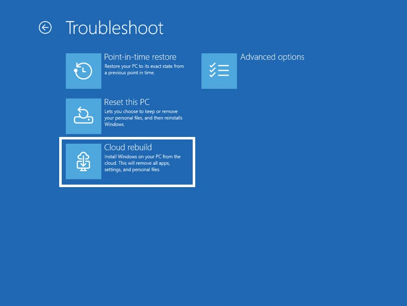

Windows не загружается, флешки нет, второго компьютера тоже нет. Раньше это был тот ещё квест: найти оригинальный ISO, записать USB, загрузиться с него и попытаться поставить систему заново.

Теперь Microsoft тестирует решение в Windows 11 — **Cloud Rebuild (Перестроение облака)**. Это полная переустановка Windows прямо из среды восстановления **WinRE** через интернет, даже если установленная система мертва и не доходит до рабочего стола. Флешка, кастомный образ и здоровая текущая установка не нужны — образ и драйверы качаются свежими с Центра обновления Windows.

Функция появилась в **Windows 11 Insider Beta Build 26220.9343** (ветка 25H2, 8 сентября 2026). Пока только в бете, интерфейс частично не переведён, широкий релиз — позже в 2026 году. Разбираю, как подготовить ПК, где найти пункт, что сотрёт и когда это лучше сброса.

## Чем Cloud Rebuild отличается от других переустановок

В Windows уже есть несколько способов переустановить систему, и их легко перепутать.

* **Вернуть компьютер в исходное состояние (Reset this PC)** — [разобрал все режимы сброса](https://trick32.ru/articles/sbros-windows-do-zavodskih-nastroek/) — переустановка из Параметров или WinRE. Предлагает «Сохранить мои файлы» или «Удалить всё», а затем «Загрузка из облака» или «Локальная переустановка». Требует хотя бы экрана входа и часто использует файлы текущей установки.
* **Исправление проблем с помощью Центра обновления Windows → Переустановить сейчас** — переустанавливает ту же версию, сохраняя файлы, программы и настройки. Работает только если Windows загружается.
* **Чистая установка с флешки** — запуск с установочного носителя, удаление разделов, установка с нуля. Требует второго ПК для создания флешки.

Cloud Rebuild — отдельный сценарий: запускается только из WinRE, всегда качает свежий образ и драйверы, не зависит от целостности старой системы и не требует USB. По сути это «чистая установка без флешки для мёртвой системы».

|  | Cloud Rebuild (Перестроение облака) | Вернуть в исходное / Скачать из облака | Переустановить сейчас (через Центр обновления) | Флешка |
|---|---|---|---|---|
| Работает если Windows не грузится | **да, из WinRE** | частично (только WinRE, с ограничениями) | нет | да |
| Нужен USB | нет | нет | нет | да |
| Откуда образ | свежий из Центра обновления + драйверы | облако или локальные файлы | Центр обновления, та же сборка | ваш ISO |
| Сохраняет файлы/программы | нет, чистая установка | на выбор | да | на выбор (при обновлении) |
| Зависит от здоровья старой системы | нет | да (локальная — сильно) | да | нет |

Если Windows ещё грузится и нужно сохранить данные, пробуйте `sfc /scannow` и `DISM` или «Переустановить сейчас». Cloud Rebuild — крайний случай, когда система уже не поднимается.

## Предварительные условия

Перед запуском проверьте на целевом ПК:

1. **Windows 11 и включённый WinRE.** Проверьте из командной строки от администратора: `reagentc /info` — должно быть `Windows RE status: Enabled`. Без WinRE пункт не появится.
2. **Совместимый сетевой драйвер в WinRE.** Производитель должен включить драйвер в образ восстановления. На практике это почти всегда есть для Intel/Realtek LAN и популярных Wi-Fi, но на экзотике может не заработать.
3. **Доступ в интернет из WinRE.** Подходит проводной Ethernet (подключится сам) или личная сеть **WPA-Personal / WPA2-Personal** по Wi-Fi. Корпоративные WPA-Enterprise и сети с сертификатами пока не поддерживаются в превью, хотя в релизе обещают поддержку.
4. **Соответствие минимальным требованиям Windows 11** — TPM 2.0 включён, Secure Boot, совместимый CPU. Иначе получите ошибку `0xc1900200`.

Также держите рядом ключ BitLocker (если шифрование включено) и учтите, что понадобится несколько гигабайт трафика и питание от сети.

## Где найти и как запустить — пошагово

### Как попасть в WinRE

Автоматически — после двух неудачных загрузок Windows сама предложит восстановление. Вручную из загруженной Windows: **Параметры → Система → Восстановление → Расширенный запуск → Перезапустить сейчас**. Ещё вариант — зажать **Shift** на экране входа и нажать **Перезагрузка**.

На экране **Выбор действия** выберите **Поиск и устранение неисправностей**.

В превью пункт называется **Troubleshoot → Recovery and uninstall → Cloud rebuild**. На русской Windows он появится как **Устранение неполадок → Перестроение облака** — это официальный перевод из [документации Microsoft](https://learn.microsoft.com/ru-ru/windows/configuration/cloud-rebuild).

### 8 шагов Cloud Rebuild по документации

1. Выберите **Устранение неполадок → Перестроение облака**.
2. Подключитесь к сети. Ethernet — автоматически, Wi-Fi — выберите свою WPA-Personal сеть и введите ключ.
3. Дождитесь подготовки: WinRE связывается с Центром обновления, определяет целевую сборку и качает сетевые драйверы.
4. Проверьте целевое состояние: на экране покажут **сборку, выпуск и язык** — убедитесь, что это то, что ожидаете.
5. Прочитайте предупреждение: **переформатирует системный диск и удалит все локально сохранённые файлы, учётные записи, приложения и параметры**. Данные в OneDrive не затрагиваются. Нажмите **Продолжить**.
6. Наблюдайте прогресс: этапы подготовки, скачивания и установки, устройство может перезапуститься несколько раз. **Не выключайте и не отключайте от сети**, иначе рискуете получить незагружаемую систему — тогда останется только диск восстановления или флешка производителя.
7. Дождитесь окончания. Устройство перезагрузится.
8. Пройдите **готовый интерфейс OOBE** как на новом ПК.

В августе эту функцию только [нашли в скрытом виде в сборках 25H2](https://dzen.ru/a/akv-frkSuTJ_W0oj) — теперь Microsoft показала полный сценарий.

## Что сотрёт, а что оставит

**Удалит полностью с системного диска (обычно C:):** документы на рабочем столе, в Документах, Загрузках, профили пользователей, установленные программы, драйверы, настройки, учётные записи. Это чистая установка, не «сохранить мои файлы».

**Не трогает:** другие разделы (D:, E:) и файлы в OneDrive/облаке. Но бэкап на внешний диск всё равно делайте **до** запуска — ошибка выбора диска или сбой питания стоят дороже.

**Активация:** цифровая лицензия остаётся, после подключения к интернету Windows активируется сама. Главное — не сменить выпуск (Home → Pro).

**Драйверы:** базовые подтянутся из Центра обновления, но фирменные утилиты ноутбука (Lenovo Vantage, MyASUS и т. п.) ставьте вручную.

## Что с BitLocker, TPM и активацией

Если системный диск зашифрован BitLocker, WinRE попросит **ключ восстановления** (48 цифр). Без него к зашифрованным данным не вернётесь. Где искать — в личной учётной записи Microsoft, рабочей учётной записи, сохранённом файле или распечатке. Подробнее — [держите ключ восстановления под рукой](https://trick32.ru/articles/bitlocker-avtomatizaciya-klyuchi-vosstanovleniya/).

Если увидите ошибку `0xc1900200`, проверьте TPM: перезагрузитесь в UEFI/BIOS, включите **TPM / PTT / fTPM / Security Device**, сохраните и проверьте в Windows командой `tpm.msc` — должно быть «TPM готов к использованию». Если и после этого та же ошибка — скорее всего, на Центр обновления не выложены сетевые драйверы или драйверы хранилища для вашей модели. Обратитесь к производителю.

На корпоративных устройствах, присоединённых к **Microsoft Entra и управляемых Intune с Windows Autopilot**, после OOBE устройство само подключится к Intune, развернёт назначенные приложения, политики, а резервное копирование для организаций восстановит параметры. Файлы станут доступны через OneDrive после входа.

## Когда не поможет и что делать вместо

Cloud Rebuild не панацея.

* **Неисправен накопитель** — зависания, ошибки чтения/записи, пропадание диска. Переустановка не вылечит железо — проверяйте SMART, меняйте SSD.
* **Перегрев** — троттлинг CPU/GPU из-за пыли или высохшей термопасты. Нужна чистка и ремонт, а не сброс.
* **Серьёзное заражение** — Microsoft советует чистую установку с носителя, а не сброс из системы. Что делать при вирусах — [в разборе](https://trick32.ru/articles/vredonosnye-programmy-kak-najti-i-udalit/).
* **Сброс/перестроение завершается ошибкой** — проверьте сеть (`0x800704C6` — нет интернета, подключите Ethernet/WPA-Personal и повторите), TPM и драйверы. Если не помогает — готовьте [оригинальный ISO Microsoft](https://trick32.ru/articles/skachat-windows-original-iso-microsoft/) и флешку.

Если система ещё грузится, начните с лёгкого: [правильная последовательность SFC и DISM](https://trick32.ru/articles/aGEXKMjfCis5Rcw4) или «Переустановить сейчас» через Центр обновления.

## Если что-то пошло не так — коды и логи

* **0x800704C6** — нет сети. Подключите Ethernet или WPA-Personal Wi-Fi, нажмите Отмена → снова **Устранение неполадок → Перестроение облака**.
* **0xc1900200** — не проходит требования. Включите TPM, проверьте `tpm.msc`, убедитесь что драйверы выложены на Центр обновления.

Для обращения в поддержку соберите логи из WinRE через **Устранение неполадок → Дополнительные параметры → Командная строка** и скопируйте на флешку:
`X:\$Windows.~BT\Sources\Panther`, `X:\Windows\Logs\MoSetup`, `X:\Windows\Logs\Rebuild` — затем отправьте через **Центр отзывов → Перестроение облака**.

## Что подготовить заранее

* Стабильный безлимитный интернет и питание от сети (образ — несколько ГБ).
* Проверьте язык и выпуск до нажатия Продолжить — потом только новой установкой.
* Сохраните пароли, ключи BitLocker, файлы с C: на внешний диск или в облако.

Cloud Rebuild пока в Insider Beta и помечен как «для оценки на нерабочих устройствах». Когда доберётся до стабильных сборок, станет самым простым способом **переустановить Windows 11 без флешки** когда всё остальное уже не помогает. Пока тестируйте только если понимаете риск полной очистки системного диска и сделали бэкап.
