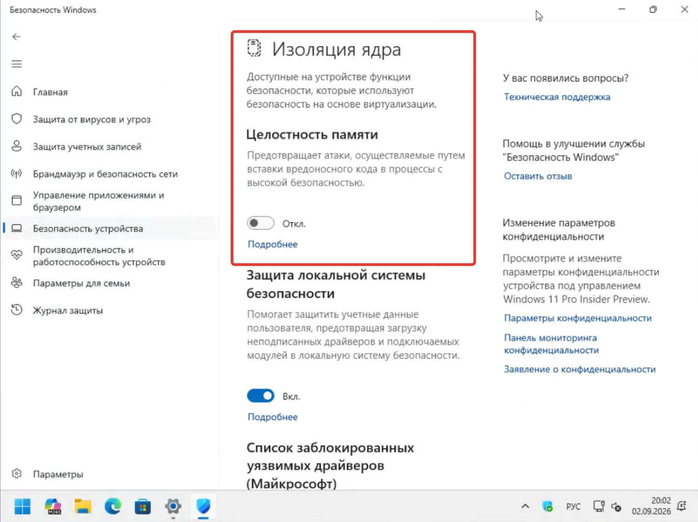
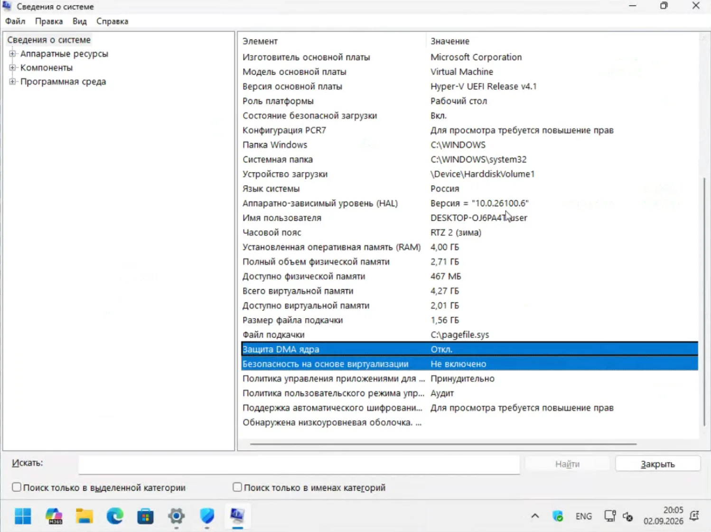
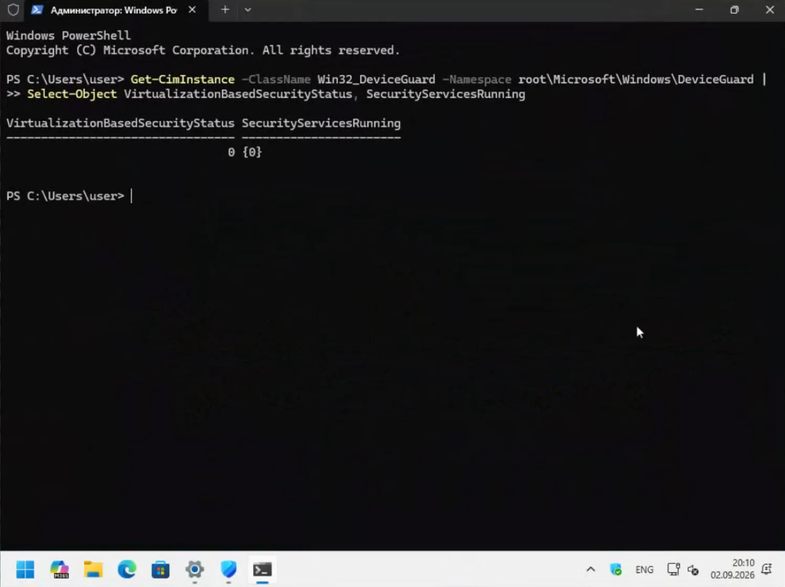
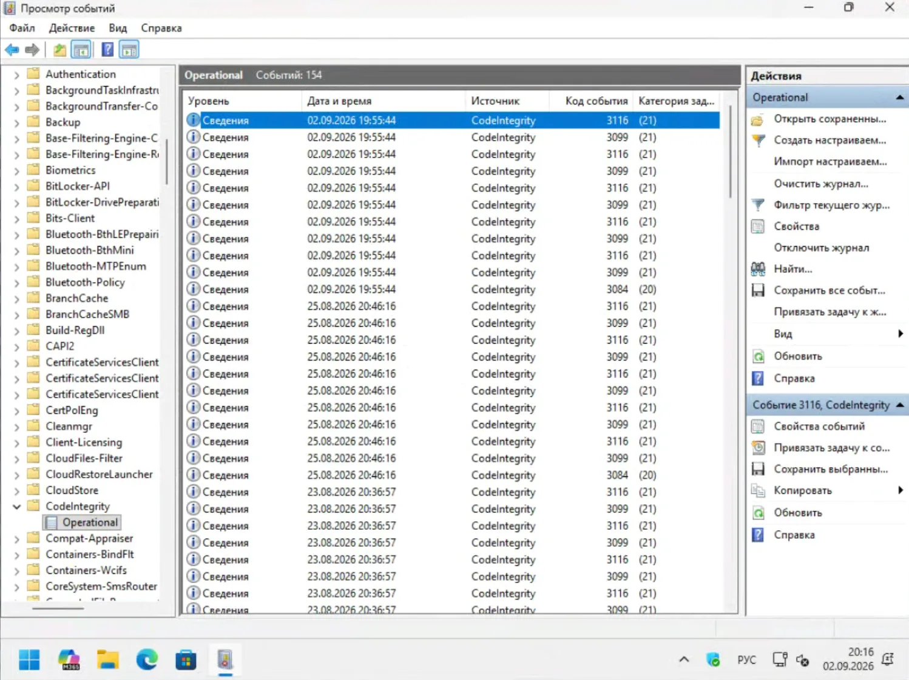
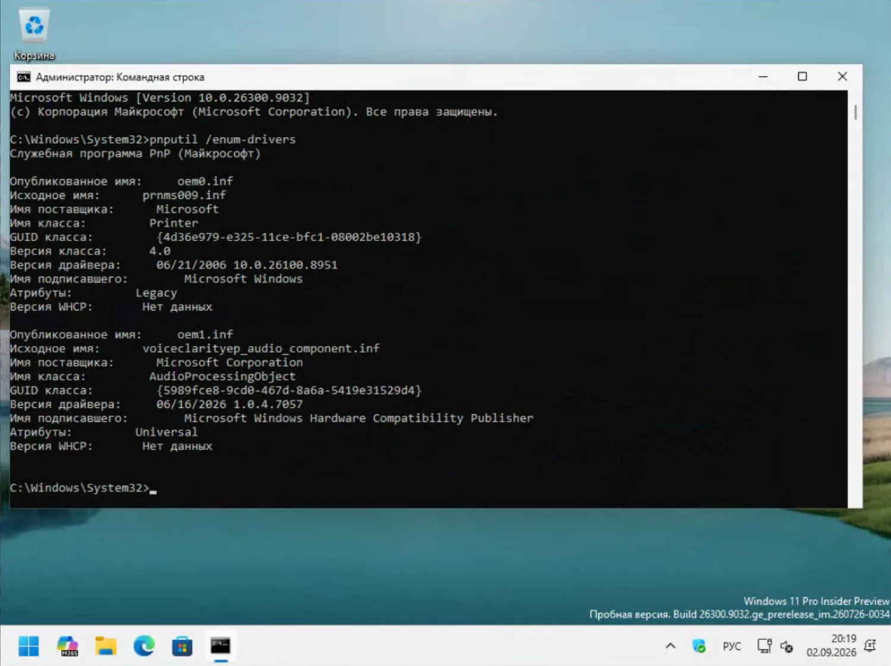
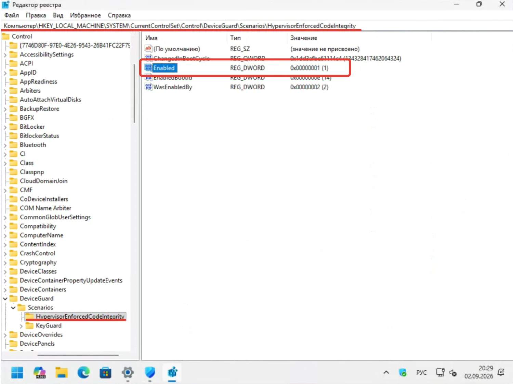

Microsoft с октября 2026 года начнёт автоматически включать **Целостность памяти** (Memory Integrity, HVCI) на совместимых компьютерах с Windows 11. Настройка придёт не отдельной программой и не новой версией Windows, а через обычные накопительные обновления.

Для большинства компьютеров изменение пройдёт незаметно. Но если Windows работает на старом ПК, в системе установлен древний драйвер принтера, сканера, виртуального диска или другого оборудования, ситуация может быть другой.

Microsoft не собирается включать HVCI вслепую на каждом компьютере. Перед включением Windows оценивает оборудование, совместимость драйверов и другие параметры системы.

Поэтому сейчас самое время проверить, что происходит на конкретном ПК.

## Что именно меняет Microsoft

1 сентября 2026 года Microsoft объявила о расширении автоматического включения Memory Integrity на подходящих устройствах.

Начиная с октября Windows 11 будет использовать для этого обычные **quality updates** (накопительные обновления качества). Если на совместимом компьютере не включена виртуализационная защита, обновление сможет включить необходимые компоненты VBS и Memory Integrity.

Здесь есть важный нюанс.

Microsoft не называет конкретный день октября, когда HVCI включат всем сразу. Поэтому привязывать изменение именно к **13 октября 2026 года**, дате октябрьского Patch Tuesday, неправильно. Официальная формулировка Microsoft — «начиная с октября 2026 года».

Кроме того, речь идёт не о принудительном изменении настройки на каждом ПК.

Microsoft отдельно указывает: если пользователь или администратор уже отключил Memory Integrity, новая схема не должна автоматически отменять это решение.

То есть сценарий выглядит примерно так:

**Windows проверяет компьютер → определяет совместимость → при подходящих условиях включает защиту.**

А не так:

**Вышло обновление → HVCI включился на всех ПК подряд.**

## Что такое «Целостность памяти» и зачем она нужна

Название немного обманчивое.

Целостность памяти не проверяет оперативную память на ошибки и не заменяет MemTest86. Речь идёт о защите кода, который работает в режиме ядра Windows.

Memory Integrity — функция **VBS (Virtualization-Based Security, безопасность на основе виртуализации)**. Microsoft также использует для неё техническое название **HVCI (Hypervisor-Protected Code Integrity)**.

VBS использует гипервизор Windows для создания изолированной среды. В ней Windows выполняет проверки целостности кода ядра.

Задача HVCI: не дать неподходящему или вредоносному коду получить слишком много свободы на уровне ядра.

Это важно, потому что обычная программа и драйвер Windows играют в разных весовых категориях. Ошибка приложения обычно заканчивается закрытием приложения. Ошибка или компрометация драйвера может затронуть всю систему.

Поэтому HVCI особенно интересен с точки зрения защиты от атак, которые используют драйверы для получения доступа к ядру Windows.

При этом антивирус и HVCI не заменяют друг друга. Это разные уровни защиты.

Упрощённо связь можно представить так:

**VBS → изолированная среда → HVCI → контроль кода ядра и драйверов.**

В интерфейсе Windows пользователь видит всё это гораздо проще: **Безопасность Windows → Безопасность устройства → Изоляция ядра → Целостность памяти**.

## Как проверить, включена ли защита

Самый простой способ: открыть

**Пуск → Параметры → Конфиденциальность и безопасность → Безопасность Windows → Безопасность устройства → Изоляция ядра.**

Там переключатель **Целостность памяти**.

Если он включён, HVCI работает.

Если выключен, HVCI сейчас не используется.

Если Windows показывает сообщение о несовместимых драйверах, не стоит сразу нажимать переключатель. Сначала нужно понять, какой именно драйвер мешает запуску защиты.

Для обычного пользователя этой проверки достаточно.



*Безопасность Windows → Безопасность устройства → Изоляция ядра. Переключатель «Целостность памяти» выключен — в таком положении HVCI не работает.*

Но Windows предоставляет и более точный способ посмотреть состояние VBS.

Нажмите **Win + R**, введите:

```text
msinfo32
```

и откройте **Сведения о системе**.

В разделе сведений о VBS можно увидеть состояние виртуализационной защиты и запущенных служб.



*msinfo32 → Сведения о системе: на этой ВМ VBS отключена. В вашем случае ищите строки «Безопасность на основе виртуализации» и «Защита DMA ядра».*

Есть ещё вариант через PowerShell:

```powershell
Get-CimInstance -ClassName Win32_DeviceGuard -Namespace root\Microsoft\Windows\DeviceGuard |
Select-Object VirtualizationBasedSecurityStatus, SecurityServicesRunning
```

Параметр `VirtualizationBasedSecurityStatus` имеет несколько состояний. Значение `2` означает, что VBS включена и работает.

А `SecurityServicesRunning` показывает запущенные службы безопасности VBS. В частности, значение `2` соответствует Memory Integrity.

Такой способ полезен, если интерфейс Windows показывает не совсем очевидное состояние.



*PowerShell от администратора: `VirtualizationBasedSecurityStatus = 0` и `SecurityServicesRunning = {0}` — VBS и Memory Integrity не работают. Значение `2` означало бы «включено».*

## Какие компьютеры смогут получить HVCI автоматически

Здесь Microsoft использует не одно условие.

В документации для автоматического включения Memory Integrity Microsoft указывает следующие ориентиры для совместимого оборудования:

| Компонент     | Требование/ориентир                              |
| ------------- | ------------------------------------------------ |
| Intel         | 8-е поколение и новее                            |
| AMD           | Zen 2 и новее                                    |
| Qualcomm      | Snapdragon 8180 и новее                          |
| ОЗУ           | от 8 ГБ для x64                                  |
| Накопитель    | SSD от 64 ГБ                                     |
| Виртуализация | поддержка и доступность аппаратной виртуализации |
| Драйверы      | совместимость с HVCI                             |

Но воспринимать эту таблицу как гарантию включения HVCI нельзя.

Одного процессора недостаточно для вывода.

Windows также учитывает возможности платформы, прошивки и драйверов. Среди проверяемых параметров есть поддержка виртуализации, UEFI, Secure Boot, IOMMU, аппаратных механизмов ускорения вроде MBEC/GMET и другие характеристики платформы.

Поэтому два компьютера с одинаковым процессором вполне могут получить разный результат.

Например, сам по себе Core i7 восьмого поколения ещё не означает, что Windows обязательно включит HVCI. Если в системе обнаружится несовместимый драйвер, автоматическое включение может не произойти.

## Главная проблема: старые драйверы

Именно здесь автоматическое включение HVCI может проявиться для обычного пользователя.

Windows может годами работать со старым драйвером. Принтер печатает, сканер сканирует, программа запускается — значит, зачем что-то менять?

Проблема появляется, когда новая защита проверяет этот драйвер по другим правилам.

Microsoft прямо предупреждает о возможных проблемах совместимости. В числе потенциально проблемных категорий — старые драйверы устройств, программы защиты, античиты и другое ПО, которое работает на низком уровне Windows.

Особенно внимательно стоит проверить компьютеры, где установлено старое оборудование:

* принтеры и МФУ;
* сканеры;
* старые ТВ-тюнеры;
* виртуальные диски;
* специализированные платы;
* старое игровое ПО;
* программы, устанавливающие собственные драйверы.

При этом возраст драйвера сам по себе ничего не доказывает.

Драйвер 2018 года не обязательно несовместим, а драйвер 2025 года не обязательно совместим.

Windows проверяет конкретный драйвер и его поведение.

## Где посмотреть несовместимый драйвер

Если Windows сообщает, что включить Целостность памяти невозможно из-за несовместимого драйвера, сначала стоит посмотреть его название.

На странице **Изоляция ядра** Windows обычно предлагает показать несовместимые драйверы.

Если информации недостаточно, можно заглянуть в журнал событий.

Откройте:

**Просмотр событий → Журналы приложений и служб → Microsoft → Windows → CodeIntegrity → Operational.**

В этом журнале Windows записывает события, связанные с проверкой целостности кода и совместимостью драйверов. Для диагностики Memory Integrity Microsoft, в частности, использует события с **Event ID 3087**.



*Просмотр событий → Журналы приложений и служб → Microsoft → Windows → CodeIntegrity → Operational. Для HVCI ищите события CodeIntegrity с кодами 3087, 3099, 3116.*

Ещё один вариант: посмотреть установленные сторонние пакеты драйверов:

```cmd
pnputil /enum-drivers
```

Команда покажет драйверные пакеты, установленные в Driver Store Windows.



*Командная строка от администратора: `pnputil /enum-drivers` показывает все сторонние пакеты драйверов. Ищите `oem*.inf` и имя поставщика.*

Но здесь есть важное правило: **не удаляйте первый попавшийся `oem*.inf` только потому, что его название выглядит подозрительно**.

Сначала нужно определить, какому устройству или программе принадлежит драйвер.

Удалили драйвер принтера, и принтер перестал работать. Удалили драйвер контроллера, и можно получить гораздо более неприятный результат.

Сначала обновление или удаление самого устройства/программы. И только потом работа с пакетом драйвера.

## Что делать, если драйвер несовместим

Первый вариант: найти новую версию драйвера на сайте производителя оборудования.

Для старого принтера лучше искать драйвер именно у производителя принтера, а не скачивать случайный `DriverPack` из поисковой выдачи.

Для специализированного оборудования ситуация сложнее.

Производитель мог давно прекратить поддержку устройства. Тогда есть три варианта:

**Оставить HVCI выключенным.** Подходит, если старое оборудование критично для работы.

**Отказаться от старого драйвера.** Подходит, если устройство больше не используется.

**Заменить оборудование или программу.** Иногда это единственный вариант, если старый драйвер принципиально не работает с HVCI.

Не стоит отключать защиту только потому, что Windows показала предупреждение.

Сначала нужно понять, что именно сломается без этого драйвера и насколько оно вам нужно.

## Можно ли отключить Целостность памяти

Да.

В Windows откройте:

**Параметры → Конфиденциальность и безопасность → Безопасность Windows → Безопасность устройства → Изоляция ядра → Целостность памяти.**

Переведите переключатель в положение **Выкл.** и перезагрузите компьютер.

Для администраторов есть и другие способы управления HVCI.

Настройка в реестре:

```text
HKEY_LOCAL_MACHINE\SYSTEM\CurrentControlSet\Control\DeviceGuard\Scenarios\HypervisorEnforcedCodeIntegrity
```

Параметр:

```text
Enabled
```

Значение `1` включает HVCI, значение `0` отключает.



*Редактор реестра: `HKLM\SYSTEM\CurrentControlSet\Control\DeviceGuard\Scenarios\HypervisorEnforcedCodeIntegrity → Enabled = 1` (HVCI включена).*

То же самое можно сделать из командной строки от имени администратора:

```cmd
reg add "HKLM\SYSTEM\CurrentControlSet\Control\DeviceGuard\Scenarios\HypervisorEnforcedCodeIntegrity" /v Enabled /t REG_DWORD /d 0 /f
```

После изменения нужна перезагрузка.

Но на рабочем компьютере организации ситуация может быть другой. Политика Group Policy или Intune способна управлять настройками VBS и HVCI централизованно. В таком случае локальное изменение может не дать ожидаемого результата.

Команду:

```cmd
bcdedit /set hypervisorlaunchtype off
```

я бы вообще не использовал как обычный способ отключения HVCI.

Она отключает запуск гипервизора Windows и затрагивает виртуализационные функции шире, чем одна настройка Memory Integrity.

Для диагностики это отдельный инструмент. Для повседневной настройки такой способ слишком грубый.

## А что будет с играми

Здесь часто начинается спор о «потере FPS от VBS».

Универсальной цифры нет.

Microsoft отмечает, что влияние HVCI на производительность зависит от аппаратной платформы. На старых процессорах без аппаратных механизмов вроде MBEC/GMET накладные расходы могут быть заметнее.

Поэтому фраза «HVCI отнимает 5% производительности» ничего не объясняет.

На одном компьютере разница может быть практически незаметна. На другом она окажется измеримой.

Если компьютер используется для игр, нормальный способ проверки простой: взять одну и ту же игру, одну сцену и одинаковые настройки, затем сравнить результат с включённой и отключённой защитой.

Есть и обратная сторона.

Современные античиты сами проверяют настройки безопасности Windows. Например, Riot Vanguard на отдельных конфигурациях учитывает VBS/HVCI и другие функции безопасности. FACEIT Anti-Cheat также проверяет состояние системы.

Поэтому отключение HVCI ради нескольких кадров может привести не к ускорению игры, а к невозможности запустить конкретный античит.

Требования лучше проверять для конкретной игры и актуальной версии античита.

## Что делать перед октябрьскими обновлениями

Если **Целостность памяти уже включена** и компьютер работает нормально, ничего делать не нужно.

Если HVCI **выключена**, стоит понять причину.

Если Windows показывает **несовместимый драйвер**, сначала найдите его и попробуйте обновить.

Если HVCI отключали специально ради старого оборудования или программы, не нужно срочно включать защиту обратно. Microsoft заявляет, что новая схема автоматического включения не должна просто игнорировать уже принятое пользователем или администратором решение.

А вот если настройку никто не отключал, а она почему-то не работает, диагностику лучше провести сейчас.

Тогда после октябрьских обновлений не придётся выяснять причину одновременно с поиском неработающего принтера или программы.

## Стоит ли вообще включать HVCI

В большинстве случаев да, если компьютер совместим с этой защитой и она не ломает нужное оборудование или программы.

Memory Integrity добавляет ещё один уровень защиты Windows. Она не заменяет антивирус, резервные копии или обновления, но усложняет атаки, которым нужен доступ к ядру через уязвимый или неподходящий драйвер.

Обратная сторона тоже понятна: чем жёстче Windows контролирует код ядра, тем меньше свободы остаётся у старого программного обеспечения.

Именно поэтому переход на HVCI особенно заметен не на новом ноутбуке с Windows 11, а на старом компьютере, который десять лет собирали из разных устройств и драйверов.

Там Windows может внезапно сказать:

> «Этот драйвер больше не подходит».

И это не обязательно означает, что сломалась Windows.

Возможно, просто закончилась эпоха, когда старый драйвер мог работать в системе без дополнительных ограничений.

## Что в итоге

Октябрьское изменение Microsoft — это не очередное обновление интерфейса Windows 11.

Компания расширяет автоматическое включение **Memory Integrity / HVCI** через обычные обновления Windows 11. При этом система должна учитывать аппаратную совместимость, драйверы и другие параметры компьютера.

Поэтому подготовка занимает несколько минут.

Откройте **Безопасность Windows → Безопасность устройства → Изоляция ядра** и посмотрите состояние **Целостности памяти**.

Если она включена и компьютер работает нормально, можно забыть об этой настройке.

Если выключена, выясните почему.

Если Windows показывает несовместимый драйвер, ищите обновление у производителя устройства.

А если HVCI отключали намеренно, потому что без него не работает старое оборудование или программа, ничего менять только из-за октябрьского обновления не требуется.

Главное не ждать момента, когда после очередного обновления перестанет работать нужное устройство. Проверить состояние HVCI сейчас намного проще.
